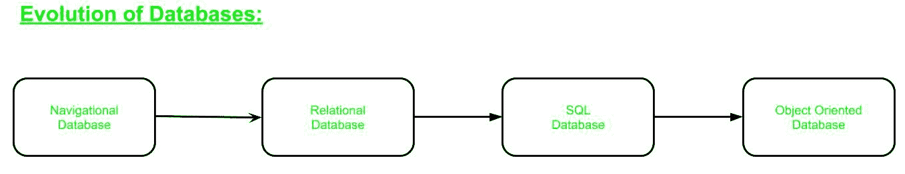

# 关于 DBMS 的有趣事实

> 原文:[https://www.geeksforgeeks.org/interesting-facts-about-dbms/](https://www.geeksforgeeks.org/interesting-facts-about-dbms/)

我们周围的信息量每天都在爆炸式增长，因此迫切需要整理所有这些数据。[数据库管理系统(DBMS)](https://www.geeksforgeeks.org/introduction-of-dbms-database-management-system-set-1/) 从存储在数据库中的数百万个事实或数据中提取信息。随着维护需求的增加，对数据库管理系统的需求也增加了。

那么，让我们了解一些关于数据库管理系统的有趣的事情:

*   你有没有注意到 ***数据库*** 的所有字母都是用左手打出来的？
    有意思对吧？现在，QWERTY 键盘的布局是为了更好地使用双手而设计的。因此，很明显，关于数据库的写作不仅不自然，而且比看起来要困难得多。

*   数据库管理系统不是一个新概念，因此它最早是在 20 世纪 60 年代实现的。据说查尔斯·巴赫曼的集成数据存储是历史上第一个数据库管理系统。

下面的流程图描述了各种类型的数据库管理系统的演变:

*   在 20 世纪 60 年代中期，IBM 为他们的信息管理系统使用了分层模型。它使用树状结构，父节点指向子节点。它被美国宇航局成功地用于管理月球着陆器的图纸。

*   后来，查尔斯·巴赫曼开发了一种更灵活的网络模型。现在，子节点可以有多个父节点。但是随着数据库变得复杂，维护和管理所有这些指针变得太难了。

*   然后在 1970 年，IBM 的一位名叫泰德·科德的计算机科学家提出了他的关系模型。在这篇文章中，他将大量数据组织成相关信息的简单表格。没有指针，因为表之间只有匹配的数据字段。

*   然后我们有了 SQL 或结构化查询语言，发音为“S-Q-L”或“See-Quell”。它成为了处理关系数据库的标准语言。
    My SQL 由瑞典一家公司 MySQL AB 于 1995 年创立，是目前使用最广泛的开源 RDBMS。

*   1975 年，IBM 生产了一个名为“系统 R”的实验性关系数据库。它使用了 SQL。

*   甲骨文成立于 1980 年。这是第一个最受欢迎的关系数据库管理系统，它逐渐挤掉了早期的大型机产品，如 IMS。

现在，几乎在每个定制业务应用程序中都可以找到数据库管理系统技术。所以，我们必须记住:

> 在这个信息时代，数据库永远不会遥远，数据永远不会不可访问。