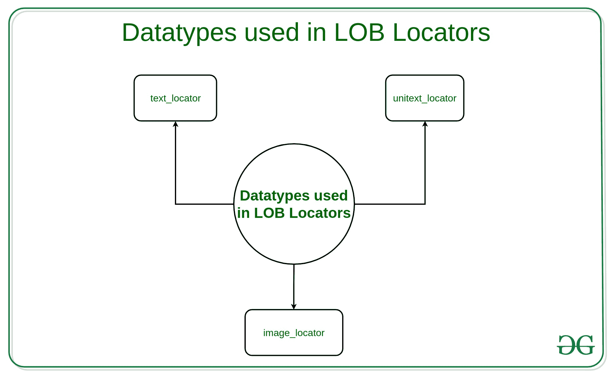

# 引入 LOB 定位器

> 原文:[https://www.geeksforgeeks.org/introducing-lob-locators/](https://www.geeksforgeeks.org/introducing-lob-locators/)

**大对象(LOB)** 定位器允许您引用 **Transact-SQL 语句**中的 **LOB** ，而不是引用 LOB 本身，因为文本的大小可以是单位文本，或者图像 LOB 可以是几兆字节。在 Transact-SQL 语句中使用**业务线定位器**有助于**减少客户端和 SAP ASE 之间的网络流量**，同时**减少客户端处理业务线所需的内存量**。 **SAP ASE 或 Sybase ASE** 帮助客户端应用程序发送和接收定位器作为主机变量和参数标记。

业务线定位器将在创建它的交易期间保持有效。SAP ASE 执行验证，每当事务提交或回滚时，验证都会使定位器失效。

[](https://media.geeksforgeeks.org/wp-content/uploads/20190624142352/Datatypes-used-in-LOB-Locators-1.jpg)

**LOB 定位器中使用的数据类型:**
LOB 定位器使用三种不同的数据类型:

*   **text_locator** :用于文本 LOBs。
*   **unitext_locator** :适用于 unitext LOBs。
*   **image_locator** :针对图像 LOBs。

**为 LOB 定位器声明局部变量:**可以为定位器数据类型声明局部变量。
例如:

```
declare @v1 text_locator

```

因为 lob 和定位器只存储在内存中，所以不能将定位器数据类型用作用户表或视图的列数据类型，也不能在约束或默认值中使用。

**创建 LOB 定位器:**可以显式或隐式创建 LOB 定位器。

通常，当在 Transact-SQL 语句中使用 LOB 定位器时，定位器会隐式转换为它们引用的 LOB。也就是说，每当将业务线定位器传递给一个 Transact-SQL 函数时，该函数都会对定位器引用的业务线进行操作。

对定位器引用的业务线所做的任何更改都不会反映在数据库中的源业务线中，除非您显式保存它们。同样，如果您对存储在数据库中的业务线所做的任何更改都不会反映在定位器引用的业务线中。

一个业务线实例有一个定位器和一个值。业务线定位器是指物理存储业务线值的地方。业务线值被称为存储在业务线中的数据。

无论何时在操作中使用业务线，例如将业务线作为参数传递，实际上都是在传递业务线定位器。在大部分情况下，您可以在应用程序中使用业务线实例，而不必关心业务线定位器的语义。没有必要去引用 LOB 定位器，因为在某些编程语言中，指针需要它。

关于业务线定位器的语义以及如何存储业务线值，仍然有一些问题需要注意。

**临时 lob**

您还可以创建类似于局部变量的临时 lob，以帮助使用数据库 lob。临时 lob 不与任何表相关联，它们只能由其创建者访问，具有定位器(这是访问它们的方式)，并且在会话结束时被删除。

不支持临时 BFILES。在 INSERT、UPDATE 或 DELETE 语句的 WHERE 子句中，临时 lob 只允许作为输入变量(IN 值)。它们也可以作为 INSERT 语句插入的值，或者 UPDATE 语句的 SET 子句中的值。临时 lob 没有数据库服务器的事务支持，这意味着您不能对它们进行提交或回滚。

临时业务线定位器可以跨越事务。当服务器异常终止时，以及当数据库 SQL 操作返回错误时，也会删除它们。

**应用程序中的 LOB 定位器**
要在 Pro*C/C++应用程序中使用 LOB 定位器，我们必须包含 oci.h 头文件，并且必须声明指向 blob 的 ociblocator、clob 和 NCLOBs 的 ociblocator 或 bfile 的 OCIBFileLocator 类型的指针。

对于 NCLOB，您可以

*   在 Pro*C/C++声明中使用子句“字符集是 NCHAR_CS”，
*   或者，您必须已经在命令行或配置文件中使用了 NLS_CHAR 预编译器选项来设置 NLS_NCHAR 环境变量。