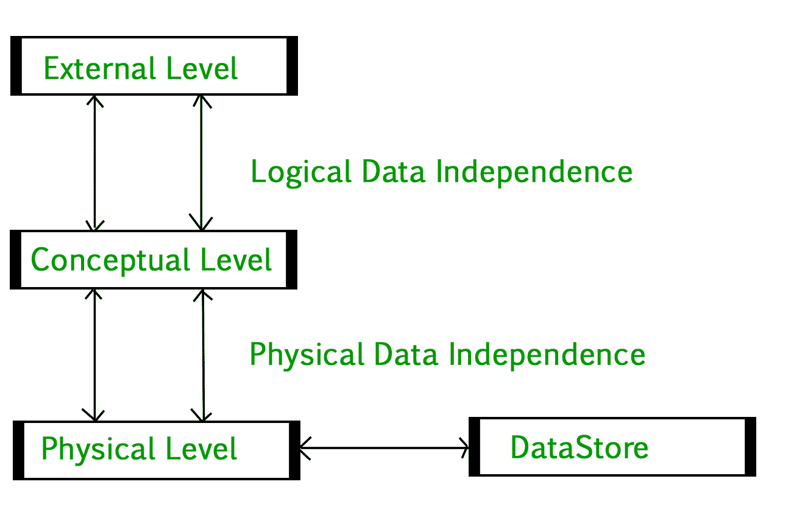
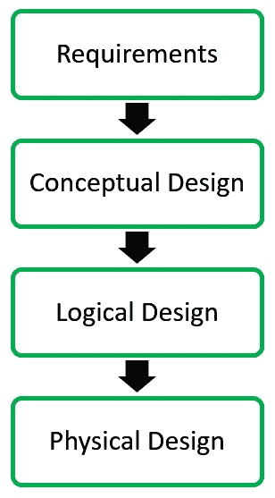

# 在 DBMS 中引入三层架构|第二集

> 原文:[https://www . geeksforgeeks . org/3 层架构介绍-in-dbms-set-2/](https://www.geeksforgeeks.org/introduction-of-3-tier-architecture-in-dbms-set-2/)

[数据库管理系统–简介|第 1 集](https://www.geeksforgeeks.org/introduction-of-dbms-database-management-system-set-1/)

**数据库管理系统三层架构**

DBMS 三层架构将整个系统划分为三个相互关联但又相互独立的模块，如下所示:

1.  **物理层:**在物理层，保存数据库对象在数据存储中的位置信息。数据库管理系统的各种用户不知道这些对象的位置。简而言之，数据库的物理级别描述了数据是如何存储在磁盘和磁带等辅助存储设备中的，并提供了关于其他存储细节的见解。
2.  **概念层:**在概念层，数据以各种数据库表的形式表示。例如，学生数据库可能包含学生表和课程表，用户可以看到这些表，但用户不知道它们的存储。也称为逻辑模式，它描述了要存储在数据库中的数据类型。
3.  **外部级别:**外部级别根据概念级别表指定数据的视图。每个外部级别视图都用于满足特定类别用户的需求。例如，一所大学的教职员工对查看学生的课程详细信息感兴趣，学生也对查看与学术、账户、课程和宿舍详细信息相关的所有详细信息感兴趣。因此，可以为不同的用户生成不同的视图。外部层的主要焦点是数据抽象。

**数据独立性**

数据独立性意味着数据在一个级别的变化不会影响到另一个级别。该体系结构中存在两种类型的数据独立性:

1.  **物理数据独立性:**表和索引的物理位置的任何变化都不应影响数据的概念层次或外部视图。这种数据独立性很容易被大多数数据库管理系统实现。
2.  **概念数据独立性:**概念层架构和外部层架构的数据必须是独立的。这意味着概念模式的改变不应影响外部模式。例如:添加或删除表的属性不应影响用户对表的视图。但是与物理数据独立性相比，这种类型的独立性很难实现，因为概念模式的变化反映在用户的视图中。

**数据库设计阶段**

真实应用程序的数据库设计从捕获需求开始，到使用数据库管理系统软件进行物理实现，包括以下步骤:

**概念设计:**使用高级概念数据模型捕获数据库的需求。例如，ER 模型用于数据库的概念设计。

**逻辑设计:**逻辑设计以关系模型的形式表示数据。概念设计阶段生成的 ER 图用于将数据转换为关系模型。

**物理设计:**在物理设计中，关系模型中的数据是使用 Oracle、DB2 等商业 DBMS 实现的。

**数据库管理系统的优势**

数据库管理系统有助于高效地组织数据库中的数据，与典型的文件系统相比，它具有以下优势:

*   **最小化冗余和数据不一致性:**数据在数据库管理系统中标准化，以最小化冗余，这有助于保持数据的一致性。例如，学生信息可以保存在数据库管理系统的一个地方，由不同的用户访问。这种最小化的冗余是由于主键和外键
*   **简化数据访问:**用户只需要关系的名称而不需要确切的位置来访问数据，所以过程非常简单。
*   **多个数据视图:**可以创建同一数据的不同视图，以迎合不同用户的需求。例如，教师工资信息可以从学生数据视图中隐藏，但在管理视图中显示。
*   **数据安全:**只有授权用户才允许访问 DBMS 中的数据。此外，数据可以通过数据库管理系统加密，这使其安全。
*   **并发访问数据:**在 DBMS 中不同用户可以同时并发访问数据。
*   **备份和恢复机制:** DBMS 备份和恢复机制有助于避免灾难性故障时的数据丢失和数据不一致。

另请参见

*   [所有数据库管理系统文章](https://www.geeksforgeeks.org/category/dbms/)
*   [数据库管理系统测验](https://www.geeksforgeeks.org/quiz-corner-gq/)

本文由 **Sonal Tuteja** 供稿。如果您发现任何不正确的地方，或者您想分享更多关于上面讨论的主题的信息，请写评论