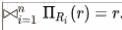

# 在 DBMS 中引入第 4 和第 5 范式

> 原文:[https://www . geesforgeks . org/introduction-of-4-和-5-normal-form-in-DBMS/](https://www.geeksforgeeks.org/introduction-of-4th-and-5th-normal-form-in-dbms/)

先决条件–[函数依赖](https://www.geeksforgeeks.org/functional-dependency-and-attribute-closure/)、[数据库规范化](https://www.geeksforgeeks.org/database-normalization-introduction/)、[范式](https://www.geeksforgeeks.org/database-normalization-normal-forms/)
如果两个或多个独立关系保持在一个关系中，或者我们可以说**多值依赖**发生在表中一行或多行的存在意味着同一表中一行或多行的存在时。换句话说，表中的两个属性(或列)彼此独立，但都依赖于第三个属性。一个**多值依赖关系**总是需要至少三个属性，因为它包含至少两个依赖于第三个的属性。

对于依赖项 A -> B，如果对于单个值 A，存在多个值 B，那么该表可能存在多值依赖项。该表应该至少有 3 个属性，对于 A-> B >多值依赖关系，B 和 C 应该是独立的。例如，

<center>

| 人 | 移动的 | 食物 _ 喜欢 |
| --- | --- | --- |
| 马什 | 9893/9424 | 汉堡/披萨 |
| Ramesh | Nine thousand one hundred and ninety-one | 比萨饼 |

</center>

```
Person->-> mobile,
Person ->-> food_likes 
```

这被理解为“人多测定移动”和“人多测定食物 _ 喜欢”

注意，函数依赖是多值依赖的一种特殊情况。在函数依赖 X -> Y 中，每个 X 恰好决定一个 Y，永远不超过一个。

#### 第四范式(4NF):

第四范式(4NF)是数据库规范化的一个层次，除了候选关键字之外，不存在非平凡的多值依赖关系。它建立在前三个范式(1NF、2NF 和 3NF)和 Boyce-Codd 范式(BCNF)的基础上。它规定，除了满足 BCNF 要求的数据库之外，它不能包含一个以上的多值依赖关系。

**属性–**当且仅当满足以下条件时，关系 R 位于 4NF:

1.  它应该是在博伊斯-科德范式(BCNF)。
2.  该表不应有任何多值依赖关系。

具有多值依赖关系的表违反了第四范式(4NK)的规范化标准，因为它会产生不必要的冗余，并可能导致数据不一致。为了把这个带到 4NF，有必要把这个信息分成两个表。

**示例–**考虑一个班级的数据库表 whaich 有两个关系 R1 包含学号(SID)和学号(SNAME)，R2 包含课程号(CID)和课程名(CNAME)。

<center>
**Table –** R1(SID, SNAME)

| （同 suddenionosphericdisturbance）电离层的突然骚扰 | SNAME |
| --- | --- |
| S1 | A |
| S2 | B |

</center>

<center>
**Table –** R2(CID, CNAME)

| 刑事调查局 | 别名 |
| --- | --- |
| C1 | C |
| C2 | D |

</center>

当进行叉积时，会产生多值依赖关系:

<center>
**Table –** R1 X R2

| （同 suddenionosphericdisturbance）电离层的突然骚扰 | SNAME | 刑事调查局 | 别名 |
| --- | --- | --- | --- |
| S1 | A | C1 | C |
| S1 | A | C2 | D |
| S2 | B | C1 | C |
| S2 | B | C2 | D |

</center>

多值依赖项(MVD)是:

```
 SID->->CID; SID->->CNAME; SNAME->->CNAME
```

**联合依赖–**连接分解是多值依赖的进一步推广。如果 R1 和 R2 在 C 上的连接等于关系 R，那么我们可以说存在一个连接
依赖(JD)，其中 R1 和 R2 是给定关系 R (A，B，C，D)的分解 R1(A，B，C，C)和 R2(C，D)。或者，R1 和 R2 是 r . a . JD .⋈{ R1，R2，…，Rn}的无损分解，如果 R1，R2，…，则称其保持关系 r..，Rn 是无损连接分解。如果 join 的属性 join 等于
关系 R，则*(A，B，C，D)，(C，D)将是 R 的 JD。这里，*(R1，R2，R3)用于表示关系 R1，R2，R3 等是 R 的 JD

设 R 是 R1、R2、R3 的关系模式……..当且仅当
时，称 Rn 为 R 的分解

**示例–**

<center>
**Table –** R1

| 公司 | 产品 |
| --- | --- |
| C1 | u 盘！u 盘 |
| C1 | MICROPHONE 的简称 |
| C2 | 扬声器 |
| C2 | 扬声器 |

</center>

```
Company->->Product 
```

<center>
**Table –** R2

| 代理人 | 公司 |
| --- | --- |
| 等于 Haman） | C1 |
| 等于 Haman） | C2 |
| 莫汉 | C1 |

</center>

```
Agent->->Company 
```

<center>
**Table –** R3

| 代理人 | 产品 |
| --- | --- |
| 等于 Haman） | u 盘！u 盘 |
| 等于 Haman） | MICROPHONE 的简称 |
| 等于 Haman） | 扬声器 |
| 莫汉 | 扬声器 |

</center>

```
Agent->->Product 
```

<center>
**Table –** R1⋈R2⋈R3

| 公司 | 产品 | 代理人 |
| --- | --- | --- |
| C1 | u 盘！u 盘 | 等于 Haman） |
| C1 | MICROPHONE 的简称 | 等于 Haman） |
| C2 | 扬声器 | 扬声器 |
| C1 | 扬声器 | 等于 Haman） |

</center>

```
Agent->->Product 
```

#### 第五范式/投影范式(5NF):

当且仅当 R 中的每个连接依赖都由 R 的候选键隐含时，关系 R 才处于 5NF 中。分解为两个关系的关系必须具有无损失连接属性，这确保当通过自然连接重新组合关系时，不会生成虚假或额外的元组。

**属性–**当且仅当关系满足以下条件时，关系 R 处于 5NF:

1.  r 应该已经在 4NF 了。
2.  它不能进一步非损失分解(连接依赖)

**示例–**考虑上面的模式，有一个案例是“如果一个公司生产一个产品，一个代理商是该公司的代理商，那么他总是为该公司销售该产品”。在这些情况下，非加太表格如下所示:

<center>
**Table –** ACP</center>

| 代理人 | 公司 | 产品 |
| --- | --- | --- |
| 一流的 | PQR | 坚果 |
| 一流的 | PQR | 拴住 |
| 一流的 | XYZ | 坚果 |
| 一流的 | XYZ | 拴住 |
| 主动脉第二声 | PQR | 坚果 |

关系 ACP 再次分解为 3 个关系。现在，所有三个关系的自然连接将显示为:

<center>
**Table –** R1

| 代理人 | 公司 |
| --- | --- |
| 一流的 | PQR |
| 一流的 | XYZ |
| 主动脉第二声 | PQR |

</center>

<center>
**Table –** R2

| 代理人 | 产品 |
| --- | --- |
| 一流的 | 坚果 |
| 一流的 | 拴住 |
| 主动脉第二声 | 坚果 |

</center>

<center>
**Table –** R3

| 公司 | 产品 |
| --- | --- |
| PQR | 坚果 |
| PQR | 拴住 |
| XYZ | 坚果 |
| XYZ | 拴住 |

</center>

R1 和 R3 自然加入“公司”，然后 R13 和 R2 自然加入“代理商”和“产品”的结果见表 **ACP** 。

因此，在这个例子中，所有冗余都被消除了，并且 ACP 的分解是无损连接分解。因此，该关系在 5NF 中，因为它不违反[无损连接](https://www.geeksforgeeks.org/database-management-system-lossless-decomposition/)的属性。