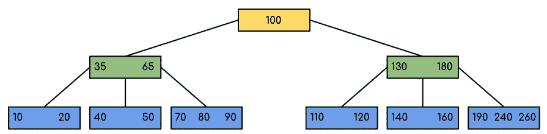
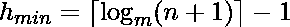
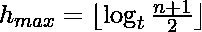
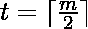
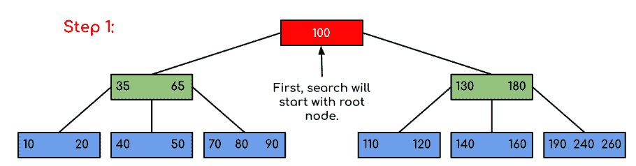
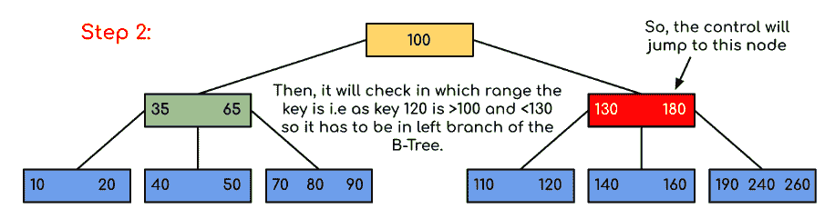
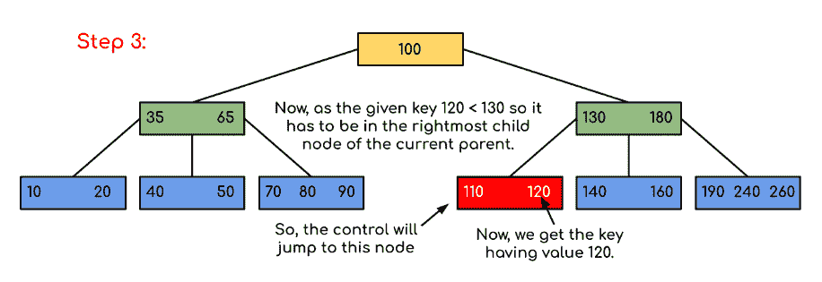

# B-树介绍

> 原文:[https://www.geeksforgeeks.org/introduction-of-b-tree-2/](https://www.geeksforgeeks.org/introduction-of-b-tree-2/)

**简介:**
B-Tree 是一个自平衡搜索树。在大多数其他自平衡搜索树中(如 [AVL](https://www.geeksforgeeks.org/avl-tree-set-1-insertion/) 和红黑树)，假设一切都在主内存中。为了理解 B-Trees 的使用，我们必须考虑无法放入主内存的大量数据。当键的数量较多时，数据以块的形式从磁盘中读取。与主内存访问时间相比，磁盘访问时间非常长。使用 B-Trees 的主要思想是减少磁盘访问的次数。大多数树操作(搜索、插入、删除、最大值、最小值，..等等)需要 O(h)个磁盘访问，其中 h 是树的高度。b 树是一棵胖树。通过在 B 树节点中放置最大可能的键，B 树的高度保持较低。通常，B 树节点大小保持与磁盘块大小相等。由于 B 树的高度较低，因此与平衡的二分搜索法树(如 AVL 树、红黑树，..等等。
**B-树的时间复杂度:**

<figure class="table">

| -你好。不，不。 | 算法 | 时间复杂性 |
| --- | --- | --- |
| 1. | 搜索 | o(对数 n) |
| 2. | 插入 | o(对数 n) |
| 3. | 删除 | o(对数 n) |

**“n”是 B-树中元素的总数。**
**B-树属性:**

1.  所有的叶子都在同一水平线上。
2.  B 树由术语*最小度*定义。t 的值取决于磁盘块的大小。
3.  除了根节点之外，每个节点都必须包含至少 t-1 个键。根至少可以包含 1 个密钥。
4.  所有节点(包括根节点)最多只能包含 2 * t–1 个键。
5.  一个节点的子节点数等于它的键数加 1。
6.  节点的所有键都按递增顺序排序。两个键 k1 和 k2 之间的子键包含 k1 和 k2 范围内的所有键。
7.  B-树从根开始生长和收缩，这与二叉查找树不同。二分搜索法树向下生长，也向下收缩。
8.  像其他平衡的二分搜索法树一样，搜索、插入和删除的时间复杂度是 O(log n)。
9.  B-树中节点的插入只发生在叶节点。

下面是最小阶为 5 的 B-树的一个例子。请注意，在实际的 B-Trees 中，最小阶的值远大于 5。



在上图中我们可以看到，所有的叶节点都在同一级别，所有的非叶节点都没有空的子树，并且键的数量比子节点的数量少一个。
**有趣的事实:**

1.  可以存在 n 个节点且 m 是一个节点的最大子节点数的 B 树的最小高度为:
2.  可以存在 n 个节点的 B-树的最大高度和 t 是非根节点可以拥有的最小子节点数是:和

**B 树中的遍历:**
遍历也类似于二叉树的有序遍历。我们从最左边的子对象开始，递归打印最左边的子对象，然后对剩余的子对象和键重复相同的过程。最后，递归打印最右边的子级。

**B- Tree 中的搜索操作:**
搜索类似于二叉查找树的搜索。让要搜索的关键字为 k。我们从根开始，递归向下遍历。对于每个被访问的非叶节点，如果该节点有密钥，我们只需返回该节点。否则，我们会返回到该节点的适当子节点(位于第一个较大键之前的子节点)。如果我们到达一个叶节点，但在叶节点中没有找到 k，我们返回 NULL。

**逻辑:**
搜索 B 树类似于搜索二叉树。这个算法是相似的，并且是递归的。在每个级别上，搜索都是优化的，就好像键值不在父范围中，那么键值就在另一个分支中。由于这些值限制了搜索，它们也被称为限制值或分离值。如果我们到达一个叶节点，但没有找到所需的键，那么它将显示为空。

**示例:在给定的 B 树中搜索 120。**


**解:**







在这个例子中，我们可以看到我们的搜索被减少了，仅仅是限制了包含值的关键字出现的机会。类似地，如果在上面的例子中我们必须寻找 180，那么控制将在步骤 2 停止，因为程序将发现键 180 存在于当前节点中。类似地，如果它要找出 90，那么它会自动转到左边的子树，因此控制流会类似地进行，如上面的例子所示。

## C++

```
// C++ implementation of search() and traverse() methods
#include<iostream>
using namespace std;

// A BTree node
class BTreeNode
{
    int *keys;  // An array of keys
    int t;      // Minimum degree (defines the range for number of keys)
    BTreeNode **C; // An array of child pointers
    int n;     // Current number of keys
    bool leaf; // Is true when node is leaf. Otherwise false
public:
    BTreeNode(int _t, bool _leaf);   // Constructor

    // A function to traverse all nodes in a subtree rooted with this node
    void traverse();

    // A function to search a key in the subtree rooted with this node.   
    BTreeNode *search(int k);   // returns NULL if k is not present.

// Make the BTree friend of this so that we can access private members of this
// class in BTree functions
friend class BTree;
};

// A BTree
class BTree
{
    BTreeNode *root; // Pointer to root node
    int t;  // Minimum degree
public:
    // Constructor (Initializes tree as empty)
    BTree(int _t)
    {  root = NULL;  t = _t; }

    // function to traverse the tree
    void traverse()
    {  if (root != NULL) root->traverse(); }

    // function to search a key in this tree
    BTreeNode* search(int k)
    {  return (root == NULL)? NULL : root->search(k); }
};

// Constructor for BTreeNode class
BTreeNode::BTreeNode(int _t, bool _leaf)
{
    // Copy the given minimum degree and leaf property
    t = _t;
    leaf = _leaf;

    // Allocate memory for maximum number of possible keys
    // and child pointers
    keys = new int[2*t-1];
    C = new BTreeNode *[2*t];

    // Initialize the number of keys as 0
    n = 0;
}

// Function to traverse all nodes in a subtree rooted with this node
void BTreeNode::traverse()
{
    // There are n keys and n+1 children, traverse through n keys
    // and first n children
    int i;
    for (i = 0; i < n; i++)
    {
        // If this is not leaf, then before printing key[i],
        // traverse the subtree rooted with child C[i].
        if (leaf == false)
            C[i]->traverse();
        cout << " " << keys[i];
    }

    // Print the subtree rooted with last child
    if (leaf == false)
        C[i]->traverse();
}

// Function to search key k in subtree rooted with this node
BTreeNode *BTreeNode::search(int k)
{
    // Find the first key greater than or equal to k
    int i = 0;
    while (i < n && k > keys[i])
        i++;

    // If the found key is equal to k, return this node
    if (keys[i] == k)
        return this;

    // If the key is not found here and this is a leaf node
    if (leaf == true)
        return NULL;

    // Go to the appropriate child
    return C[i]->search(k);
}
```

## Java 语言(一种计算机语言，尤用于创建网站)

```
// Java program to illustrate the sum of two numbers

// A BTree
class Btree {
    public BTreeNode root; // Pointer to root node
    public int t; // Minimum degree

    // Constructor (Initializes tree as empty)
    Btree(int t) {
        this.root = null;
        this.t = t;
    }

    // function to traverse the tree
    public void traverse() {
        if (this.root != null)
            this.root.traverse();
        System.out.println();
    }

    // function to search a key in this tree
    public BTreeNode search(int k) {
        if (this.root == null)
            return null;
        else
            return this.root.search(k);
    }
}

// A BTree node
class BTreeNode {
    int[] keys; // An array of keys
    int t; // Minimum degree (defines the range for number of keys)
    BTreeNode[] C; // An array of child pointers
    int n; // Current number of keys
    boolean leaf; // Is true when node is leaf. Otherwise false

    // Constructor
    BTreeNode(int t, boolean leaf) {
        this.t = t;
        this.leaf = leaf;
        this.keys = new int[2 * t - 1];
        this.C = new BTreeNode[2 * t];
        this.n = 0;
    }

    // A function to traverse all nodes in a subtree rooted with this node
    public void traverse() {

        // There are n keys and n+1 children, traverse through n keys
        // and first n children
        int i = 0;
        for (i = 0; i < this.n; i++) {

            // If this is not leaf, then before printing key[i],
            // traverse the subtree rooted with child C[i].
            if (this.leaf == false) {
                C[i].traverse();
            }
            System.out.print(keys[i] + " ");
        }

        // Print the subtree rooted with last child
        if (leaf == false)
            C[i].traverse();
    }

    // A function to search a key in the subtree rooted with this node.
    BTreeNode search(int k) { // returns NULL if k is not present.

        // Find the first key greater than or equal to k
        int i = 0;
        while (i < n && k > keys[i])
            i++;

        // If the found key is equal to k, return this node
        if (keys[i] == k)
            return this;

        // If the key is not found here and this is a leaf node
        if (leaf == true)
            return null;

        // Go to the appropriate child
        return C[i].search(k);

    }
}
```

## C#

```
// C# program to illustrate the sum of two numbers
using System;

// A BTree
class Btree
{
  public BTreeNode root; // Pointer to root node
  public int t; // Minimum degree

  // Constructor (Initializes tree as empty)
  Btree(int t)
  {
    this.root = null;
    this.t = t;
  }

  // function to traverse the tree
  public void traverse()
  {
    if (this.root != null)
      this.root.traverse();
    Console.WriteLine();
  }

  // function to search a key in this tree
  public BTreeNode search(int k)
  {
    if (this.root == null)
      return null;
    else
      return this.root.search(k);
  }
}

// A BTree node
class BTreeNode
{
  int[] keys; // An array of keys
  int t; // Minimum degree (defines the range for number of keys)
  BTreeNode[] C; // An array of child pointers
  int n; // Current number of keys
  bool leaf; // Is true when node is leaf. Otherwise false

  // Constructor
  BTreeNode(int t, bool leaf) {
    this.t = t;
    this.leaf = leaf;
    this.keys = new int[2 * t - 1];
    this.C = new BTreeNode[2 * t];
    this.n = 0;
  }

  // A function to traverse all nodes in a subtree rooted with this node
  public void traverse() {

    // There are n keys and n+1 children, traverse through n keys
    // and first n children
    int i = 0;
    for (i = 0; i < this.n; i++) {

      // If this is not leaf, then before printing key[i],
      // traverse the subtree rooted with child C[i].
      if (this.leaf == false) {
        C[i].traverse();
      }
      Console.Write(keys[i] + " ");
    }

    // Print the subtree rooted with last child
    if (leaf == false)
      C[i].traverse();
  }

  // A function to search a key in the subtree rooted with this node.
  public BTreeNode search(int k) { // returns NULL if k is not present.

    // Find the first key greater than or equal to k
    int i = 0;
    while (i < n && k > keys[i])
      i++;

    // If the found key is equal to k, return this node
    if (keys[i] == k)
      return this;

    // If the key is not found here and this is a leaf node
    if (leaf == true)
      return null;

    // Go to the appropriate child
    return C[i].search(k);

  }
}

// This code is contributed by Rajput-Ji
```

## java 描述语言

```
<script>

// Javascript program to illustrate the sum of two numbers

// A BTree
class Btree
{

    // Constructor (Initializes tree as empty)
    constructor(t)
    {
        this.root = null;
        this.t = t;
    }

    // function to traverse the tree
    traverse()
    {
        if (this.root != null)
            this.root.traverse();
        document.write("<br>");
    }

    // function to search a key in this tree
    search(k)
    {
        if (this.root == null)
            return null;
        else
            return this.root.search(k);
    }

}

// A BTree node
class BTreeNode
{
     // Constructor
    constructor(t,leaf)
    {
        this.t = t;
        this.leaf = leaf;
        this.keys = new Array(2 * t - 1);
        this.C = new Array(2 * t);
        this.n = 0;
    }
    // A function to traverse all nodes in a subtree rooted with this node
    traverse()
    {
        // There are n keys and n+1 children, traverse through n keys
        // and first n children
        let i = 0;
        for (i = 0; i < this.n; i++) {

            // If this is not leaf, then before printing key[i],
            // traverse the subtree rooted with child C[i].
            if (this.leaf == false) {
                C[i].traverse();
            }
            document.write(keys[i] + " ");
        }

        // Print the subtree rooted with last child
        if (leaf == false)
            C[i].traverse();
    }

    // A function to search a key in the subtree rooted with this node.
    search(k)    // returns NULL if k is not present.
    {

        // Find the first key greater than or equal to k
        let i = 0;
        while (i < n && k > keys[i])
            i++;

        // If the found key is equal to k, return this node
        if (keys[i] == k)
            return this;

        // If the key is not found here and this is a leaf node
        if (leaf == true)
            return null;

        // Go to the appropriate child
        return C[i].search(k);
    }
}

// This code is contributed by patel2127
</script>
```

上面的代码不包含驱动程序。我们将在下一篇文章 [B 树插入](https://www.geeksforgeeks.org/b-tree-set-1-insert-2/)中介绍完整的程序。
定义 B-Tree 有两种约定，一种是按最小度定义(在[科曼书](http://www.flipkart.com/introduction-algorithms-3rd/p/itmczynzhyhxv2gs?pid=9788120340077&affid=sandeepgfg)中紧随其后)，第二种是按顺序定义。我们已经遵循了最低学位惯例，并将在 B-Tree 的后续帖子中遵循同样的惯例。上述程序中使用的变量名也与科曼书保持一致，以提高可读性。
**插入和删除**
[B-树插入](https://www.geeksforgeeks.org/b-tree-set-1-insert-2/)
[B-树删除](https://www.geeksforgeeks.org/b-tree-set-3delete/)
**参考文献:**
[Clifford Stein、Thomas H. Cormen、Charles E. Leiserson、罗纳德·L·李维斯特](http://www.flipkart.com/introduction-algorithms-3rd/p/itmczynzhyhxv2gs?pid=9788120340077&affid=sandeepgfg)
算法导论第三版如果您发现任何不正确的地方，请写下评论，或者您想分享更多关于上述主题的信息。

</figure>