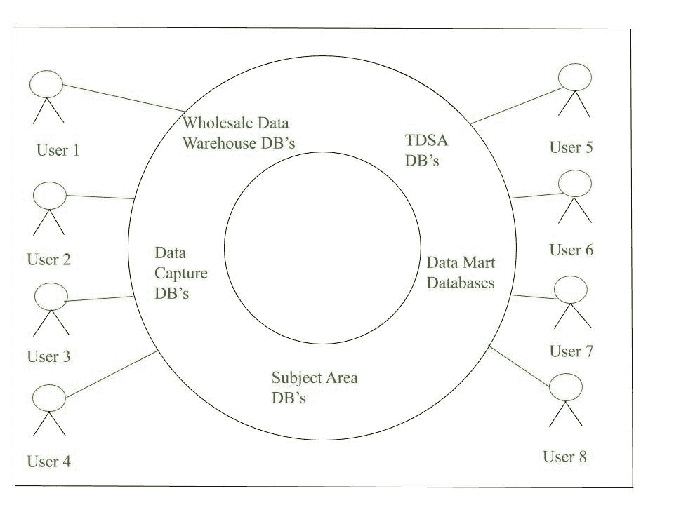

# 企业数据库介绍

> 原文:[https://www . geesforgeks . org/企业数据库简介/](https://www.geeksforgeeks.org/introduction-of-enterprise-database/)

今天这个世界充满了数据。我们有大量的资源每天生成数据，所有这些数据都以非常安全的方式存储在**数据库**中。所有数据在[数据库](https://www.geeksforgeeks.org/introduction-of-dbms-database-management-system-set-1/)中相互链接。借助数据库，可以根据需要轻松插入、使用和删除数据。

**比如**，如果我们考虑博客网站，博客网站上的数据存储表就是用户和文章。在这里，为了检索哪个用户写了哪篇文章，我们将这两个表用公共属性连接起来，比如用户 id。用来管理数据库的软件叫做[数据库管理系统](https://www.geeksforgeeks.org/introduction-of-dbms-database-management-system-set-1/)。比如 [MySQL](https://www.geeksforgeeks.org/mysql-common-mysql-queries/) ，甲骨文等。是在不同应用中使用的流行数据库管理系统。

**定义:**
随着科技的发展，人们对线上资源的使用超过了线下，数据量也与日俱增。如果我们谈一谈像[电商](https://www.geeksforgeeks.org/e-commerce/)市场等有百万客户群，有百万数据要存储的大组织，那么我们就知道为什么**企业数据库**会起作用了。越来越多的企业希望在处理不断增长的数据量时引入强大的方法。几年前依赖 Excel 电子表格或 Microsoft Access 处理数据的小型企业也希望为数据库和应用程序增加更多容量、功能和灵活性。公司使用业务数据库来制定战略、计划和标准化公司未来将要开展的各种活动，这些活动也将帮助公司提高生产率。

一个**企业数据库管理系统**可以同时访问 100 到 10，000 个人。企业和大公司用它来处理他们庞大的数据集。这样的数据库允许企业提高生产率。这种数据库可以处理拥有成千上万名员工的大型组织和数十万人同时在线访问的繁忙的网络服务器。

通常数据库管理系统由数据库管理员管理，数据库管理员是特定软件产品的专家。数据库管理员指示系统加载、检索或更改数据库中的数据，并告诉谁可以访问数据以及每个人可以使用什么命令。

下图为代表**企业数据库环境**的图片。这些数据库提供了五种类型的数据库架构的互连集合:原始数据捕获、事务数据暂存区、主题区、批发数据仓库和数据集市。所有这些数据库通常代表每个企业中存在的一个或多个功能领域。

*   **原始数据捕获:**
    原始数据捕获将有关正在进行的应用程序的信息存储到数据库中。数据可以由任何个人创建，也可以是软件开发的结果。
*   **TDSA :**
    TDSA 代表事务数据暂存区，它平滑了原始数据捕获包中可能出现的所有各种语义、时间和单位，因为它们来自不同的用户，运行在不同的操作系统下。
*   **主题领域数据库:**
    主题领域数据库从一个或多个 TDSA 数据库中提取数据，并创建大型主题领域的数据库。主题领域数据库的总数等于独立用户资源的数量
*   **[仓库数据库](https://www.geeksforgeeks.org/data-warehousing/) :**
    仓库数据库是保存从主题领域的几个不同数据库中获取的数据的数据库。数据中心的数据取自主题区域的数据库。
*   **数据集市数据库:**
    数据集市数据库是专门为特定需求而创建的。它的架构、加载软件和报告都是定制的。数据集市数据库量也可以限制在单个办公室甚至个人所需的大范围数据，并且可以每周甚至每晚下载到该办公室或个人。

**各种企业数据库管理系统:**
有很多企业数据库，比如:

*   甲骨文数据库 18c
*   微软 SQL 服务器
*   [IBM DB2](https://www.geeksforgeeks.org/difference-between-couchbase-and-ibm-db2/)
*   SAP Sybase ASE
*   [PostgreSQL](https://www.geeksforgeeks.org/what-is-postgresql-introduction/)
*   [马里亚银行企业等](https://www.geeksforgeeks.org/introduction-of-mariadb/)

**企业数据库管理系统特点:**

*   **并行查询:**
    同时有几个用户会在那里定位查询。所有的问题都同时得到回答。
*   **多流程支持:**
    几个流程之间都可以拆分工作负荷来处理。
*   **聚类特征:**
    即结合多台服务器或单个数据库连接的情况。通常一台服务器不足以处理数据量，所以这是该功能发挥作用的时候了。