# ER 车型介绍

> 原文:[https://www.geeksforgeeks.org/introduction-of-er-model/](https://www.geeksforgeeks.org/introduction-of-er-model/)

ER 模型用于从数据角度对系统的逻辑视图进行建模，该模型由以下组件组成:

**实体，实体类型，实体集–**

一个实体可能是一个有实体存在的物体——一个特定的人、车、房子或雇员——或者它可能是一个有概念存在的物体——一个公司、一份工作或一门大学课程。

实体是实体类型的对象，所有实体的集合称为实体集。例如:E1 是一个具有实体类型学生的实体，所有学生的集合称为实体集。在 ER 图中，实体类型表示为:

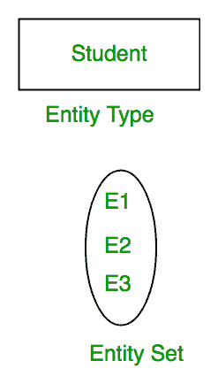

**属性:**
属性是定义实体类型的**属性。例如，Roll_No、姓名、出生日期、年龄、地址、手机号码是定义实体类型 Student 的属性。在 ER 图中，属性用椭圆表示。**

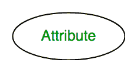

**1。关键属性–**
**唯一标识实体集内每个实体**的属性称为关键属性。例如，Roll_No 对于每个学生都是唯一的。在 ER 图中，键属性由一个带有基础线的椭圆表示。

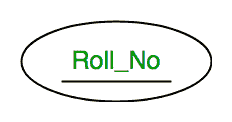

**2。复合属性–**
由许多其他属性组成的属性**称为复合属性。例如，学生实体类型的地址属性由街道、城市、州和国家组成。在 ER 图中，复合属性由一个由椭圆组成的椭圆表示。**

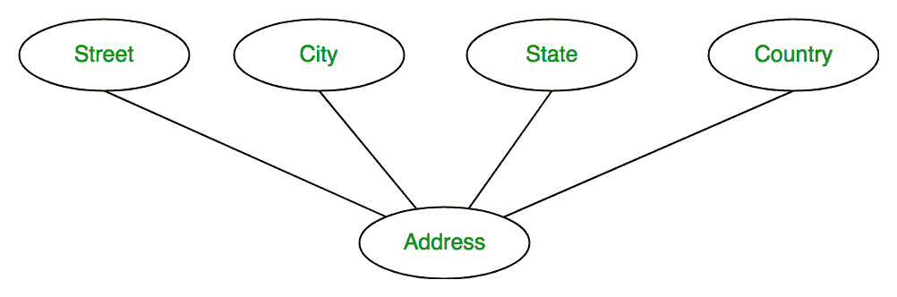

**3。多值属性–**
由给定实体的多个值组成的属性。例如，电话号码(对于给定的学生可以有多个)。在 ER 图中，多值属性用双椭圆表示。

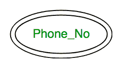

**4。派生属性–**
一个可以从实体类型的其他属性派生的属性称为派生属性。例如:年龄(可从 DOB 中得出)。在 ER 图中，派生属性用虚线椭圆表示。

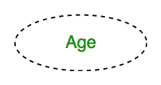

完整的实体类型**学生**及其属性可以表示为:

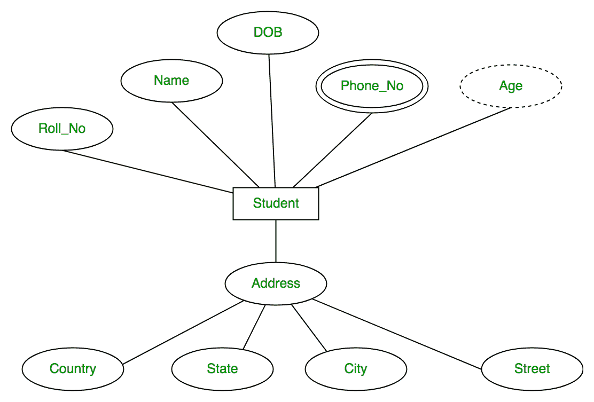

**关系类型和关系集:**
关系类型表示实体类型之间的**关联。例如，“注册”是存在于实体类型“学生”和“课程”之间的关系类型。在 ER 图中，关系类型用菱形表示，并用线连接实体。**

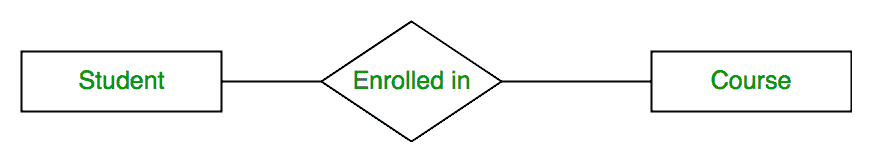

一组相同类型的关系称为关系集。下面的关系描述了 S1 在 C2 注册，S2 在 C1 注册，S3 在 C3 注册。

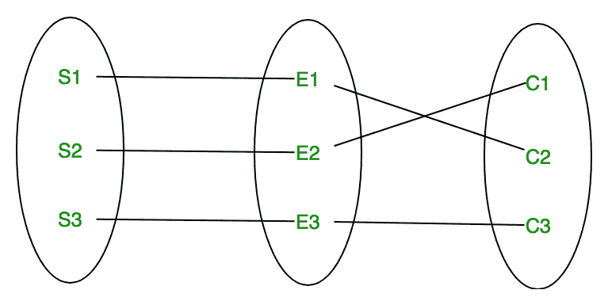

**关系集的度:**
参与关系集的不同实体集**的数量称为关系集的度。**

**1。一元关系–**
当只有**一个实体集参与关系**时，该关系称为一元关系。比如一个人只和一个人结婚。

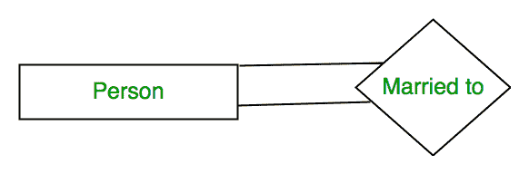

**2。二元关系–**
当有**两个实体集参与一个关系**时，该关系称为二元关系。例如，学生注册了课程。

**3。n 元关系–**
当有 n 个实体集参与一个关系时，这个关系称为 n 元关系。

**基数:**

实体集的实体参与关系集的**次数称为基数。基数可以是不同的类型:**

**1。一对一–**当每个实体集的每个实体在关系中只能参与**一次时，基数为一对一。让我们假设一个男性可以和一个女性结婚，一个女性可以和一个男性结婚。所以关系会是一对一的。**

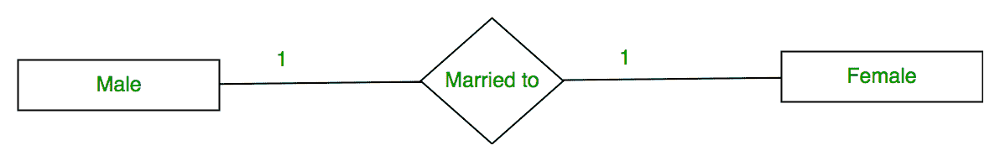

使用集合，它可以表示为:

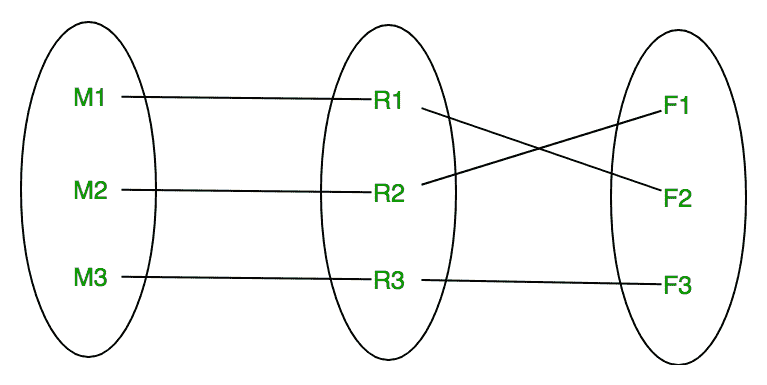

**2。多对一–**当一个实体集**中的实体在关系集中只能参与一次，而其他实体集中的实体在关系集中可以参与多次时，**基数为多对一。让我们假设一个学生只能选修一门课，但是一门课可以被很多学生选修。所以基数是 n 比 1。这意味着一门课程可以有 n 个学生，但对于一个学生来说，只有一门课程。

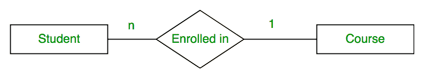

使用集合，它可以表示为:

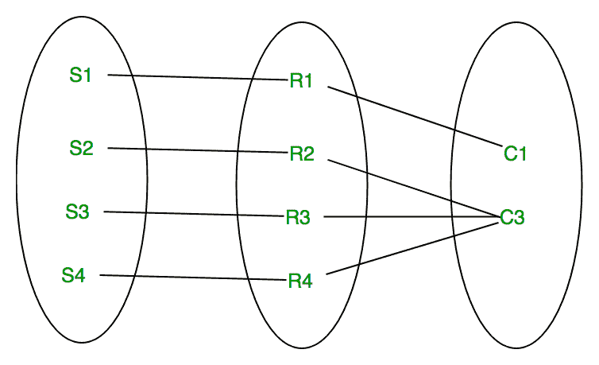

在这种情况下，每个学生只选修一门课，但有一门课被许多学生选修了。

**3。多对多–**当所有实体集的实体都可以**多次参与关系时**基数为多对多。让我们假设一个学生可以选修多门课程，一门课程可以被许多学生选修。所以关系会多对多。

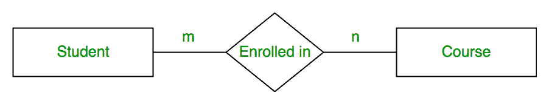

使用集合，它可以表示为:

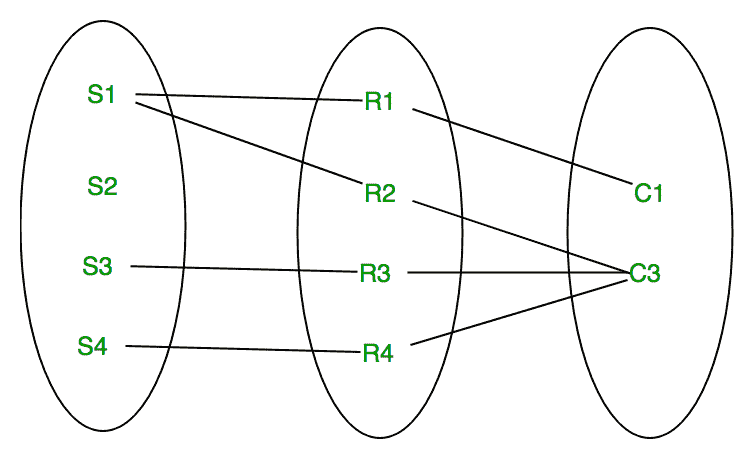

在本例中，学生 S1 在 C1 和 C3 注册，课程 C3 由 S1、S3 和 S4 注册。所以是多对多的关系。

**参与约束:**
参与约束应用于参与关系集的实体。

**1。全面参与–**实体集**中的每个实体都必须参与关系中的**。如果每个学生都必须注册一门课程，那么学生的参与将是全部。总参与度在 ER 图中用双线表示。

**2。部分参与–**实体集**中的实体可以参与也可以不参与关系中的** e。如果有些课程没有被任何学生注册，课程的参与将是部分的。

该图描述了“注册”关系集，其中学生实体集有全部参与，课程实体集有部分参与。

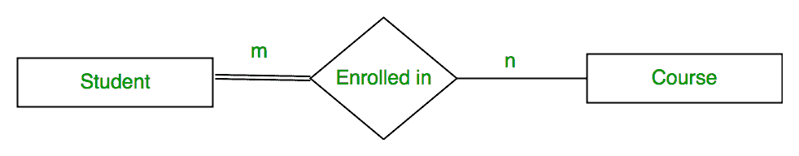

使用 set，它可以表示为，

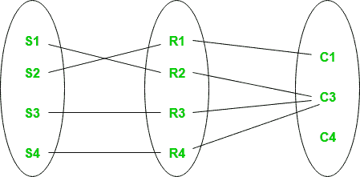

学生实体集的每个学生都参与关系，但是有一门课程 C4 没有参与关系。

**弱实体类型和识别关系:**
如前所述，实体类型具有唯一识别实体集内每个实体的关键属性。但是存在**一些无法定义关键属性的实体类型**。这些被称为弱实体类型。

例如，公司可能存储员工的受抚养人(父母、子女、配偶)的信息。但是没有员工，家属就不存在。因此，受抚养人将是弱实体类型，员工将是受抚养人的标识实体类型。

弱实体类型由双矩形表示。弱实体类型的参与总是总量。弱实体类型与其识别强实体类型之间的关系称为识别关系，用双菱形表示。

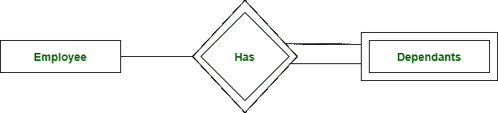

[**ER-MODEL 上的测验**](https://www.geeksforgeeks.org/dbms-gq/er-and-relational-models-gq/)

Sonal Tuteja 撰写的文章。如果您发现任何不正确的地方，或者您想分享关于上面讨论的主题的更多信息，请写评论