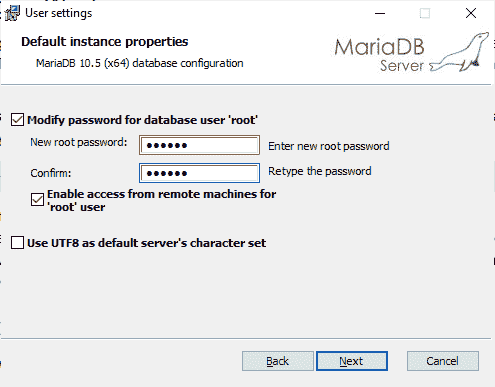
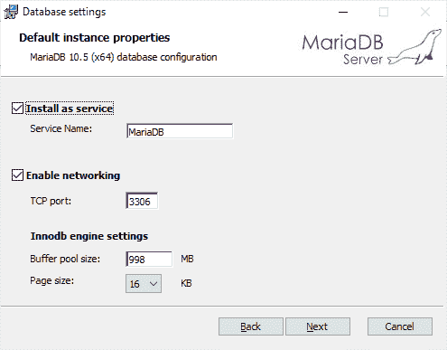
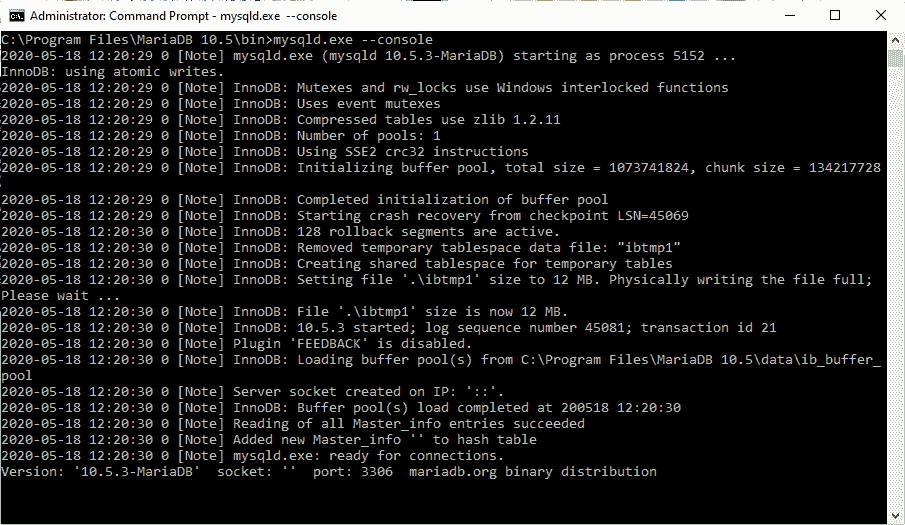

# 马里亚数据库介绍

> 原文:[https://www.geeksforgeeks.org/introduction-of-mariadb/](https://www.geeksforgeeks.org/introduction-of-mariadb/)

**马里亚数据库**是最流行的开源关系数据库管理系统之一，可以作为 MySQL 的一个很好的替代。它是由 MySQL 的原始开发者开发的。MariaDB 还可以将数据存储在各种表中。它也是大多数云产品的一部分，也是大多数 Linux 发行版的默认值。为了建立这些表之间的关系，使用了主键和外键。

### 马里亚数据库的特点

*   它快速、可扩展且健壮。
*   它拥有丰富的插件、存储引擎等生态系统，这使得它非常适用于各种各样的用例。
*   它是根据 GPL、LGPL 或 BSD 许可的。
*   它使用标准和流行的查询语言。它运行在不同的操作系统上，支持多种编程语言。
*   它还提供了对 PHP 的支持，并提供了 Galera 集群技术。

### 安装 MariaDB

**1。**下载[马里亚数据库](https://downloads.mariadb.org/)。
**2。**阅读他们的条款和条件，如果你认为这样做没问题，就接受他们。然后在下一步，只需点击下一步。
**3。**设置根密码并启用远程机器访问选项。

**4。**现在设置端口号，设置引擎缓冲池。建议将其保留为默认值。

**5。**然后点击安装。马里亚数据库将在一分钟后安装。
T21【6】。为了验证安装，请转到您的安装目录和其中的 bin 文件夹(默认为“C:\ Program Files \ MariaDB 10.5 \ bin”)。并通过地址栏打开 cmd，然后在那里写下下面的命令。

```
mysqld.exe --console

```


**注:** Mariadb 为其工作安装了一个名为 heidi 的客户端，所以它甚至可以用来和 Mariadb 一起工作。