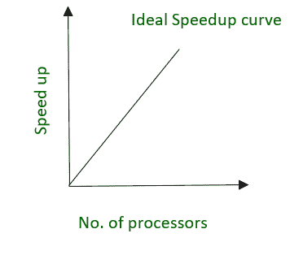
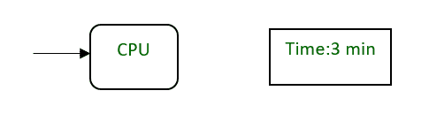
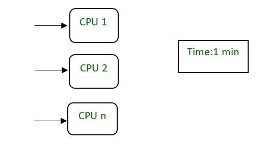
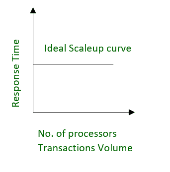
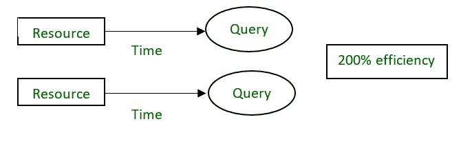

# 并行数据库介绍

> 原文:[https://www . geesforgeks . org/并行数据库简介/](https://www.geeksforgeeks.org/introduction-of-parallel-database/)

在本文中，我们将讨论并行数据库的概述，然后强调它们的需求和优势，最后将通过示例介绍性能度量因素，如加速和扩展。我们一个一个来讨论。

**并行数据库:**
如今的组织需要以高传输速率处理海量数据。对于这样的需求，客户机-服务器或集中式系统效率不高。随着提高系统效率的需要，并行数据库的概念应运而生。并行数据库系统试图通过并行化概念来提高系统的性能。

**需求:**
并行使用多个资源，如 CPU 和磁盘。这些操作是同时执行的，而不是串行处理。并行服务器可以允许多台机器上的用户访问单个数据库。它还执行许多并行化操作，如数据加载、查询处理、构建索引和评估查询。

**优势:**
在这里，我们将讨论并行数据库的优势。让我们看看。

1.  **性能提升–**
    通过并行连接 CPU 和磁盘等多个资源，我们可以显著提高系统的性能。

2.  **高可用性–**
    在并行数据库中，节点之间的联系较少，因此一个节点的故障不会导致整个系统的故障。这相当于显著提高了数据库的可用性。

3.  **适当的资源利用–**
    由于并行执行，CPU 永远不会理想。因此，适当利用资源是存在的。

4.  **提高可靠性–**
    当一个站点出现故障时，可以继续在拥有数据副本的另一个可用站点上执行。使系统更加可靠。

**数据库的性能测量:**
在这里，我们将强调性能测量因素，如加速和扩展。让我们借助例子一个一个地来理解。

**加速–**
通过增加资源数量在更短时间内执行任务的能力称为加速。

```
Speedup=time original/time parallel
Where ,
time original = time required to execute the task using 1 processor
time parallel = time required to execute the task using 'n' processors
```



图理想加速曲线

**示例–**



图一个 CPU 执行一个进程需要 3 分钟



图‘n’CPU 需要 1 分钟来执行一个进程，通过划分成更小的任务

**纵向扩展–**
当工作负载和资源成比例增加时，保持系统性能的能力。

```
Scaleup = Volume Parallel/Volume Original
Where ,
Volume Parallel = volume executed in a given amount of time using 'n' processor
Volume Original = volume executed in a given amount of time using 1 processor
```



图理想放大曲线

**示例–**
20 个用户正在以 100%的效率使用一个 CPU。如果我们试图添加更多的用户，那么单个处理器不可能处理更多的用户。可以增加一个新的处理器来并行地为用户服务。并将提供 200%的效率。

