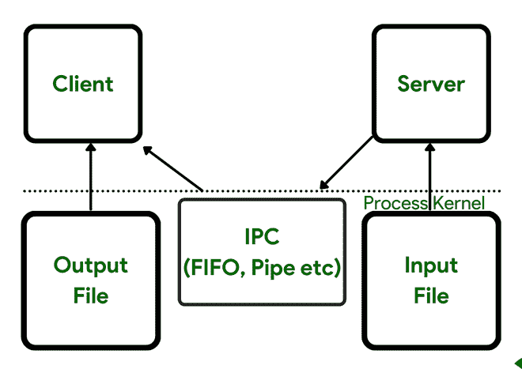

# 共享内存段介绍

> 原文:[https://www . geesforgeks . org/共享内存段介绍/](https://www.geeksforgeeks.org/introduction-of-shared-memory-segment/)

**共享内存段介绍:**
最快可以访问的 IPC 是共享内存。在内存被映射到共享内存区域的进程的地址空间之后，没有内核参与进程之间的数据传输。然而，在向共享内存区域保存数据和从共享内存区域检索数据的进程之间，通常需要某种类型的同步。互斥体、条件变量、读写锁、记录锁和信号量都在本系列的第 3 部分中进行了探讨。
考虑我们用来演示各种消息传递形式的客户机-服务器文件复制应用程序中的典型阶段。

*   输入文件由服务器读取。内核将文件中的数据读入内存，然后将其复制到进程中。
*   服务器使用管道、先进先出或消息队列将这些数据写入消息。

这些类型的 IPC 通常需要从进程到内核的数据传输。
在大多数情况下，需要四份数据。此外，这四个副本是在内核和进程之间制作的，这通常是一个昂贵的副本(比在内核或单个进程内复制数据更昂贵)。客户机和服务器之间通过内核的数据传输如图 1 所示。



图 1。

各种类型的 IPC——管道、先进先出和消息队列——的困难在于，信息必须通过内核才能让两个进程进行通信。

通过允许两个或多个进程共享内存空间，共享内存提供了一种解决方法。当然，这些进程必须协同工作来协调或同步它们对共享内存的使用。

这种同步可以使用任何策略来完成，以下是客户端-服务器示例的各个阶段:

*   服务器使用信号量来访问共享内存对象。
*   服务器从输入文件加载共享内存对象。数据缓冲区的地址是读取的第二个参数，指向共享内存对象。
*   当读取完成时，服务器向客户端发送一个信号量消息。
*   客户端将共享内存对象中的数据写入输出文件。

**创建并初始化一个信号量:**
我们建立并初始化一个信号量来保护一个我们认为是共享的变量(全局计数)。这个信号量是不必要的，因为这个假设是不正确的。注意我们如何执行 sem unlink 来从系统中移除信号量名称；然而，虽然这删除了路径名，但是它对已经打开的信号量没有影响。我们这样做是为了即使程序崩溃，路径名也会从文件系统中删除。

**设置无缓冲的标准输出和分叉:**
因为父级和子级都将写入标准输出，所以我们让它无缓冲。因此，两个过程的输出不会交错。父节点和子节点都运行一个循环，该循环将计数器增加设定的次数，只在信号量保持不变时增加变量。

## C

```
#include <stdio.h>
#include <unpipc.h>
#define GEEKSNAME "mysem"
int counter = 0;
int main(int argc, char** argv)
{
    int i, nloop;
    sem_t* mutex;
    if (argc != 2)
        err_quit("usage: incr1 <#loops>");
    nloop = atoi(argv[1]);
    /* unlink semaphore */
    mutex = Sem_open(Px_ipc_name(GEEKSNAME),
                     O_CREAT | O_EXCL, FILE_MODE, 1);
    Sem_unlink(Px_ipc_name(GEEKSNAME));
    setbuf(stdout, NULL); /* stdout is unbuffered */
    if (Fork() == 0) { /* child */
        for (i = 0; i < nloop; i++) {
            Sem_wait(mutex);
            printf("child: %d\n", counter++);
            Sem_post(mutex);
        }
        exit(0);
    }
    /* owner */
    for (i = 0; i < nloop; i++) {
        Sem_wait(mutex);
        printf("parent: %d\n", counter++);
        Sem_post(mutex);
    }
    exit(0);
}
```

可以看到，这两个进程都有自己的全局计数副本。每个变量都从 0 开始，然后增加它自己的副本。

**结论:**
因为共享内存的所有线程或进程都可以使用共享内存中数据的一个副本，所以共享内存是最快可以访问的 IPC 类型。然而，为了协调共享内存的众多线程或进程，通常需要某种类型的同步。

因为这是一种跨相关或不相关进程传输内存的技术，所以本章重点介绍了 mMap 函数和常规文件到内存的映射。我们不再需要读取、写入或试图访问已被内存映射的文件；相反，我们只是获取或保存已经被 mMap 映射到文件的内存区域。