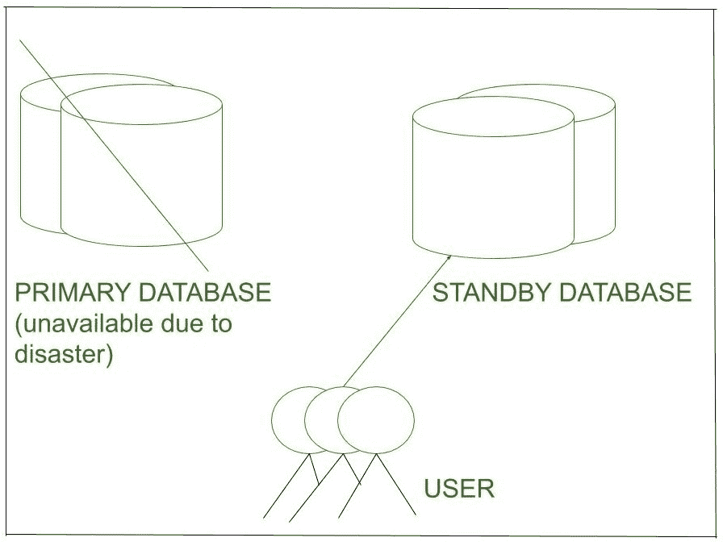

# 备用数据库介绍

> 原文:[https://www . geesforgeks . org/备用数据库介绍/](https://www.geeksforgeeks.org/introduction-of-standby-database/)

你有没有想过生成的主[数据库](https://www.geeksforgeeks.org/what-is-database/)被破坏的场景，这种情况下会发生什么？由于数据库已损坏，我们如何获取值并通过插入新数据来更新数据库？为了面对这种情况，保持系统的平稳运行，有**备用数据库**的概念。

备用数据库是从主数据库备份生成的数据库副本。如果主数据库丢失或数据损坏，可以故障切换到备用数据库。现在在这种情况下，备用数据库成为新的主数据库。

下一个问题是如何将数据从主数据库复制到备用数据库。根据主数据库中的更改更新备用数据库的步骤是什么？

1.  间隔一段时间后，主数据库更新。时间间隔可能会有所不同，但主数据库包含许多更新，例如添加新用户、删除旧内容、更改密码等。因此，数据库更新被捕获在重做日志中，以将其复制到备用数据库。
2.  重做日志中的更新一次并不是最终的。它们被循环覆盖。因为重做日志是临时的，所以会制作重做日志的副本。这叫做存档日志。与重做日志不同，这是永久副本。
3.  保存的存档日志现在被移动到备用服务器。传输的归档日志中的修改应用于备用数据库，从而用主数据库更新备用数据库。

**备用数据库优势:**

*   **灾难保护–**
    例如，维护主数据库和备用数据库，以便在主数据库驱动器出现故障时，备用数据库可以被激活，正常操作可以恢复，并防止任何即将到来的灾难。
*   **防止数据损坏–**
    例如，备用数据库通过不将损坏的日志应用于备用数据库，为主数据库中的不正确批处理作业、用户错误或应用程序损坏提供可能的保护。然后可以激活未损坏的备用数据库，使其成为主数据库。

**附加报告:**
备用数据库的附加要求是:

1.  **额外的计算机–**
    为了在单独的主机上维护备用数据库，额外的一台计算机用于帮助减少未来的灾难。
2.  **额外存储–**
    我们需要额外的系统资源和额外的存储空间。
3.  **管理–**
    需要管理备用数据库来复制在主数据库上执行的操作。