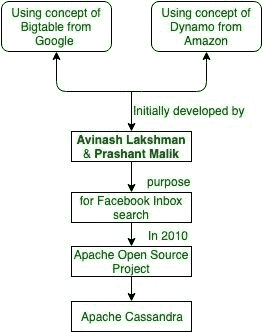
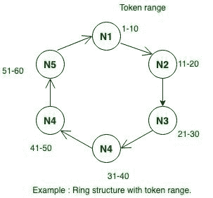

# 阿帕奇卡珊德拉介绍

> 原文:[https://www . geesforgeks . org/introduction-to-Apache-Cassandra/](https://www.geeksforgeeks.org/introduction-to-apache-cassandra/)

**Cassandra** 是一个开源的分布式数据库管理系统，具有宽列存储、NoSQL 数据库，能够处理跨多种商品服务器的大量数据，提供高可用性，无单点故障。它是用 Java 编写的，由 Apache 软件基金会开发。

阿维纳什·拉克什曼 & **普拉尚特·马利克**最初在脸书开发了卡珊德拉，为脸书收件箱搜索功能提供动力。脸书在 2008 年 7 月发布了作为谷歌代码开源项目的 Cassandra。2009 年 3 月成为 Apache 孵化器项目，2010 年 2 月成为顶级项目。由于其突出的技术特点，卡珊德拉变得如此受欢迎。

卡珊德拉介绍

Apache Cassandra 用于管理分布在世界各地的大量结构数据。它提供高度可用的服务，没有单点故障。以下是阿帕奇·卡珊德拉的一些观点:

*   它具有可伸缩性、容错性和一致性。
*   它是面向列的数据库。
*   其分布式设计基于亚马逊的 Dynamo，其数据模型基于谷歌的 Big table。
*   它是在脸书创建的，与关系数据库管理系统有很大的不同。

卡珊德拉实现了一个迪纳摩式的复制模型，没有单点故障，但它增加了一个更强大的“列族”数据模型。脸书、推特、思科、Rackspace、易贝、网飞等一些大公司正在使用 Cassandra。

Cassandra 的设计目标是跨多个节点处理大数据工作负载，而没有任何单点故障。Cassandra 具有跨节点的对等分布式系统，数据分布在集群的所有节点上。

卡珊德拉集群中的所有节点都扮演相同的角色。每个节点都是独立的，同时又与其他节点互连。群集中的每个节点都可以接受读写请求，而不管数据实际位于群集中的什么位置。当一个节点发生故障时，可以从网络中的其他节点发出读/写请求。

**卡珊德拉的特点:**
卡珊德拉因其技术特点而走红。卡珊德拉有一些特点:

1.  **轻松的数据分发–**
    它通过跨多个数据中心复制数据，提供了将数据分发到所需位置的灵活性。
    例如:
    如果有 5 个节点，比如 N1、N2、N3、N4、N5，通过使用分区算法，我们将决定令牌范围并相应地分发数据。每个节点都有特定令牌范围，数据将在其中分发。让我们看一下图表，以便更好地理解。 

    具有令牌范围的环结构

2.  **灵活的数据存储–**
    卡珊德拉适应所有可能的数据格式，包括:结构化、半结构化和非结构化。它可以根据您的需要动态地适应数据结构的变化。
3.  **弹性可扩展性–**
    Cassandra 具有很高的可扩展性，可以根据需求添加更多的硬件来容纳更多的客户和数据。
4.  **Fast writes–**
    卡珊德拉被设计成在廉价的商品硬件上运行。Cassandra 的写入速度极快，可以存储数百万亿字节的数据，而不会牺牲读取效率。
5.  **始终开启体系结构–**
    卡珊德拉没有单点故障，它可持续用于无法承受故障的关键业务应用。
6.  **快速线性扩展性能–**
    Cassandra 可线性扩展，因此当您增加集群中的节点数量时，它会增加您的吞吐量。它保持快速的响应时间。
7.  **事务支持–**
    卡珊德拉支持事务的原子性、一致性、隔离性和持久性(ACID)等属性。