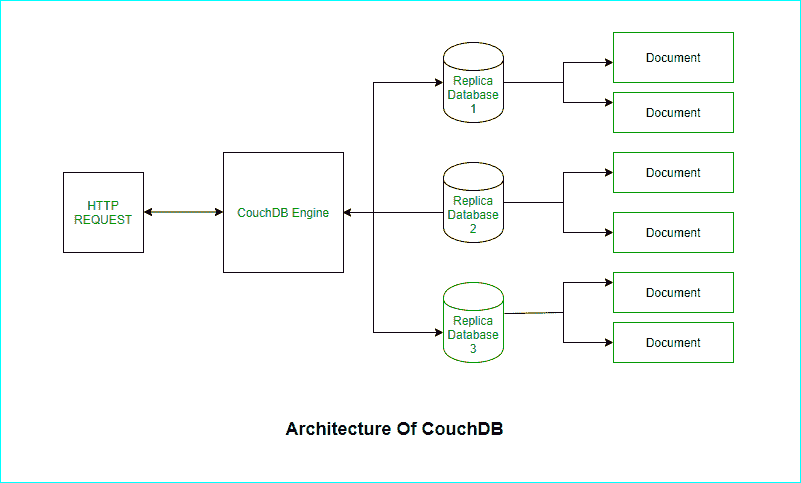

# Apache couch db 简介

> 原文:[https://www . geesforgeks . org/introduction-to-Apache-couch db/](https://www.geeksforgeeks.org/introduction-to-apache-couchdb/)

Apache CouchDB 由 Apache 软件基金会开发，最初于 2005 年发布。CouchDB 是用 Erlang 写的。它是一个开源数据库，使用各种不同的格式和协议来存储、传输和处理其数据。它使用 JSON 存储数据，使用 MapReduce 将 JavaScript 作为其查询语言，使用 HTTP 作为 API。文档是 CouchDB 中的主要数据单元，它们还包括元数据。文档字段具有唯一的名称，包含不同类型的值，并且对文本大小或元素数量没有设置限制。

### 历史

CouchDB 是用 Erlang 编程语言编写的。它由达米安·卡茨于 2005 年创立。CouchDB 在 2008 年成为了一个 Apache 项目。目前版本的 CouchDB 是 1.61。

### 建筑

CouchDB 的架构描述如下:

1.  **CouchDB Engine:** 它基于 B 树，在 B 树中，数据通过直接映射到底层 B 树操作的键或键范围来访问。它是管理存储内部数据、文档和视图的系统的核心。
2.  **HTTP Request:** 用于创建索引和从文档中提取数据。它是用 JavaScript 编写的，允许创建由 MapReduce 作业组成的即席视图。
3.  **文档:**存储大量数据。
4.  **副本数据库:**用于将数据复制到本地或远程数据库，并同步设计文档。

### CouchDB 的特性

CouchDB 的功能包括以下内容:

1.  **复制:**它提供了最简单的复制形式，没有其他数据库复制起来这么简单。
2.  **文档存储:**它是一个 NoSQL 数据库，遵循文档存储，其中每个字段都有唯一的名称，并包含各种数据类型的值，如文本、数字、布尔值、列表等。
3.  **ACID 属性:**CouchDB 文件布局遵循 ACID 属性的所有特性。
4.  **安全性:**它还提供数据库级安全性，权限分为读者和管理员，读者可以对数据库进行读写。
5.  **地图/缩小:**couch db 受欢迎的主要原因是地图/缩小系统。
6.  **身份验证:** CouchDB 便于您通过类似于 web 应用程序的会话 cookie 来保持身份验证的开放性。
7.  **专为离线打造:** CouchDB 可以复制到智能手机等设备上，这些设备具有离线功能，并在设备恢复在线时为您处理数据同步。
8.  **最终一致性:** CouchDB 保证最终一致性，以提供可用性和分区容差。
9.  **HTTP API:** 所有项目都有一个唯一的 URI(唯一资源标识符)，通过 HTTP 公开。它使用像 POST、GET、PUT 和 DELETE 这样的 HTTP 方法对所有资源进行四种基本的 CRUD(创建、读取、更新、删除)操作。

### CouchDB 的优势

CouchDB 的优势包括以下几点:

1.  HTTP 应用编程接口用于方便通信。
2.  它用于存储任何类型的数据。
3.  ReduceMap 允许优化数据的组合。
4.  CouchDB 的结构非常简单
5.  快速索引和检索。

### CouchDB 的缺点

CouchDB 的缺点包括以下几点:

1.  CouchDB 占用很大的开销空间，与其他数据库相比，这是一个主要的缺点。
2.  任意查询是昂贵的。
3.  与大多数替代方案相比，CouchDB 有一点额外的空间开销。
4.  大型数据集上的临时视图非常慢。
5.  它不支持交易
6.  大型数据库的复制可能会失败。