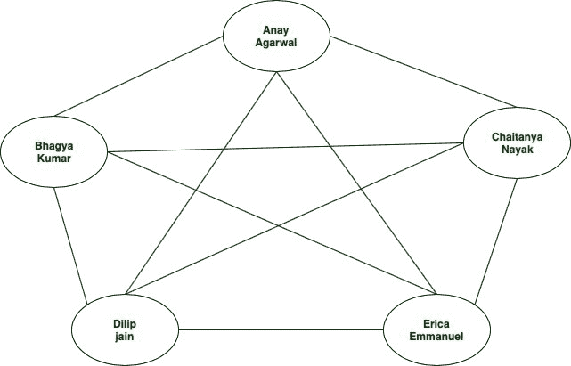
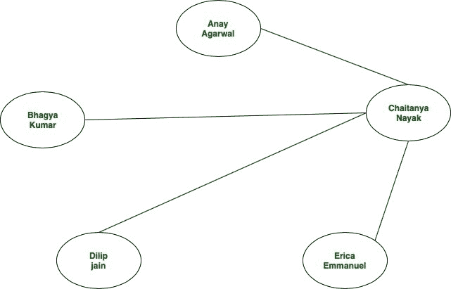

# 图形数据库介绍

> 原文:[https://www . geesforgeks . org/introduction-to-graph-databases/](https://www.geeksforgeeks.org/introduction-to-graph-databases/)

**什么是图形数据库？**
图形数据库旨在将数据之间的关系视为对数据本身同样重要。

**为什么图形数据库很重要？**
因为图擅长处理关系，所以一些数据库以图的形式存储数据。

**示例**
我们有一个社交网络，在这个网络中，五个朋友都是有联系的。这些朋友是阿奈、巴格亚、柴坦尼亚、陈爱龙和埃里卡。存储他们个人信息的图形数据库可能如下所示:

**以上示例但是使用传统的数据库方法**
我们现在将使用关系数据库来存储信息。我们很可能使用两个表——一个用于存储每个用户的信息，另一个用于存储用户之间的关系。“用户”表是这样的:

| 身份证明（identification） | 西方人名的第一个字 | 姓 | 电子邮件 | 电话 |
| one | 走开！走开 | 阿加瓦尔 | anay@example.net | 555-111-5555 |
| Two | 巴哈伊 | 库马尔 | bhagya@example.net | 555-222-5555 |
| three | 柴坦尼亚 | 他是个傻瓜 | chaitanya@example.net | 555-333-5555 |
| four | 迪利普 | 耆那教教徒 | dilip@example.net | 555-444-5555 |
| five | 石南科灌木 | 以马内利 | erica@example.net | 555-555-5555 |

现在，我们还需要另一张表来捕捉用户/朋友之间的友谊/关系。我们的友谊表看起来像这样:

| 用户 id | 朋友 id |
| one | Two |
| one | three |
| one | four |
| one | five |
| Two | one |
| Two | three |
| Two | four |
| Two | five |
| three | one |
| three | Two |
| three | four |
| three | five |
| four | one |
| four | Two |
| four | three |
| four | five |
| five | one |
| five | Two |
| five | three |
| five | four |

我们将避免深入数据库(主键和外键)理论。相反，假设友谊表使用两个朋友的 id。

假设我们的社交网络有一个功能，允许每个用户看到他/她的朋友的个人信息。所以，如果柴坦尼亚要求提供信息，那就意味着她需要关于阿纳伊、巴格亚、陈爱龙和埃里卡的信息。我们将以传统的方式(关系数据库)来处理这个问题。我们必须首先在用户表中识别柴坦尼亚的 id:

| 身份证明（identification） | 西方人名的第一个字 | 姓 | 电子邮件 | 电话 |
| three | 柴坦尼亚 | 他是个傻瓜 | chaitanya@example.net | 555-333-5555 |

现在，我们将在用户 id 为 3 的友谊表中查找所有元组。结果关系如下所示:

| 用户 id | 朋友 id |
| three | one |
| three | Two |
| three | four |
| three | five |

现在，让我们分析一下这种关系数据库方法所花费的时间。这大约是对数(N)次，其中 N 代表友谊表中元组的数量或关系的数量。在这里，数据库按照 id 的顺序维护行。因此，一般来说，对于‘M’个查询，我们的时间复杂度为 **M*log(N)**

只有当我们使用图形数据库方法时，总的时间复杂度才会是 O(N)。因为，一旦我们在数据库中找到了辛迪，我们只需要迈出一步就能找到她的朋友。以下是我们的查询将如何执行:

**缺点:**
请注意，图形数据库并不总是应用程序的最佳解决方案。在决定架构之前，我们需要评估应用程序的需求。

