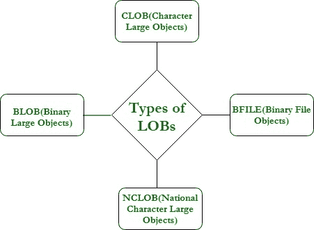
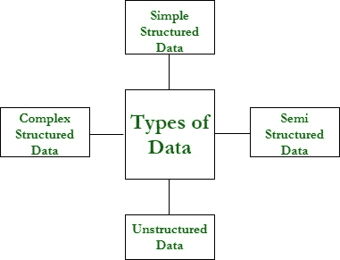

# 大型物体介绍(LOBs)

> 原文:[https://www . geesforgeks . org/introduction-to-大型对象-lobs/](https://www.geeksforgeeks.org/introduction-to-large-objects-lobs/)

**大型对象(LOBs)** 是数据类型的集合，旨在保存大量数据。一个业务线能够容纳的最大容量从**8tb 到**128 TB 不等，这取决于您的数据库是如何配置的。将数据存储到 LOBs 中有助于您在自己的应用程序中高效地操作&访问数据。

**为什么要使用大对象**
下面是开发应用程序时可能遇到的不同类型的数据。让我们看看其中哪一个适合大物体。

*   **简单结构化数据:**这些数据可以组织成简单的表格，表格的结构基于业务规则。
*   **复杂的结构化数据:**这些数据本质上是复杂的&非常适合 Oracle 数据库的对象关系特性，例如引用、集合和用户定义的类型。
*   **半结构化数据:**这种类型的数据具有数据库通常不解释的逻辑结构。例如，由任何应用程序或任何外部服务处理的 XML 文档可以被认为是半结构化数据。
*   **非结构化数据:**这种类型的数据通常不会被数据库或应用程序解释，也不会分解成更小的逻辑结构。非结构化数据的一个例子是存储为二进制文件的照片图像。

所以基本上，大对象适合上面最后两种数据:**半结构化** & **非结构化数据**。大型对象功能允许您将这两种数据存储在数据库以及通常从数据库访问的操作系统文件中。

**LOBs 的优势:**
随着内容丰富的应用程序和互联网的增长，数据库支持以下数据类型变得非常重要:

*   能够以高效的方式轻松存储非结构化和半结构化数据。
*   对于大数据量，可以进行优化。
*   为访问存储在数据库外部或数据库内部的数据提供统一的方式。

这些是由大型数据库对象或业务对象提供的。