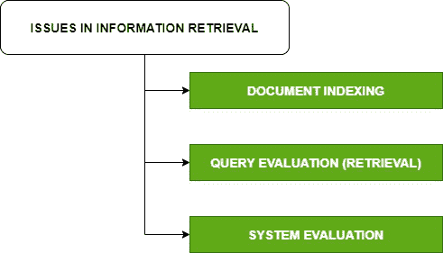

# 信息检索中的问题

> 原文:[https://www . geesforgeks . org/issues-in-information-retrieval/](https://www.geeksforgeeks.org/issues-in-information-retrieval/)

**索引**是任何信息检索系统中最重要的部分。这是一个将用户所需的文档转换成可搜索数据结构的过程。索引也可以称为提取过程，而不是分析特定内容。它创建了信息检索过程的核心功能，因为它是信息检索的第一步，有助于高效的信息检索。

在这个过程中，首先，创建文档代理来表示每个文档。其次，它需要分析原始文档，包括简单的(识别元信息，如作者、标题、主题等。)和复杂(内容的语言分析)数据。索引是用来加快搜索速度的数据结构。

**信息检索中的评估**是通过使用由一组标准控制的特定标准来系统地确定一个主题的优点、价值和重要性的过程。

**信息检索中的问题:**
信息检索的主要问题是文档和查询索引、查询评估和系统评估。

1.  **文档和查询索引–**
    文档和查询索引的主要目标是找到重要的含义并创建内部表示。要考虑的因素是表示语义的准确性、详尽性和计算机操作的便利性。
2.  **查询评估–**
    在检索模型中，如何用选定的关键词来表示文档，以及如何将文档和查询表示进行比较来计算分数。信息检索处理信息系统中的不确定性和模糊性等问题。
    *   **不确定性:**
        可用的表示通常不能反映图像、视频等对象的真实语义。
    *   **模糊性:**
        用户需要的信息缺乏清晰性，只是在查询、反馈或用户动作中模糊表达。
3.  **系统评估–**
    系统评估讲述了确定给定信息对用户成就的影响的重要性。这里，我们看看特定系统的效率是否与时间和空间有关。