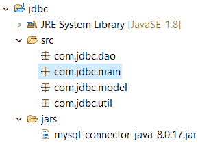
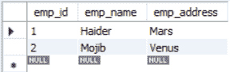
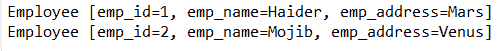
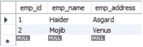
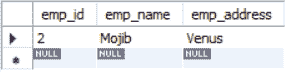

# 使用模型对象和单例类的 JDBC

> 原文:[https://www . geesforgeks . org/JDBC-使用模型-对象-单例-类/](https://www.geeksforgeeks.org/jdbc-using-model-object-and-singleton-class/)

本文解释了如何使用一个**模型**对象和一个来自 [MySQL 数据库](https://www.geeksforgeeks.org/mysql-database-files/)的 **[单例](https://www.geeksforgeeks.org/singleton-design-pattern/)** 连接类来执行 JDBC 操作。

**[【JDBC】](https://www.geeksforgeeks.org/jdbc-drivers/)**是一个用于 Java 的[应用程序编程接口](https://www.geeksforgeeks.org/introduction-to-apis/)，它将一个 Java 应用程序与一个数据库连接起来以执行 **CRUD** 操作。

**先决条件:**

*   JDK 7+ ( [点击此处下载)](https://www.oracle.com/technetwork/java/javase/downloads/jdk8-downloads-2133151.html)
*   MySQL 数据库([点击此处下载](https://dev.mysql.com/downloads/installer/))
*   MySQL J 连接器([点击此处下载](https://dev.mysql.com/downloads/connector/j/))
*   JDBC 基础([点击此处学习 JDBC](https://www.geeksforgeeks.org/performing-database-operations-java-sql-create-insert-update-delete-select/) )
*   Eclipse 或任何其他集成开发环境

**[模型类](https://www.geeksforgeeks.org/mvc-design-pattern/) :** 模型类在 [MVC 模式](https://www.geeksforgeeks.org/mvc-design-pattern/)中被高度使用，它作为业务逻辑和视图之间的中间媒介。通常，模型包含特定实体的一些变量和方法。

**[Singleton 类](https://www.geeksforgeeks.org/singleton-design-pattern/) :** Singleton 类是一种软件设计模式，确保该类只有一个实例。[实现单例类](https://www.geeksforgeeks.org/java-singleton-design-pattern-practices-examples/)有多种方式。

**方法:**我们将创建一个包含雇员表的组织数据库。我们还将创建一个与组织数据库连接的 java 应用程序。连接将由包含所有必要驱动程序信息的单例类建立。在 java 应用程序中，我们将使用 Employee 的模型对象执行一些数据操作任务，如插入、删除、更新和检索。

1.  **创建 MySQL 数据库和表:**

    ```
    create database org;
    use org;
    create table employee(
        emp_id int auto_increment,
        emp_name varchar(400),
        emp_address varchar(400),
        primary key (emp_id)
    );

    ```

2.  **Project setup in eclipse:**
    *   在 eclipse 中创建一个名为“jdbc”的项目
    *   在该项目中创建一个名为“jars”的文件夹，并将 MySQL J Connector 粘贴到该文件夹中
    *   向 java 构建路径添加 jar
    *   创建 4 个包:com.jdbc.util、com.jdbc.dao、com.jdbc.model 和 com.jdbc.main

    [](https://media.geeksforgeeks.org/wp-content/uploads/20200202204033/Capture2104-1.png)

3.  **数据库连接:**在 com.jdbc.util 包中创建单例连接类 Database connection。在变量用户上使用您的 MySQL 用户名和密码，然后通过。仔细看“url”变量的最后一部分。必须保持名称与数据库名称相同。我的数据库的名称是“org”，这就是为什么我把“org”放在 URL 变量中。

    ## 数据库连接类

    ```
    package com.jdbc.util;

    import java.sql.Connection;
    import java.sql.DriverManager;
    import java.sql.SQLException;

    public class DatabaseConnection {

        private static Connection con = null;

        static
        {
            String url = "jdbc:mysql:// localhost:3306/org";
            String user = "root";
            String pass = "root";
            try {
                Class.forName("com.mysql.jdbc.Driver");
                con = DriverManager.getConnection(url, user, pass);
            }
            catch (ClassNotFoundException | SQLException e) {
                e.printStackTrace();
            }
        }
        public static Connection getConnection()
        {
            return con;
        }
    }
    ```

4.  **模型类:**在 com.jdbc.model 包中创建一个名为 Employee 的模型类。它应该包含作为变量的所有属性。

    ## 模型类

    ```
    package com.jdbc.model;

    public class Employee {

        int emp_id;
        String emp_name;
        String emp_address;

        public Employee() {}

        public Employee(String emp_name, String emp_address)
        {
            this.emp_name = emp_name;
            this.emp_address = emp_address;
        }

        public int getEmp_id()
        {
            return emp_id;
        }

        public void setEmp_id(int emp_id)
        {
            this.emp_id = emp_id;
        }

        public String getEmp_name()
        {
            return emp_name;
        }

        public void setEmp_name(String emp_name)
        {
            this.emp_name = emp_name;
        }

        public String getEmp_address()
        {
            return emp_address;
        }

        public void setEmp_address(String emp_address)
        {
            this.emp_address = emp_address;
        }

        @Override
        public String toString()
        {
            return "Employee [emp_id=" + emp_id + ", 
    emp_name=" + emp_name + ", 
    emp_address=" + emp_address + "]";
        }
    }
    ```

5.  **数据库访问对象(DAO):** 我们将创建一个 EmployeeDao 接口和另一个实现 EmployeeDao 的 EmployeeDao 实现类。这个实现的类将被用作执行 CRUD 操作的 DAO。我们将使用 PreparedStatement 来执行查询。PreparedStatement 有 3 种特殊方法:

    ## 员工个人界面

    ```
    package com.jdbc.dao;

    import java.sql.SQLException;
    import java.util.List;

    import com.jdbc.model.Employee;

    public interface EmployeeDao {

        public int add(Employee emp)
            throws SQLException;
        public void delete(int id)
            throws SQLException;
        public Employee getEmployee(int id)
            throws SQLException;
        public List<Employee> getEmployees()
            throws SQLException;
        public void update(Employee emp)
            throws SQLException;
    }
    ```

    ## 员工实施类

    ```
    package com.jdbc.dao;

    import java.sql.Connection;
    import java.sql.PreparedStatement;
    import java.sql.ResultSet;
    import java.sql.SQLException;
    import java.util.ArrayList;
    import java.util.List;

    import com.jdbc.model.Employee;
    import com.jdbc.util.DatabaseConnection;

    public class EmployeeDaoImplementation
        implements EmployeeDao {

        static Connection con
            = DatabaseConnection.getConnection();

        @Override
        public int add(Employee emp)
            throws SQLException
        {

            String query
                = "insert into employee(emp_name, "
                  + "emp_address) VALUES (?, ?)";
            PreparedStatement ps
                = con.prepareStatement(query);
            ps.setString(1, emp.getEmp_name());
            ps.setString(2, emp.getEmp_address());
            int n = ps.executeUpdate();
            return n;
        }

        @Override
        public void delete(int id)
            throws SQLException
        {
            String query
                = "delete from employee where emp_id =?";
            PreparedStatement ps
                = con.prepareStatement(query);
            ps.setInt(1, id);
            ps.executeUpdate();
        }

        @Override
        public Employee getEmployee(int id)
            throws SQLException
        {

            String query
                = "select * from employee where emp_id= ?";
            PreparedStatement ps
                = con.prepareStatement(query);

            ps.setInt(1, id);
            Employee emp = new Employee();
            ResultSet rs = ps.executeQuery();
            boolean check = false;

            while (rs.next()) {
                check = true;
                emp.setEmp_id(rs.getInt("emp_id"));
                emp.setEmp_name(rs.getString("emp_name"));
                emp.setEmp_address(rs.getString("emp_address"));
            }

            if (check == true) {
                return emp;
            }
            else
                return null;
        }

        @Override
        public List<Employee> getEmployees()
            throws SQLException
        {
            String query = "select * from employee";
            PreparedStatement ps
                = con.prepareStatement(query);
            ResultSet rs = ps.executeQuery();
            List<Employee> ls = new ArrayList();

            while (rs.next()) {
                Employee emp = new Employee();
                emp.setEmp_id(rs.getInt("emp_id"));
                emp.setEmp_name(rs.getString("emp_name"));
                emp.setEmp_address(rs.getString("emp_address"));
                ls.add(emp);
            }
            return ls;
        }

        @Override
        public void update(Employee emp)
            throws SQLException
        {

            String query
                = "update employee set emp_name=?, "
                  + " emp_address= ? where emp_id = ?";
            PreparedStatement ps
                = con.prepareStatement(query);
            ps.setString(1, emp.getEmp_name());
            ps.setString(2, emp.getEmp_address());
            ps.setInt(3, emp.getEmp_id());
            ps.executeUpdate();
        }
    }
    ```

    *   executeQuery():用于检索数据
    *   executeUpdate():用于插入、更新、删除
    *   execute():用于创建
6.  **测试应用程序:**最后，是时候使用 EmployeeDaoImplementation 的所有方法来执行 CRUD 应用程序了。在 com.jdbc.main 包中创建一个 Application 类。

    ## 驱动程序代码

    ```
    package com.jdbc.main;

    import java.sql.SQLException;
    import java.util.List;

    import com.jdbc.dao.EmployeeDaoImplementation;
    import com.jdbc.model.Employee;

    public class Application {

        public static void main(String[] args)
            throws SQLException
        {

            Employee emp = new Employee();
            emp.setEmp_name("Haider");
            emp.setEmp_address("Mars");
            EmployeeDaoImplementation empDao
                = new EmployeeDaoImplementation();

            // add
            empDao.add(emp);

            // read
            Employee e = empDao.getEmployee(1);
            System.out.println(e.getEmp_id() + " "
                               + e.getEmp_name() + " "
                               + e.getEmp_address());

            // read All
            List<Employee> ls = empDao.getEmployees();
            for (Employee allEmp : ls) {
                System.out.println(allEmp);
            }

            // update
            Employee tempEmployee = empDao.getEmployee(1);
            tempEmployee.setEmp_address("Asgard");
            empDao.update(tempEmployee);

            // delete
            empDao.delete(1);
        }
    }
    ```

**输出:**

*   对于**插入操作**，您必须查看组织数据库中的员工表。
    [](https://media.geeksforgeeks.org/wp-content/uploads/20200204205646/add6.png)
*   对于**读取一项**，使用 id 获取数据并打印到控制台。
    [](https://media.geeksforgeeks.org/wp-content/uploads/20200204205935/read4.png)
*   对于**显示所有项目**，只需调用方法并将其打印到控制台。
    [](https://media.geeksforgeeks.org/wp-content/uploads/20200204210124/read-all.png)
*   **更新操作**应该将更新后的值更改到数据库中。
    [](https://media.geeksforgeeks.org/wp-content/uploads/20200204210746/update3.png)
*   **删除操作**将从数据库中删除该 id 的信息。
    [](https://media.geeksforgeeks.org/wp-content/uploads/20200204210919/delete2.png)