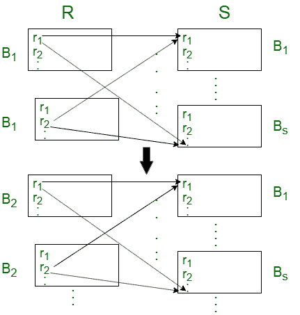
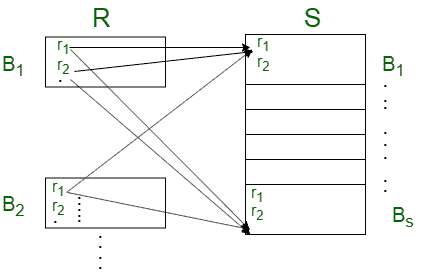
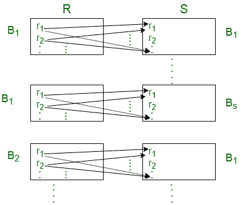
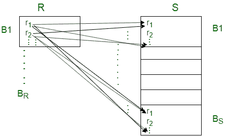

# 数据库中的连接算法

> 原文:[https://www.geeksforgeeks.org/join-algorithms-in-database/](https://www.geeksforgeeks.org/join-algorithms-in-database/)

计算数据库中两个关系的自然连接和条件连接有两种算法:嵌套循环连接和块嵌套循环连接。

为了理解这些算法，我们将假设有两个关系，关系 R 和关系 s。关系 R 具有 T <sub>R</sub> 元组并占据 B <sub>R</sub> 块。关系 S 有 T <sub>S</sub> 元组，占用 B <sub>S</sub> 块。我们还将假设关系 R 是外部关系，S 是内部关系。

### **嵌套循环连接**

在嵌套循环连接算法中，对于外部关系中的每个元组，我们必须将其与内部关系中的所有元组进行比较，然后只考虑外部关系的下一个元组。满足条件的所有元组对都被添加到连接的结果中。

```
for each tuple tR in TR do
 for each tuple ts in Ts do
  compare (tR, ts) if they satisfies the condition
  add them in the result of the join
 end 
end
```

这种算法被称为嵌套连接，因为它由嵌套 for 循环组成。

让我们看一些案例来理解这个算法的性能，

**情况-1:** 假设只有两个主存储器块可用于存储来自 R 和 S 关系的块。



对于与 R 相关的每个元组，我们必须传输关系 S 的所有块，并且关系 R 的每个块应该只传输一次。
因此，所需的总区块转移= T<sub>R</sub>* B<sub>S</sub>+B<sub>R</sub>

**情况-2:** 假设一个关系完全适合主内存，并且至少有一个额外块的空间。



在这种情况下，关系块 S(即内部关系)只传送一次，并保存在主存储器中，关系块 R 按顺序传送。因此，这两个关系的所有块只被转移一次。
因此，所需的总区块转移= B <sub>R</sub> + B <sub>S</sub>

具有较少数量块的关系应该是最小化主存储器中完成连接所需的块访问总数的外部关系。
即 min(B <sub>R</sub> 、B <sub>S</sub> )+1 是主内存中连接两个关系所需的最小块数，这样就不会有块被传输超过一次。

在嵌套循环连接中，如果为连接分配的主内存空间非常有限，则连接关系需要更多的访问开销。

### **块嵌套循环连接:**

在块嵌套循环连接中，对于一个外部关系块，将该块中的所有元组与内部关系的所有元组进行比较，然后只考虑下一个外部关系块。满足条件的所有元组对都被添加到连接的结果中。

```
for each block bR in BR do
 for each block bs in BS do
  for each tuple tR in TR do
   for each tuple ts in Ts do
    compare (tR, ts) if they satisfies the condition
    add them in the result of the join
   end
  end 
 end
end 
```

让我们看一些类似嵌套循环连接的情况，

**情况-1:** 假设只有两个主存储器块可用于存储来自 R 和 S 关系的块。



对于关系 R 的每个块，我们必须转移关系 S 的所有块，并且关系 R 的每个块应该只转移一次。
因此，所需的总块传输= B<sub>R</sub>+B<sub>R</sub>* B<sub>S</sub>

**情况-2:** 假设一个关系完全适合主内存，并且至少有一个额外块的空间。



在这种情况下，所需的总块传输类似于嵌套循环连接。
如果为连接分配的主内存空间有限，块嵌套循环连接算法相比嵌套循环连接降低了访问成本。

**相关 GATE 问题:**

*   [Gate IT 2005 |问题 84](https://www.geeksforgeeks.org/gate-gate-it-2005-question-84/)
*   [Gate IT 2005 |问题 85](https://www.geeksforgeeks.org/gate-gate-it-2005-question-85/)