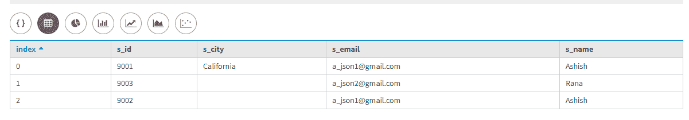
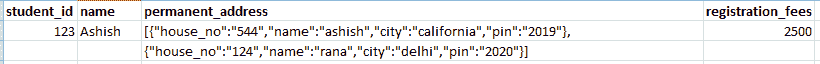
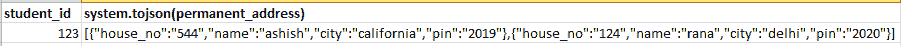

# Cassandra 中的 JSON 格式

> 原文:[https://www.geeksforgeeks.org/json-format-in-cassandra/](https://www.geeksforgeeks.org/json-format-in-cassandra/)

在本文中，我们将讨论 JSON JavaScript Object notification 格式将数据插入到表中，这很有用，并且以编程方式插入列及其值比使用 cqlsh 更实用。对于测试和验证查询，cqlsh 非常方便。

[卡珊德拉查询语言(CQL)](https://www.geeksforgeeks.org/additional-functions-in-cql-cassandra-query-language/) 支持的 JSON 格式，其中数据作为字符串插入，但实际上作为给定的数据类型值存储。

例如，如果 id 具有 int 数据类型，那么 Id 的值将像“Id”一样插入:“101”，但实际上它将作为 INT 存储。让我们考虑一个表 student_registration，其中 s_id、s_name、s_city、s_email 是字段。

```
CREATE TABLE student_registration(
s_id int PRIMARY KEY, 
s_name text, 
s_city text, 
s_email text
); 
```

现在，我们将以 JSON 格式将数据插入到 student_registration 表中。让我们看看。

```
INSERT INTO student_registration
JSON '{
"s_id" : "9001",
"s_name" : "Ashish",
"s_city" : "California",
"s_email": "a_json1@gmail.com"
}';

INSERT INTO student_registration
JSON '{
"s_id" : "9002",
"s_name" : "Ashish",
"s_email": "a_json1@gmail.com"
}' ;

INSERT INTO student_registration
JSON '{
"s_id" : "9003",
"s_name" : "Rana",
"s_email": "a_json2@gmail.com"
}' ; 
```

让我们使用下面的 CQL 查询来查看输出。

```
select * 
from student_registration; 
```

**输出:**



这里，s_city 值不是使用 JSON 插入的，所以默认情况下会插入空值。

**嵌套 JSON:**
我们先用一个嵌套 JSON 的例子来理解我们正在创建的[用户定义类型](https://www.geeksforgeeks.org/overview-of-user-defined-type-udt-in-cassandra/)永久 _ 地址，其中门牌号、姓名、城市、pin 是字段。

```
CREATE type permanent_address
( 
house_no int, 
name text, 
city text,
pin int 
); 
```

现在，我们正在为注册目的创建 registration_form 表，其中有学生 id、姓名、注册费和永久地址等字段。

```
CREATE TABLE registration_form( 
"student_id" int  PRIMARY KEY, 
"name" text, 
"registration_fees" int, 
"permanent_address" list<frozen>); 
```

现在，在这里向表中插入数据使用了下面的 CQL 查询。

```
INSERT INTO registration_form("student_id", "name",  
                                   "registration_fees", 
                                   "permanent_address") 
VALUES (123, 'Ashish', 2500, 
 [{ house_no : 544, name : 'ashish', city : 'california', pin : 2019 },
  { house_no : 124, name : 'rana', city : 'delhi', pin : 2020}]) ; 
```

让我们使用下面的 CQL 查询来查看插入的数据。

```
select * 
from registration_form; 
```

**输出:**



toJson()是一个转换 Json 字符串的 JSON 函数。让我们看看。

```
 select student_id, toJson(permanent_address) 
from registration_form; 
```

**输出:**



参考–[数据税](https://www.datastax.com/blog/2015/06/whats-new-cassandra-22-json-support)