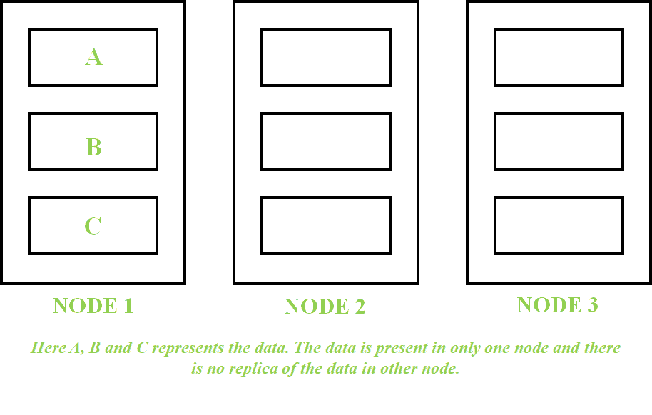
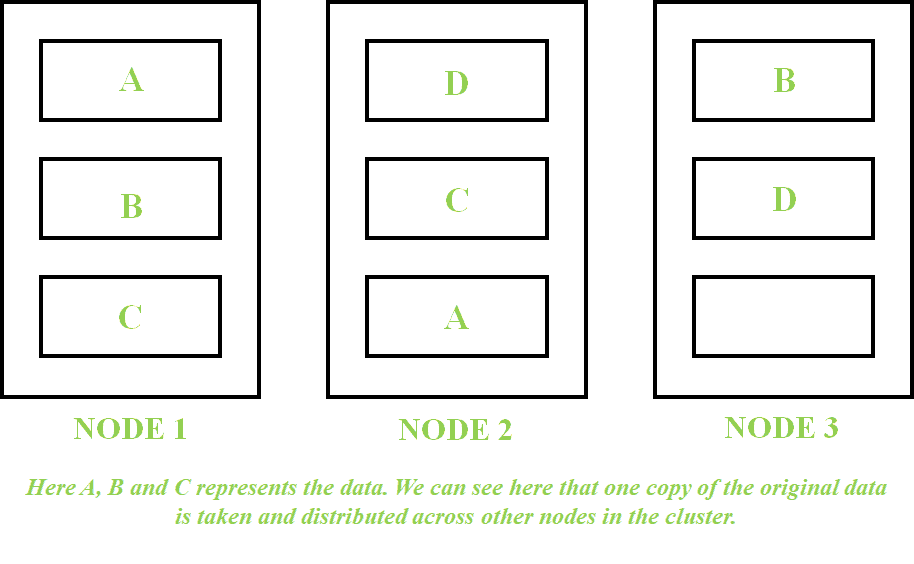

# K-惠普垂直领域的安全

> 原文:[https://www.geeksforgeeks.org/k-safety-in-hp-vertica/](https://www.geeksforgeeks.org/k-safety-in-hp-vertica/)

当我们将数据存储到任何数据库中时，我们期望数据随时可用，或者简而言之，我们需要期望数据的高可用性。在[惠普 Vertica](https://www.geeksforgeeks.org/features-of-hp-vertica/) 中，数据存储在数据库的不同节点中。数据被复制到不同的节点，这样即使其中一个节点出现故障，数据在另一个节点中仍然可用。 **K-Safety** 是系统 ***容错度*** 的度量。“k”表示存在于节点群集中的原始数据的拷贝数。

**<u>K–SAFE 0</u>:**
如果**K-SAFE = 0**，则表示节点群集中不存在原始数据的副本。因此，如果包含原始数据的节点关闭，数据将不可用。

**<u>K–SAFE 1</u>:**
如果**K-SAFE = 1**，则表示在集群中的某个其他节点中有一份数据拷贝原始数据。如果包含原始数据的节点发生故障，则可以从具有原始数据的副本或复制品的另一个节点检索数据。这里，如果我们看到集群中数据的总拷贝数，那么它将是 2。

同样，如果 **K-Safety = 2** ，则表示存储了 2 份原始数据。这里，集群中数据的总拷贝数将是 3。一般来说，如果 K = n，则整个节点群集中存在的数据拷贝总数将为 n+1。

如果特定数据库的 K-Safety 高，那么我们可以说特定数据库具有高容错性或高数据可用性。