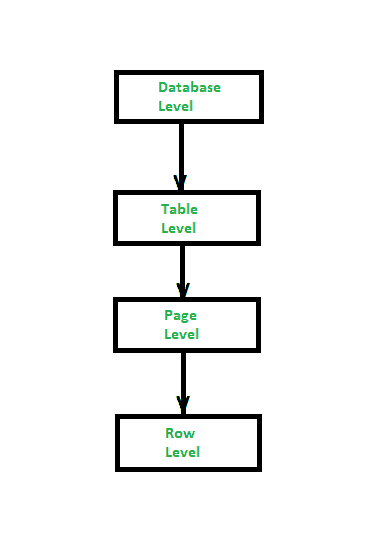

# 数据库管理系统中的锁定级别

> 原文:[https://www.geeksforgeeks.org/levels-of-locking-in-dbms/](https://www.geeksforgeeks.org/levels-of-locking-in-dbms/)

数据库中的锁定可以在 4 个级别完成，从最高级别的数据库开始，通过表和页向下到最低级别的行。

*   **数据库级**
*   **表级**
*   **页面级**
*   **行级**

在讨论锁的级别之前，我们应该了解锁的类型或锁模式。因此，锁中有 5 种锁类型，下面将对它们进行讨论:

*   **独占(X)锁-**
    这种锁定方法根据锁的用途来区分锁。这也确保了页面的数据或信息将被独占地保留给那些使用独占锁的事务。这些锁仅在执行写操作的资源上应用。只有在没有应用其他共享或独占类型的锁时，这些锁才能应用于页面。

*   **共享锁–**
    这种锁定方法仅适用于读取操作。如果此锁定应用于任何行或页，则它将为读取操作保留该行或页。我们可以在同一行或同一页上应用多个锁，但是它不应该应用于任何其他类型的锁。

*   **意图独占(IX)锁–**
    这种用独占或共享锁在较低级别锁定显式锁的方法。这意味着，如果一个事务已经使用了这种类型的锁，那么它一定是通过单独施加排他锁来修改较低级别的资源的情况。

*   **意图共享(IS)锁–**
    这种锁定方法是在树的较低层显式锁定，但仅使用共享锁。这意味着，如果一个事务已经使用了这种类型的锁，那么它一定是通过单独施加共享锁来读取较低级别的资源的情况。

*   **共享意图独占(SIX)锁定–**
    这种锁定方法声明事务用于读取较低级别的资源。在 SIX 中，我们将共享锁强加给了所有在较低级别可用的资源。以该节点为根的子树在共享模式下被显式锁定，显式锁定是在较低的级别用独占模式锁定完成的。在这种方法中，一次只能在一个关系上获取一个六，如果有任何其他事务需要更新任何更改，那么它将阻止这些事务。

*   **Update(U)Lock–**
    这种锁定方法可以应用于已经包含共享锁的记录，如果它已经有了共享锁，那么 update lock 将在关系的目标行或页面上应用另一个共享锁。这与排他锁相同，在某些方面也很灵活。在此锁中，在检查事务持有用于修改数据的更新锁之后，更新锁将被修改为排他锁。

锁定中的层次级别

现在，让我们逐一讨论锁定的级别。

**1。数据库级别:**
在数据库级别，完整的数据库被锁定。现在，假设一个数据库中有两个关系。如果说，R1 使用桌子的 R1 和 R2，那么 R2 就不能使用桌子。每当事务连接到数据库时，您总是会在这个级别上找到一个共享锁。在这个级别上，我们使用共享锁定来防止删除数据库或恢复正在使用的数据库的数据库备份。我们来看一个例子。当我们使用 SELECT 语句读取一些数据时，共享锁将应用于数据库级别，意图共享锁将应用于表和页级别，共享锁应用于行本身。

**数据库级应用–**

*   这种类型的锁定适用于一组进程。
*   这种类型的锁定非常慢，因此不用于多用户 DBMS 的在线版本。

**2。表级:**
在表级，整个表或关系被锁定。现在，假设一个数据库中有两个关系，比如 R1 和 R2，R1 使用表，那么 R2 不能使用它。但是，只有当两个事务访问不同的关系时，它们才能访问同一个数据库。使用表级别的事务将持有共享和/或独占表锁。在表级别，有 5 种不同类型的锁。即独占(X)、共享(S)、意图独占(IX)、意图共享(IS)和意图独占共享(SIX)，这些锁已经在上面讨论过了。

**表级应用–**

*   这种类型的锁定级别不适合多用户数据库管理系统。
*   它也主要用于防止在 DML 操作中删除关系。

**3。页面级别:**
页面级别总是由固定大小组成，即 2 或 2 的幂 i 类型。一个表可以跨越几个页面，一个页面可以包含一个或多个关系的几个元组。在页面级别，将强加一个意图共享锁。该锁能够锁定表、共享页或独占页。如果存在 DML 语句(即插入、更新、删除)的情况，将实施意图排他锁(IX)或意图更新锁(IU)。

**页面级应用–**

*   这种类型的锁定级别适用于多用户数据库管理系统。
*   它们相对较快，但也有各种冲突。

**4。行级别:**
与其他级别的锁定相比，此级别的锁定限制较少。在行级别，如果并发事务访问同一关系中的不同行，即使这些行位于同一页上，数据库系统也可以接受这一点。在这一层，数据库管理系统允许并发事务访问相同关系的行，即使这些行在同一页上。在这个级别，我们可以应用 3 种不同类型的锁，即独占锁、共享锁、更新锁，这些锁已经在上面讨论过了，而且在这个级别的查询中特定的行被锁定。

**行级应用–**

*   与其他级别的锁定相比，它非常昂贵。
*   也很有限制性。