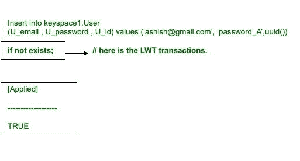
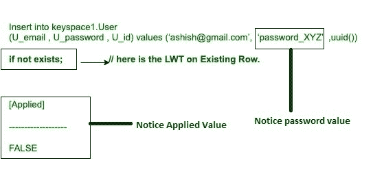
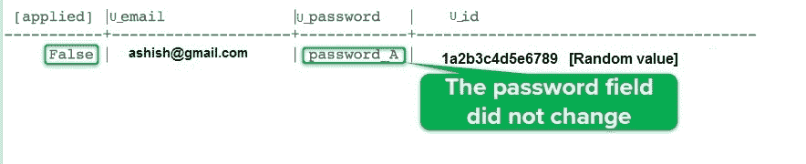
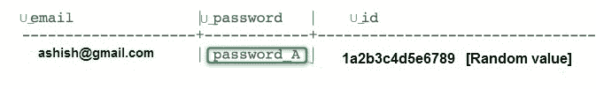
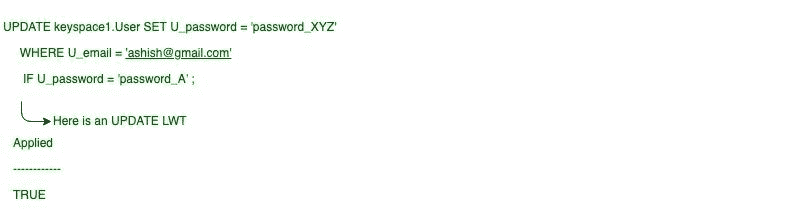

# 卡珊德拉轻量级交易

> 原文:[https://www . geesforgeks . org/轻量级-transactions-in-cassandra/](https://www.geeksforgeeks.org/lightweight-transactions-in-cassandra/)

在本文中，我们将在 [Cassandra](https://www.geeksforgeeks.org/introduction-to-apache-cassandra/) 中讨论轻量级事务(LWT)，这也有助于提高性能。

有时插入或更新操作必须是唯一的，这需要先读后写。先读后写对性能有影响–明智使用！CQL 轻量级事务(LWT)通过在插入和更新中使用 IF 子句解决了这类问题。

例如:
**创建关键空间:**

```
CREATE KEYSPACE IF NOT EXIST keyspace1 
WITH replication = {'class': 'SimpleStrategy', 
                    'replication_factor' : 2}; 
```

**创建表格:**

```
CREATE TABLE User (
U_email text,
U_password int,      
U_id UUID,
PRIMARY KEY (email)
); 
```

**阅读使用了以下 CQL 查询。**

```
Select * 
from keyspace1.User 
where U_email = ‘ashish@gmail.com’; 
```

**输出:**

<center>

| U_email | u _ 密码 | U_id |
| --- | --- | --- |
|  |  |  |

</center>

**【0 行】**

**要将数据插入表中，请使用以下 CQL 查询。**

```
Insert into keyspace1.User (U_email, U_password, U_id) 
values (‘ashish@gmail.com’, ‘password_A’, uuid()) 
if not exists; 
```

让我们看看。



<center>**Figure –** LWT in Cassandra</center>

现在，LWT 创造了这个世界。

```
Select * 
from keyspace1.User 
where U_email = ‘ashish@gmail.com’; 
```

**输出:**

<center>

| U_email | u _ 密码 | U_id |
| --- | --- | --- |
| ashish@gmail.com | 密码 | 1a2b3c4d5e6789 |

</center>

**[1 rows] LWT created the row**

**现有行上的 LWT:**

```
Insert into keyspace1.User (U_email, U_password, U_id) 
values (‘ashish@gmail.com’, ‘password_XYZ’, uuid()) 
if not exists;  
```

让我们看看，



<center>**Figure –** LWT on existing row</center>

以下是上述 CQL 查询的输出。



```
Select * 
from keyspace1.User 
where U_email = ‘ashish@gmail.com’; 
```

**输出:**



<center>**Figure –** The row did not change</center>

**更新行时的轻量级事务(LWT):**
更新现有行的 CQL 查询，现在我们将 LWT 应用于此。更新现有行的 CQL 查询。

```
UPDATE keyspace1.User SET U_password = 'password_XYZ' 
WHERE U_email = 'ashish@gmail.com'
IF U_password = 'password_A' ; 
```

运算符可用于更新命令:

```
=, <,, >=, != and IN 
```

让我们看看，

