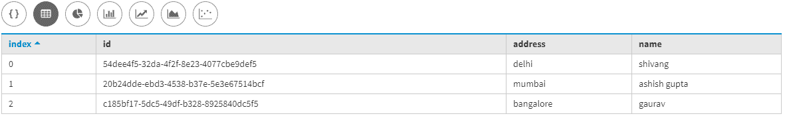
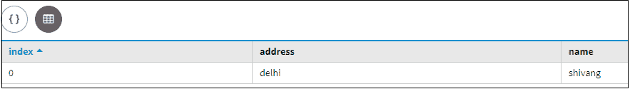
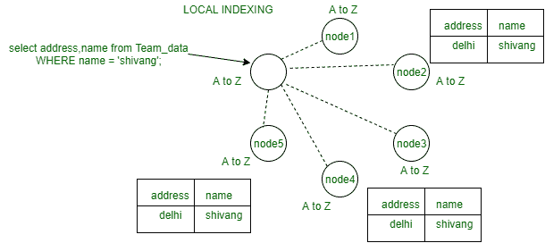
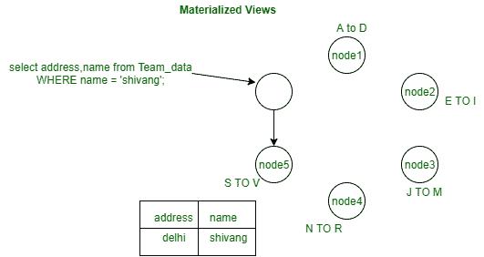

# Cassandra 3.0 中的本地索引和物化视图

> 原文:[https://www . geesforgeks . org/local-indexing-and-物化视图-in-cassandra-3-0/](https://www.geeksforgeeks.org/local-indexing-and-materialized-views-in-cassandra-3-0/)

先决条件–[索引的概念](https://www.geeksforgeeks.org/concept-of-indexing-in-apache-cassandra/)、[物化视图的概念](https://www.geeksforgeeks.org/materialized-views-in-cassandra/)
在本文中，我们将了解如何进行本地索引以及它如何工作，物化视图如何在内部工作。

我们一个一个来讨论。

首先，我们需要创建一个表。让我们考虑一个表 Team_data，其中 id、名称、地址是字段。
我们来看看。

```
CREATE TABLE Team_data
(
 id uuid PRIMARY KEY,
 name text,
 address text
); 
```

现在，向表中插入一些数据(Team_data)。让我们看看。

```
Insert into Team_data(id, name, address) 
values(uuid(), 'ashish gupta', 'mumbai');

Insert into Team_data(id, name, address) 
values(uuid(), 'shivang', 'delhi');

Insert into Team_data(id, name, address) 
values(uuid(), 'gaurav', 'bangalore'); 
```

让我们看看结果来验证插入的数据。

```
select * 
from Team_data; 
```

**输出:**



现在，我们将在 Team_data 表上的 name 列中创建本地索引(customer1)。让我们来看看。

```
create index customer1 on Team_data(name); 
```

现在，我们要搜索我们需要的数据。
我们来看看。

```
select address, name 
from Team_data
WHERE name = 'shivang'; 
```

**输出:**



现在，我们将在这里看到上面的 CQL 查询是如何工作的，并以图形方式执行。
我们来看看。



在上图中，首先，坐标节点将消息发送到环上的所有节点，并考虑到表的每一行都有三个副本(Team_data)，然后它将在环上每个节点的索引基础上搜索我们要查找的数据。

现在，这里我们将看到同一个表(Team_data)的物化视图如何在上面讨论的相同场景中工作。首先，我们要创建物化视图。
我们来看看。

```
create materialized view customer2 as select * 
from Team_data 
where name IS NOT NULL
PRIMARY KEY(name, id); 
```

现在，当我们再次执行 CQL 查询时，物化视图中的第一个数据将在每个节点被索引，并且更容易快速搜索数据，性能也将提高。让我们看看。

```
select address, name from Team_data
WHERE name = 'shivang'; 
```

**输出:**


现在，我们将看到上面的 CQL 查询如何在上面相同的场景中为物化视图工作。
我们来看看。

