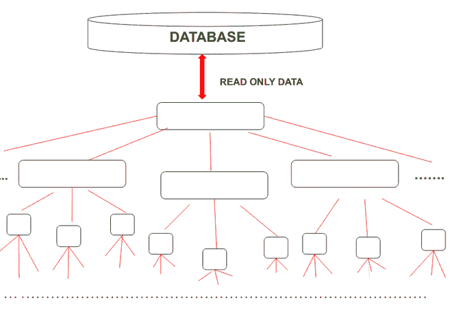
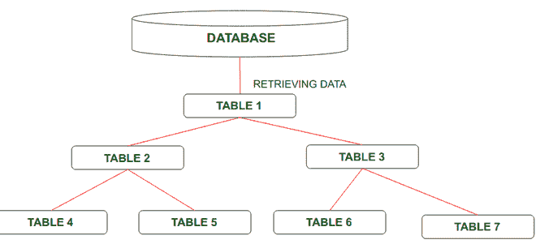
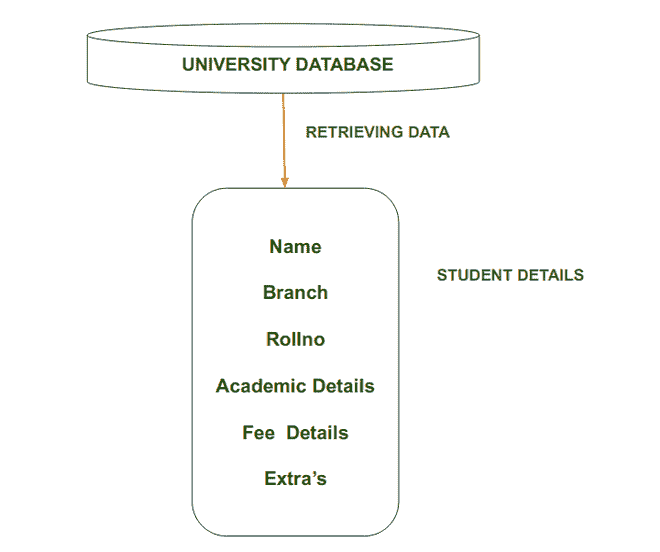

# 逻辑数据库

> 原文:[https://www.geeksforgeeks.org/logical-database/](https://www.geeksforgeeks.org/logical-database/)

逻辑数据库是 ABAP(高级商业应用和编程)的一种特殊类型，用于从各种表中检索数据，并且数据相互关联。此外，逻辑数据库提供数据的只读视图。

**逻辑数据库的结构:**
逻辑数据库仅使用表的层次结构，即数据以树状结构组织，数据存储为通过边(链接)相互连接的记录。逻辑数据库包含 Open [SQL 语句](https://www.geeksforgeeks.org/sql-ddl-dql-dml-dcl-tcl-commands/)，用于从[数据库](https://www.geeksforgeeks.org/introduction-of-dbms-database-management-system-set-1/)中读取数据。逻辑数据库读取程序，如果需要，将它们存储在程序中，并将它们逐行传递给应用程序。

逻辑数据库的结构

**逻辑数据库的特性:**
在本节中，让我们来看看逻辑数据库的一些特性:

*   我们只能选择我们需要的数据类型。
*   进行数据身份验证是为了维护安全性。
*   由于保持了数据完整性，逻辑数据库使用分层结构。

**逻辑数据库的目标:**
逻辑数据库的目标是创建反映用户需求的结构良好的表。逻辑数据库的表以非冗余方式存储数据，外键将用于表中，以便支持表和实体之间的关系。

**逻辑数据库的任务:**
下面是逻辑数据库的一些重要任务:

*   借助逻辑数据库，我们将从多个程序中读取相同的数据。
*   一个逻辑数据库为多个程序定义相同的用户界面。
*   逻辑数据库确保对集中式敏感数据库进行授权检查。
*   在逻辑数据库的帮助下，性能得到了提高。像在逻辑数据库中一样，我们将使用连接而不是多个 SELECT 语句，这将提高响应时间，这将提高逻辑数据库的性能。

**逻辑数据库的数据视图:**
逻辑数据库提供逻辑数据库表的特定视图。当数据库的结构较大时，可以适当地使用逻辑数据库。使用流程很方便，即

*   挑选
*   阅读
*   过程
*   展示

为了高效地使用数据库。逻辑数据库的数据本质上是分层的。这些表在外键关系中相互链接。

逻辑数据库的数据视图如图所示:

**需要记住的要点:**

*   表必须有外键关系。
*   逻辑数据库由逻辑相关的表组成，这些表以分层方式排列，用于读取或检索数据。
*   逻辑数据库由三个主要元素组成:
    *   数据库的结构
    *   从数据库中选择数据
    *   数据库程序
*   如果我们想提高数据的访问时间，那么我们在逻辑数据库中使用视图。

**例:**
假设在一所大学或学院中，一名 HOD 想要获得某个特定学生的信息。为此，他首先从大量数据中检索关于其批次和分支的数据，并且他将容易地获得关于所需学生的信息，但是没有改变关于该学生的信息。

**逻辑数据库的优势:**
我们来看看逻辑数据库的一些优势:

*   在逻辑数据库中，我们可以从大量数据中选择有意义的数据。
*   逻辑数据库由检查数据库访问是否经过身份验证的中央授权组成。
*   在此编码中，与其他数据库相比，从数据库中检索数据所需的零件较少。
*   从数据库的层次结构中读取数据的访问性能很好。
*   易于理解的用户界面。
*   逻辑数据库首先检查功能，进一步检查用户输入是否完整、正确和合理。

**逻辑数据库的缺点:**
本节介绍逻辑数据库的缺点:

*   当所需数据在最后时，逻辑数据库需要更多的时间，因为如果在最低级别需要该表，那么首先应该读取所有较高级别的表，这需要更多的时间，这会降低性能。
*   在逻辑数据库中，ENDGET 命令不存在，因此与事件相关联的代码块以下一个事件语句结束。