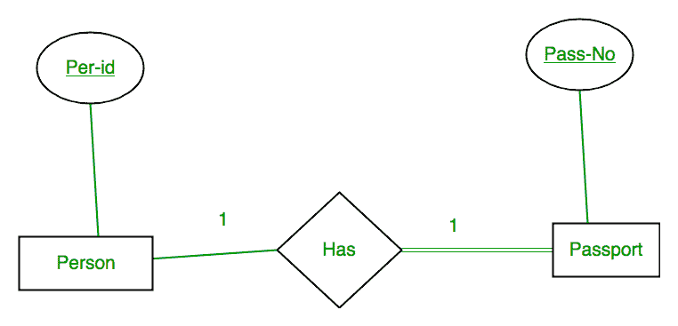
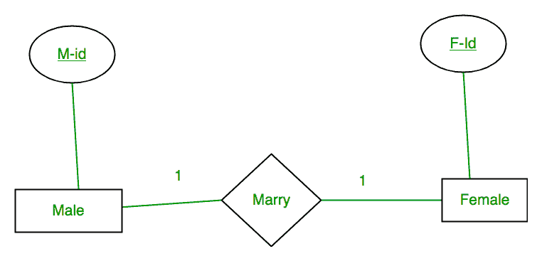
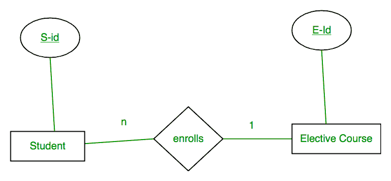
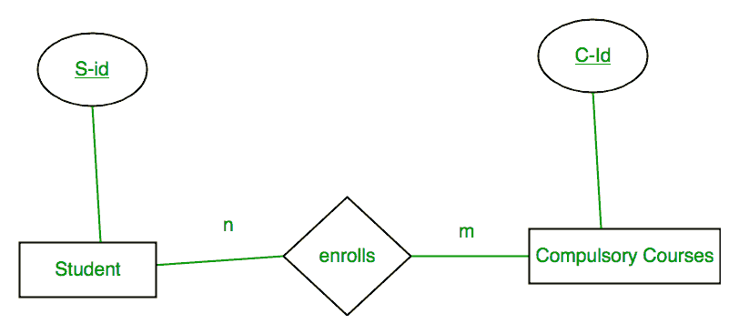
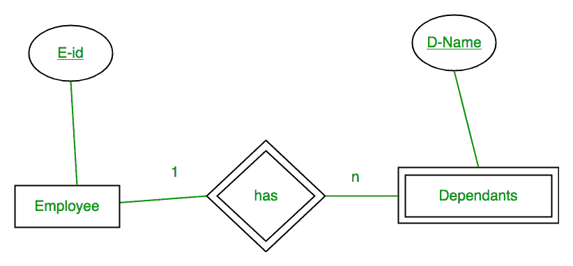

# 从 ER 模型到关系模型的映射

> 原文:[https://www . geesforgeks . org/mapping-from-er-model-to-relational-model/](https://www.geeksforgeeks.org/mapping-from-er-model-to-relational-model/)

要理解这一点，您应该有一个想法:

[ER 型号](https://www.geeksforgeeks.org/introduction-of-er-model/)

[关系模型](https://www.geeksforgeeks.org/relational-model-in-dbms/)

在设计好系统的 er 图后，我们需要将其转换为关系模型，这种模型可以直接由任何关系数据库系统实现，如 Oracle、MySQL 等。在本文中，我们将讨论如何针对不同的场景将 ER 图转换为关系模型。

**情况 1:基数为 1:1 的二元关系，一个实体全部参与**

一个人有 0 或 1 个护照号码，护照总是由一个人拥有。所以它是 1:1 基数，有 Passport 的完全参与约束。

**首先将每个实体和关系转换成表格。**人员表对应于人员实体，关键字为每个标识。类似地，护照表对应于护照实体，密钥为通行证号。哈希表表示个人和护照之间的关系(哪个人拥有哪个护照)。因此，它将从个人获得个人身份证，从护照获得通行证号码。

<figure class="table">

| **人** |   | **有** |   | **护照** |
|  | **其他人属性** |  | **通过-否** | **<u>通过-否</u>** | **其他密码属性** |
| PR1 | – | PR1 | PS1 | PS1 | – |
| PR2 | – | PR2 | PS2 | PS2 | – |
| PR3 | – |   |   |   |   |   |   |

**表 1**

从表 1 中我们可以看到，在**哈希**表中，每个每标识和通过号只有一个条目。因此，我们可以将所有三个表合并成一个表，其属性如表 2 所示。每个个人标识都是唯一的，不为空。所以这将是关键。“通过-否”不能是关键字，因为对于某些人来说，它可以为空。
T3】

| <u>Per-Id</u> | 其他人属性 | 通过-不 | 其他密码属性 |

**表 2**

**情况 2:基数 1:1，两个实体部分参与的二元关系**

一个男性娶 0 或 1 个女性，反之亦然。所以是 1:1 的基数，两者都有部分参与约束。首先将每个实体和关系转换为表。男性表对应于男性实体，键为男性标识。类似地，女性表对应于女性实体，键为 F-Id。婚姻表代表男女关系(哪个男娶哪个女)。所以它会从男性身上取属性 M-Id，从女性身上取属性 F-Id。

<figure class="table">

| **男** |   | **结婚** |   | **女** |
| <u>M-Id</u> | 其他男性属性 | <u>M-Id</u> | 联邦身份证 | <u>F-Id</u> | 其他女性属性 |
| M1 | – | M1 | 第二子代 | 子一代 | – |
| 货币供应量之二 | – | 货币供应量之二 | 子一代 | 第二子代 | – |
| M3 | – |   |   |   |   | 第三子代 | – |

**表 3**

从表 3 中我们可以看出，一些男性和一些女性没有结婚。如果我们将 3 个表合并成 1 个，对于某些 M-Id，F-Id 将为空。所以没有总是不为空的属性。所以我们不能把这三张表都合并成 1。我们可以转换成 2 张桌子。在表 4 中，已婚的男性身份证将与女性身份证相关联。对于其他人，它将为空。表 5 将包含所有女性的信息。主键已加下划线。

<figure class="table">

| <u>M-Id</u> | 其他男性属性 | 联邦身份证 |

**表 4**

<figure class="table">

| <u>F-Id</u> | 其他女性属性 |

**表 5**

**注意:**基数为 1:1 的二元关系，如果两个实体都部分参与关系，就会有 2 个表。如果至少有一个实体参与，所需的表数将为 1。

**情况 3:基数为 n: 1 的二元关系**

在这种情况下，每个学生只能注册一门选修课，但选修课可以有多个学生。首先将每个实体和关系转换为表。学生表对应于学生实体，关键字为学生标识。类似地，选修课表对应于选修课实体，关键字为电子身份证。注册表表示学生和选修课之间的关系(哪个学生注册哪个课程)。因此，它将从选修课中获取属性 S-Id 和学生 E-Id。

<figure class="table">

| **学生** |   | **注册** |   | **选修 _ 课程** |
| <u>S-Id</u> | 其他学生属性 | <u>S-Id</u> | 电子身份证 | <u>电子身份证</u> | 其他选修课程属性 |
| S1 | – | S1 | E1 | E1 | – |
| S2 | – | S2 | E2 | E2 | – |
| S3 | – |   | S3 | E1 |   | E3 | – |
| 第四心音 | – |   | 第四心音 | E1 |   |   |   |

**表 6**

从表 6 中我们可以看到，S-Id 在注册表中没有重复。因此，它可以被认为是注册表的一个关键。学生表和注册表的键是相同的；我们可以将其合并为一个表。结果表如表 7 和表 8 所示。主键已加下划线。

<figure class="table">

| <u>S-Id</u> | 其他学生属性 | 电子身份证 |

**表 7**

<figure class="table">

| <u>电子身份证</u> | 其他选修课程属性 |

**表 8**

**情况 4:m:n 基数的二元关系**

在这种情况下，每个学生可以注册一门以上的必修课，一门必修课可以有一个以上的学生。首先将每个实体和关系转换为表。学生表对应于学生实体，关键字为学生标识。类似地，必修 _ 课程表对应于以 C-Id 为关键字的必修课程实体。注册表表示学生和必修课之间的关系(哪个学生注册哪个课程)。所以它会从人身上取属性 S-Id，从必修课上取属性 C-Id。

<figure class="table">

| **学生** |   | **注册** |   | **必修 _ 课程** |
| <u>S-Id</u> | 其他学生属性 | <u>S-Id</u> | <u>C-Id</u> | <u>C-Id</u> | 其他必修课程属性 |
| S1 | – | S1 | C1 | C1 | – |
| S2 | – | S1 | C2 | C2 | – |
| S3 | – |   | S3 | C1 |   | C3 | – |
| 第四心音 | – |   | 第四心音 | C3 |   | 补体第四成份缺乏 | – |
|   |   |   | 第四心音 | C2 |   |   |   |
|   |   |   | S3 | C3 |   |   |   |

**表 9**

从表 9 中我们可以看到，在注册表中，S-Id 和 C-Id 都在重复。但它的组合是独一无二的；因此它可以被认为是“注册”表的一个键。所有表的键都不同，这些不能合并。所有表的主键都加了下划线。

**案例 5:与弱实体的二元关系**

在这种情况下，一名员工可以有多个受抚养人，一个受抚养人可以依赖一名员工。没有员工，受抚养人不存在(例如；你作为一个孩子可以依赖你的父亲在他的公司)。因此，它将是一个薄弱的实体，它的参与将永远是全面的。弱实体没有自己的键。所以它的密钥将是它的识别实体的密钥(在这种情况下是雇员的电子身份)和它的部分密钥(姓名)的组合。

首先将每个实体和关系转换为表。员工表对应于以电子标识为关键字的员工实体。类似地，从属表对应于键为“名称”和“标识”的从属实体。哈希表表示员工和家属之间的关系(哪个员工有哪个家属)。因此，它将从员工处获取属性“电子身份证”，从家属处获取属性“姓名”。

<figure class="table">

| **员工** |   | **有** |   | **家属** |
| <u>电子身份证</u> | 其他员工属性 | <u>电子身份证</u> | <u>D-名称</u> | <u>D-名称</u> | <u>电子身份证</u> | 其他相关属性 |
| E1 | – | E1 | 随机存取存储 | 随机存取存储 | E1 | – |
| E2 | – | E1 | 斯利尼 | 斯利尼 | E1 | – |
| E3 | – | E2 | 随机存取存储 | 随机存取存储 | E2 | – |
|   |   | E3 | ASHISH | ASHISH | E3 | – |

**表 10**

从表 10 可以看出，E-Id、D-Name 是**拥有**以及随军家属表的关键。所以我们可以把这两个合并成 1。因此，结果表如表 11 和表 12 所示。所有表的主键都加了下划线。

<figure class="table">

| <u>电子身份证</u> | 其他员工属性 |

**表 11**

<figure class="table">

| <u>D-名称</u> | <u>电子身份证</u> | 其他相关属性 |

**表 12**

文章由 Sonal Tuteja 供稿。如果你发现任何不正确的地方，请写评论，或者你想分享更多关于上面讨论的话题的信息

</figure>

</figure>

</figure>

</figure>

</figure>

</figure>

</figure>

</figure>

</figure>

</figure>

</figure>