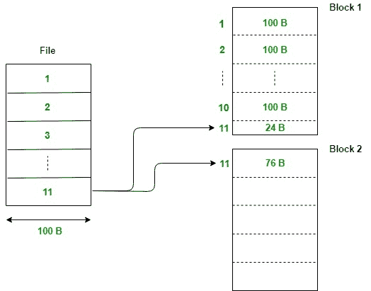
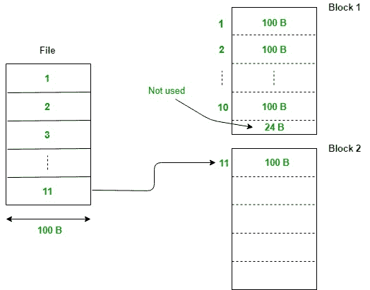

# 将文件记录映射到块的策略

> 原文:[https://www . geesforgeks . org/mapping-strategies-for-file-records-in-blocks/](https://www.geeksforgeeks.org/mapping-strategies-for-file-records-into-blocks/)

数据库是大量相关数据的集合。在关系数据库管理系统的情况下，数据以关系或表的形式存储。作为一个普通用户，我们看到的是存储在表中的数据，但实际上这个巨大的数据量是以文件的形式存储在物理内存中的。

A **[文件](https://www.geeksforgeeks.org/dbms-file-organization-set-1/)** 是以二进制格式存储在磁盘等二级存储器上的相关记录的集合。将文件记录映射到磁盘块有多种策略:

**1。跨区映射:**
在跨区映射中，文件的记录存储在块内，即使它只能被部分存储，因此，该记录跨越两个块，给它命名为*跨区映射*。

*   **优点:**无内存浪费(无内部碎片)。
*   **缺点:**已经跨越的记录，在访问它时，我们需要访问两个块，并且由于磁盘上的块数量太大，一个块的搜索时间大于一个块内记录的搜索时间。

**2。未平移映射:**
在未平移映射中，与跨区制策略不同，文件的记录只有在可以完全存储在块内的情况下才会存储在块内。

*   **优势:**一条记录的访问时间较少。这是因为在跨区映射中，为了访问跨区记录，我们需要访问两个块，并且我们知道一个块的访问时间比一个记录的访问时间长得多。但是在非平移映射中，对于单个记录，我们每次只需要访问单个块，因此速度更快。
*   **缺点:**内存浪费较多(内部碎片)。