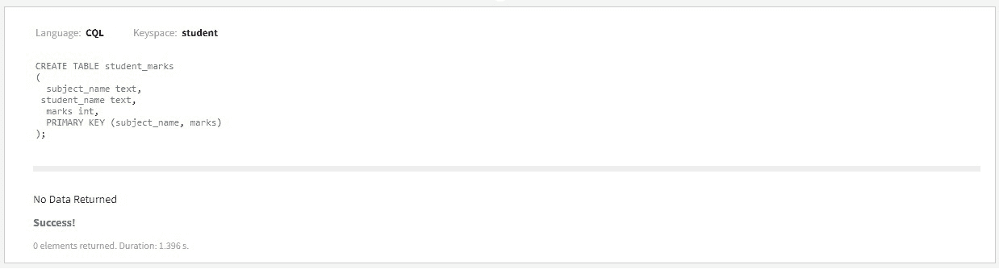
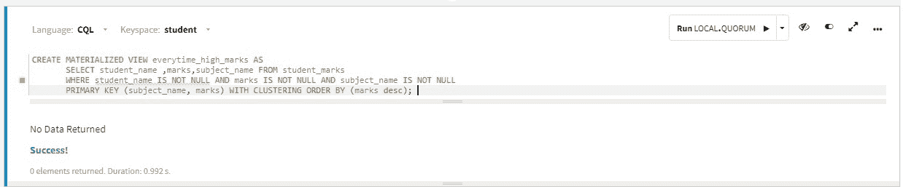
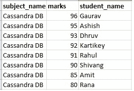
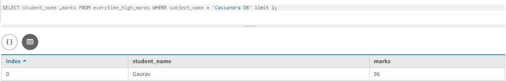

# 卡珊德拉中具有实用方法的物化视图

> 原文:[https://www . geesforgeks . org/实体化视图-带实用方法的方法-in-cassandra/](https://www.geeksforgeeks.org/materialized-views-with-practical-approach-in-cassandra/)

在本文中，我们将在 Cassandra 中讨论一种实用的方法。在[卡珊德拉](https://www.geeksforgeeks.org/introduction-to-apache-cassandra/)中，物化视图处理服务器端的去规范化，在基表和物化视图表之间确保最终的一致性。让我们用一个例子来理解。

让我们首先定义基表，这样 student_marks 就是获得班级最高分的基表。在这个基表中，主题名、学生名和标记是列。我们将创建一个基表的物化视图表，并查询下面给出的查询。

从物化视图中找到一个班级中最高分的学生。

**示例:**基表–学生分数

```
CREATE TABLE student_marks
(
  subject_name text, 
 student_name text,
  marks int,
  PRIMARY KEY (subject_name, marks)
); 
```

**输出:**



现在，让我们讨论上面基表的物化视图，在这个视图中，我们将创建一个班级中学生最高分的视图。

为了创建实体化视图(实体化视图表–每次 _high_marks)，我们提供了一个简单的 select 语句和用于该视图的主键。指定 CLUSTERING ORDER BY 允许我们对最高分进行反向排序，这样我们只需选择分区中的第一项就可以获得最高分。

要创建实体化视图，请使用以下 CQL 查询。

```
CREATE MATERIALIZED VIEW everytime_high_marks AS
SELECT student_name, marks, subject_name 
FROM student_marks 
WHERE student_name IS NOT NULL 
      AND marks IS NOT NULL 
      AND subject_name IS NOT NULL
PRIMARY KEY (subject_name, marks) 
WITH CLUSTERING ORDER BY (marks desc);  
```

**输出:**



现在，首先我们将数据插入基表，它也将反映物化视图。插入数据后，我们可以从物化视图表中进行查询，并获得 CQL 查询所需的结果。实际上，我们正在使用 DataStax Studio 运行所有查询来验证 CQL 查询。

要将数据插入基表，请使用以下 CQL 查询。

```
INSERT INTO student_marks (student_name, subject_name, marks) 
       VALUES ('Ashish', 'Cassandra DB', 95);
INSERT INTO student_marks (student_name, subject_name, marks) 
       VALUES ('Rana', ' Cassandra DB ', 80);
INSERT INTO student_marks (student_name, subject_name, marks) 
       VALUES ('Amit', ' Cassandra DB ', 85);
INSERT INTO student_marks (student_name, subject_name, marks) 
       VALUES ('Shivang', ' Cassandra DB ',90);
INSERT INTO student_marks (student_name, subject_name, marks) 
       VALUES ('Kartikey', ' Cassandra DB ',92);
INSERT INTO student_marks (student_name, subject_name, marks) 
       VALUES ('Dhruv', 'Cassandra DB',93);
INSERT INTO student_marks (student_name, subject_name, marks) 
       VALUES ('Rahul', 'Cassandra DB',91);
INSERT INTO student_marks (student_name, subject_name, marks) 
       VALUES ('Gaurav', 'Cassandra DB',96); 
```

**输出:**


<center>**Figure –** Insert data into base table</center>

```
SELECT * 
FROM everytime_high_marks 
WHERE subject_name = 'Cassandra DB'; 
```

**输出:**



<center>**Figure –** MV Output</center>

现在，我们可以搜索一个给定科目在班级中得分最高的学生。我们可以使用物化视图表来获得我们期望的结果。让我们看看。

```
SELECT student_name, marks 
FROM everytime_high_marks 
WHERE subject = 'Cassandra DB' limit 1; 
```

这里，我们可以在 WHERE 子句中使用“subject”列，因为它也是物化视图的主键。

**输出:**



如输出表所示**高拉夫**有 **96** 分，是班里最高的。