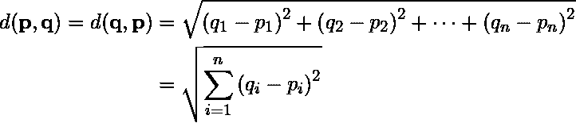
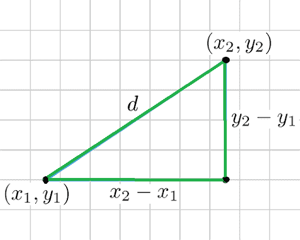
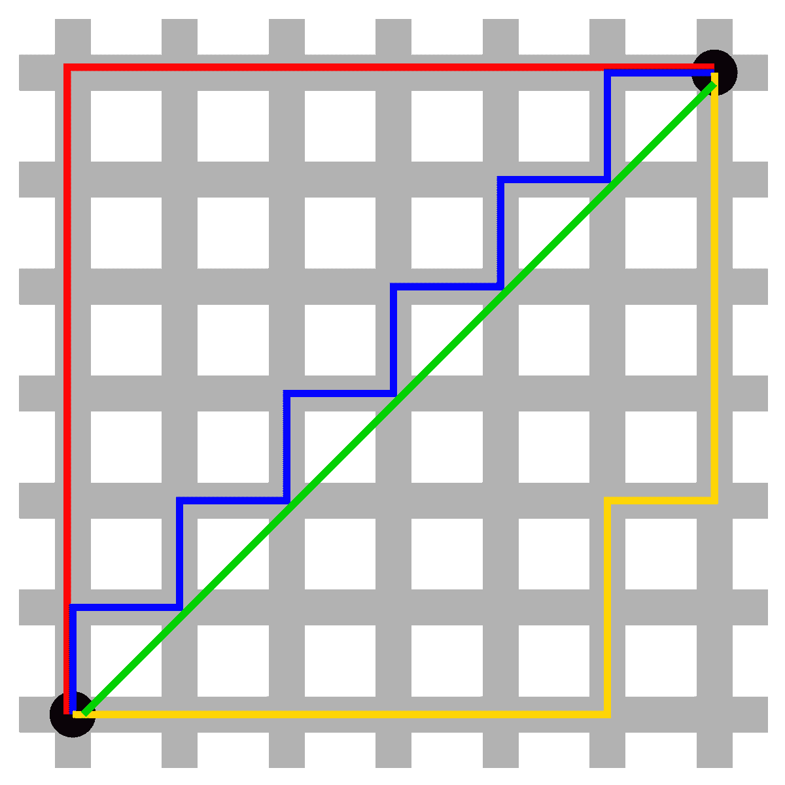
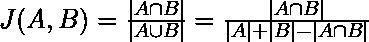
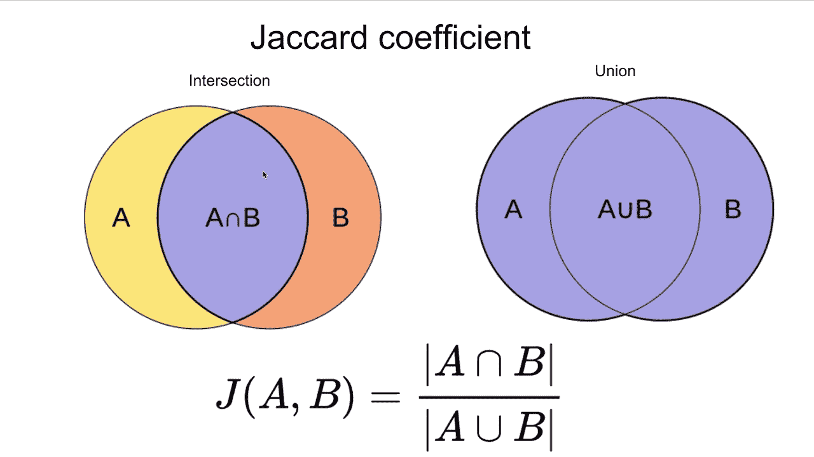
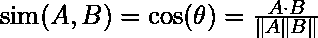
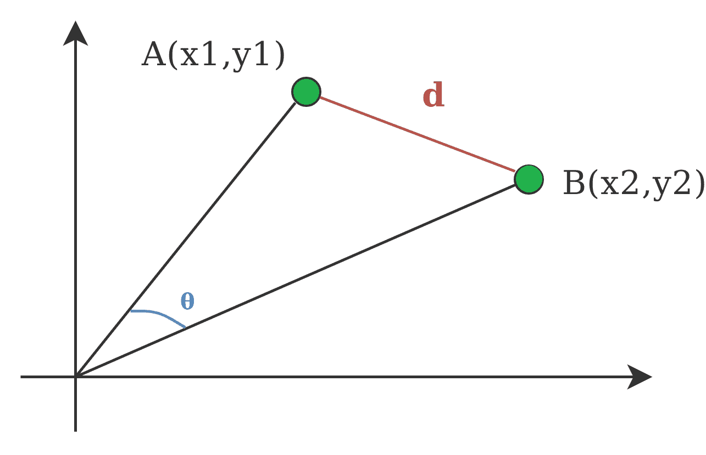

# 数据挖掘中的距离度量

> 原文:[https://www . geesforgeks . org/数据挖掘中的距离度量/](https://www.geeksforgeeks.org/measures-of-distance-in-data-mining/)

**聚类**是将某些相似的对象进行分组，可以用来判断两个项目的属性是否相似。

在[数据挖掘](https://www.geeksforgeeks.org/data-mining/)的意义上，相似性度量是具有描述对象特征的维度的距离。这意味着如果两个数据点之间的距离是**小**，则对象之间的相似度是**高**，反之亦然。相似性是**主观的**，很大程度上取决于上下文和应用。例如，蔬菜之间的相似性可以从它们的味道、大小、颜色等来确定。

大多数聚类方法使用距离度量来评估一对对象之间的相似性或差异，最常用的距离度量是:

**1。欧几里得距离:**
欧几里得距离被认为是几何问题的传统度量。可以简单解释为两点之间的**普通距离**。它是聚类分析中最常用的算法之一。使用该公式的算法之一是 **K 均值**。数学上，它计算两个物体之间坐标的平方差**的平方根**。





<center>**Figure –** Euclidean Distance</center>

**2。曼哈顿距离:**
这决定了这一对坐标之间的绝对差异。

假设我们有两个点 P 和 Q 来确定这些点之间的距离，我们只需要计算这些点与 X 轴和 Y 轴的垂直距离。
在坐标(x1，y1)为 P，坐标(x2，y2)为 Q 的平面上。

P 和 Q 之间的曼哈顿距离= | x1–x2 |+| y1–y2 |



这里**红色**线的总距离给出了两点之间的曼哈顿距离。

**3。Jaccard Index:**
Jaccard 距离测量两个数据集项目的相似性，作为那些项目的**交集**除以数据项目的**并集**。





<center>**Figure –** Jaccard Index</center>

**4。闵可夫斯基距离:**
它是欧几里德和曼哈顿距离度量的**广义**形式。在 **N 维空间**中，一个点被表示为，

```
(x1, x2, ..., xN) 
```

考虑两点 P1 和 P2:

```
P1: (X1, X2, ..., XN)
P2: (Y1, Y2, ..., YN) 
```

然后，P1 和 P2 之间的闵可夫斯基距离给出为:

![\sqrt[p]{(x 1-y 1)^{p}+(x 2-y 2)^{p}+\ldots+(x N-y N)^{p}} ](img/54583dae57019d83028d35801309ee65.png "Rendered by QuickLaTeX.com")

*   当 **p = 2** 时，闵可夫斯基距离与**欧几里得**距离相同。
*   当 **p = 1** 时，闵可夫斯基距离与**曼哈顿**距离相同。

**5。余弦指数:**
用于聚类的余弦距离测度确定两个向量之间角度的**余弦**，由以下公式给出。


这里(**θ**)给出了两个向量之间的夹角，A、B 都是 n 维向量。



<center>**Figure –** Cosine Distance</center>