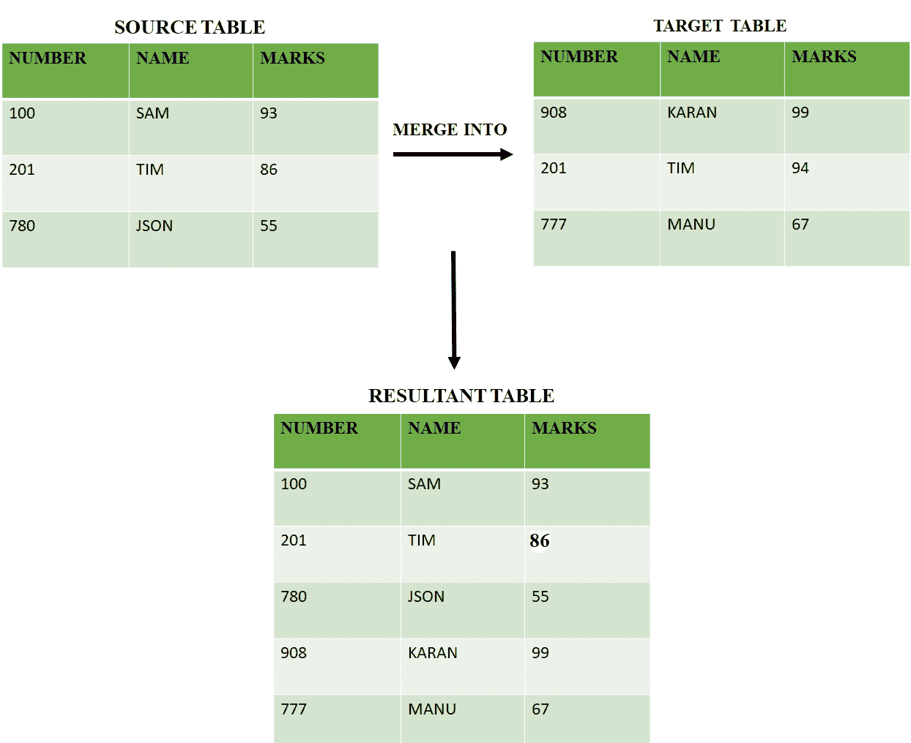
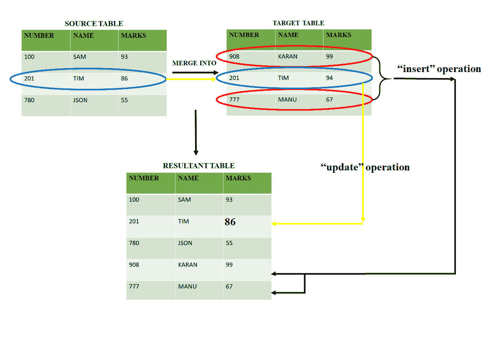

# 惠普 Vertica 中的合并操作

> 原文:[https://www . geesforgeks . org/merge-operation-in-HP-vertica/](https://www.geeksforgeeks.org/merge-operation-in-hp-vertica/)

在 [HP Vertica](https://www.geeksforgeeks.org/features-of-hp-vertica/) 中，合并操作是插入和更新操作的组合。指定的条件用于更新值。

源表可以包括新的和现有的数据。如果目标表不包含源表的任何记录(新的或现有的)，MERGE 会将所有源数据插入目标表。如果目标表已经包含该行，则使用合并操作用源表数据更新目标表数据的值。

**语法:**

```
MERGE INTO schema_name.target_table 
USING schema_name.source_table ON [condition] 
WHEN MATCHED THEN UPDATE SET col1=val1... 
WHEN NOT MATCHED THEN INSERT VALUES (source.col1, ..); 
```

**示例:**

```
MERGE INTO target TGT
USING source SRC
ON SRC.A=TGT.A 
WHEN MATCHED THEN 
UPDATE SET A=TGT.A, B=TGT.B, C=TGT.C, D=TGT.D, E=TGT.E 
WHEN NOT MATCHED THEN 
INSERT VALUES (SRC.A, SRC.B, SRC.C, SRC.D, SRC.E); 
```



**解释:**
新行“908–KARAN–99”和“777–MANU–67”作为新行插入结果表中。但是我们看到行“201–TIM–94”出现在源表和目标表中(在 source 条件下。数字=目标。因此，我们通过从源表中获取值来更新结果表中的值。

