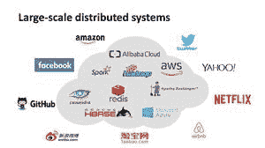
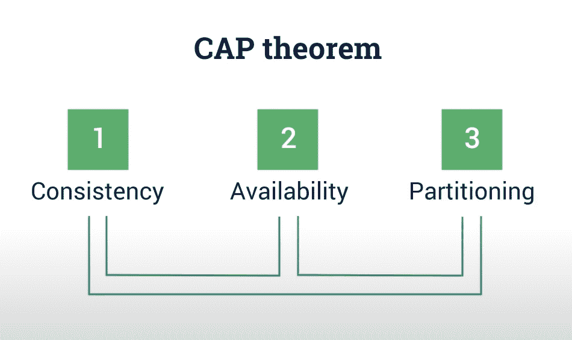
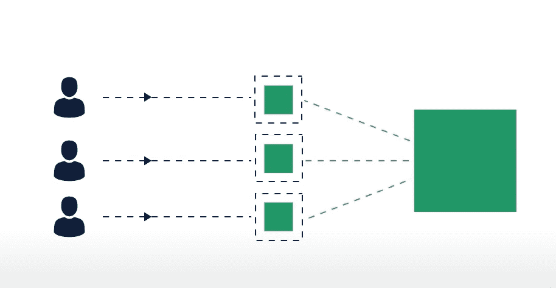

# 大规模分布式系统的方法论

> 原文:[https://www . geesforgeks . org/methods-of-大规模分布式系统/](https://www.geeksforgeeks.org/methodologies-of-large-scale-distributed-systems/)

大规模分布式系统的典型特征是数据量大、并发用户多、可伸缩性要求高以及延迟等吞吐量要求高。
大规模分布式系统面临的主要挑战是，平台变得非常大，现在无法满足系统中的每一个需求。同样，在如此大的规模下，也很难进行开发和测试实践。这项技术被 GIT、Hadoop 等多家公司使用。

**大规模系统架构:**

1.  架构必须在显著理解领域方面发挥重要作用。对于利益相关者和产品所有者来说，了解域是非常重要的。此外，他们还必须了解未来将与平台进行的集成。
2.  另一个重要方面是关于平台的安全性和合规性要求，这些也是从项目开始就必须做的决定，这样未来的开发过程就不会受到影响。

**分配系统:**

*   现在让我们先来谈谈分配系统。分布式系统包含多个物理上分离但使用网络链接在一起的节点。每个节点都包含一小部分分布式操作系统软件。为了更好的理解，请参考 [**【分布式系统】**](https://www.geeksforgeeks.org/synchronization-in-distributed-systems/) 一文
*   大型分布式系统非常复杂，这意味着在容错方面(你的系统有多大的弹性)。这意味着您是否考虑过系统崩溃并能从中恢复的所有可能情况。
*   为了使分布式系统工作良好，我们使用了微服务架构。你可以从文章中读到[微服务架构](https://www.geeksforgeeks.org/monolithic-vs-microservices-architecture/)。但挑战是要有一个基于微服务的架构，你应该划定微服务的边界，否则你可能会过度操纵系统，你可能会把它打破成不自然的边界，系统在自然条件下不能团结一致地工作。我们讨论的微服务架构的另一面是 Cap 定理。

    微服务的边界必须清晰

    T6】

**CAP 定理:**

*   Cap 定理指出，您可以拥有一致性、可用性和分区的所有三个方面。这三样东西你只能有两样。现在你应该非常清楚根据你的领域需求，你想在这三个方面中选择哪两个。

    从这三个方面中选择任意两个

**消息队列:**
[消息队列](https://www.geeksforgeeks.org/ipc-using-message-queues/)很棒，就像一些微服务发布一些消息，而一些微服务消耗消息并执行流程，但是在进入微服务架构之前，您必须思考的挑战是消息的顺序。如果你不关心消息的顺序，那么你可以不用消息的顺序来存储消息。流程中更重要的一件事是事件来源。

**事件源:**
事件源是一种伟大的模式，在这种模式下，你可以拥有不可变的系统。如果我们可以有这样的模型，在这个模型中，我们可以将所有的事情都看作是一段时间内的事件流，我们只是一个接一个地处理这些事件，并且我们还跟踪这些事件，那么您就可以利用不可变的架构。不可变意味着我们总是可以回放我们已经存储的消息，以达到最新的状态。这意味着在部署和迁移时，您可以很容易地来回切换，并且它还会记录数据损坏，这通常发生在处理异常时。

**注意–**
事件源和消息队列将齐头并进，它们有助于使系统具有大规模的弹性。

**部署方法:**

*   你不能有一个团队在一个地方做所有的事情，你必须考虑把你的团队分成小的跨职能团队。你必须有小团队，他们不断地在那里开发部件，开发他们的微服务，并与其他人开发的微服务进行交互。
*   还有一件事要在这里提一下，这些事情是由优步、网飞等组织推动的。这些组织拥有优秀的团队和惊人的技能。所以问题是你应该始终根据你的团队实力而不是理想的团队来比赛。

    一个团队在一个地方做事

    

    小型团队不断开发零件/微服务

**安全性和 TDD(测试驱动开发):**
团队中的开发必须确保编码实践和开发系统的安全，其中动态数据和静态数据根据合规性和监管框架进行加密。

测试驱动开发是关于同时开发代码和测试用例，这样你就可以用你开发的正确的测试用例来测试你的特定代码的每个抽象。通过这种方式，你可以在开发过程中获得反馈，一切都按照你的计划进行，而不是等到开发完成。