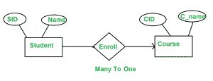
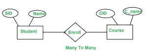
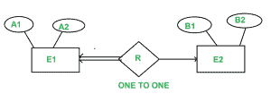
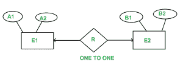

# 电流变图的最小化

> 原文:[https://www.geeksforgeeks.org/minimization-of-er-diagrams/](https://www.geeksforgeeks.org/minimization-of-er-diagrams/)

实体关系图是数据库中数据的图形表示，它显示了数据之间的关系。

注:本文针对已经知道什么是 ER 图，如何画 ER 图的人。

**1)当 **ER 图**中有一对多**基数**时。**
比如一个学生只能报一门课，但是一门课可以被很多学生报



对于学生(样本号，姓名)，样本号是主键。对于课程(CID，C_name)，CID 是主键

```
           Student                           Course 
        (SID   Name)                    ( CID   C_name )
        --------------                  -----------------
          1      A                        c1      Z
          2      B                        c2      Y
          3      C                        c3      X
          4      D

              Enroll 
            (SID   CID)
             ----------
             1       C1
             2       C1
             3       c3
             4       C2
```

现在的问题是，注册 SID 或 CID 或组合的主键应该是什么。我们不能将 CID 作为主键，因为您可以在注册相同的 CID 时看到，我们有多个 SID。(SID，CID)可以唯一区分表，但不是最小值。所以 SID 是关系注册的主键。

对于上面的 ER 图，我们考虑了数据库
中的三个表

```
Student 
Enroll
Course
```

但是我们可以将“学生”和“注册”表合并起来，重命名为“学生 _ 注册”。

```
                 Student_Enroll 
                ( SID   Name   CID )
                ---------------------
                  1      A      c1
                  2      B      c1
                  3      C      c3
                  4      D      c2
```

学生表和注册表现已合并。

因此，学生注册和课程至少需要两个数据库管理系统表。

**注意:**在一对多关系中，我们至少可以有两个表。

**2。当** **在 ER 图中有多对多基数时。**
我们来考虑一下上面的例子，变化是现在一个学生也可以报 1 门以上的课程。



```
  Student                            Course
( SID   Name)                    ( CID   C_name )
--------------                  -----------------
   1      A                        c1      Z
   2      B                        c2      Y
   3      C                        c3      X
   4      D

              Enroll 
           ( SID   CID )
             ----------
             1       C1
             1       C2
             2       C1
             2       C2
             3       c3
             4       C2
```

现在，同样的问题注册关系的主键是什么，如果我们仔细分析
注册的注册主键，表是(SID，CID)。

但是在这种情况下，我们不能将“注册”表与“学生”和“课程”中的任何一个合并。如果我们试图将“注册”与“学生”和“课程”中的任何一个合并，将会创建冗余数据。

**注意:**多对多关系中至少需要三个表。

**3。一对一关系**

有两种可能性
**A)如果我们有一对一的关系，并且我们至少在一端有完全的参与。**

例如，考虑下面的 er 图。



A1 和 B1 分别是 E1 和 E2 的主键。

在上图中，我们在 E1 端有全部参与。

在这种情况下，只需要一个表，将 E1 的主键作为其主键。

由于 E1 是全部参与国，E1 的每个条目只与 E2 中的一个条目相关，但并非 E2 中的所有条目都与 E1 的一个条目相关。

应该允许 E1 的主键作为缩减表的主键，因为如果使用 E2 的主键，它在缩减表中的许多条目可能具有空值。

**注意:**只需要 1 张表。

**B)没有完全参与的一对一关系。**



A1 和 B1 分别是 E1 和 E2 的主键。

R 的主键可以是 A1，也可以是 B1，但我们还是不能把三张表都合并成一张。如果我们这样做了，那么组合表中的一些条目可能会有 NULL 条目。所以把三张表合并成一张的想法并不好。

但是我们可以把 R 合并成 E1 或者 E2。所以至少需要 2 张桌子。

下面是大门往年问题。
[https://www . geesforgeks . org/gate-gate-cs-2008-question-82/](https://www.geeksforgeeks.org/gate-gate-cs-2008-question-82/)
T5】https://www . geesforgeks . org/gate-gate-cs-2008-question-83/

如果发现有不正确的地方，请写评论，或者想分享更多关于以上讨论话题的信息