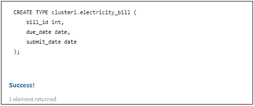
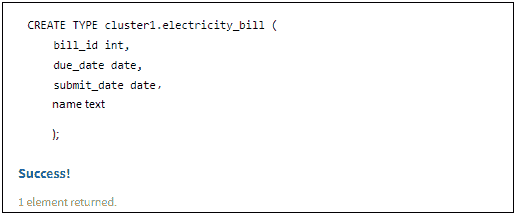
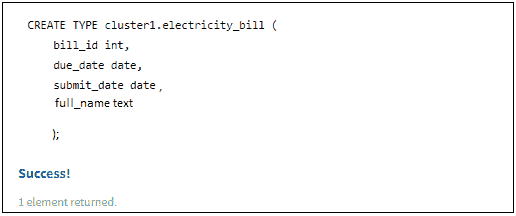

# 修改用户定义的类型(UDT)

> 原文:[https://www . geesforgeks . org/modification-a-user-defined-type-udt/](https://www.geeksforgeeks.org/modifying-a-user-defined-type-udt/)

先决条件–[用户定义类型概述](https://www.geeksforgeeks.org/overview-of-user-defined-type-udt-in-cassandra/)
在本文中，我们将讨论如何更改 UDT 列，以及如何添加、重命名用户定义类型中的现有列。那么，我们来看看。

现在，首先，我们将创建一个 UDT 表，然后我们将根据需要修改它。让我们考虑一下电费是一个表名。

```
CREATE TYPE Electricity_bill
 (
  Bill_id int,
  Due_date date,
  Submit_date date
 ); 
```

现在，让我们使用下面给出的 CQL 查询来验证用户定义的类型。

```
DESCRIBE TYPE Electricity_bill; 
```

**输出:**



要在用户定义的类型中添加新列，请使用以下 CQL 查询。

```
ALTER TYPE cluster1.Electricity_bill
ADD name text; 
```

**输出:**

```
DESCRIBE TYPE Electricity_bill; 
```



要重命名现有字段，可以使用“rename”关键字。让我们看看。

```
ALTER TYPE cluster1.Electricity_bill
RENAME name TO full_name; 
```

现在，让我们使用下面给出的 CQL 查询来验证修改用户定义的类型。

```
DESCRIBE TYPE Electricity_bill; 
```

**输出:**



限制:在修改自定义项的情况下，有一个限制，就是不支持修改主键中的自定义项，索引列也不支持，也不支持更改自定义项的列类型。