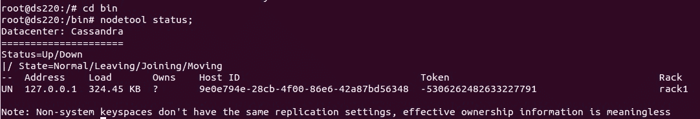
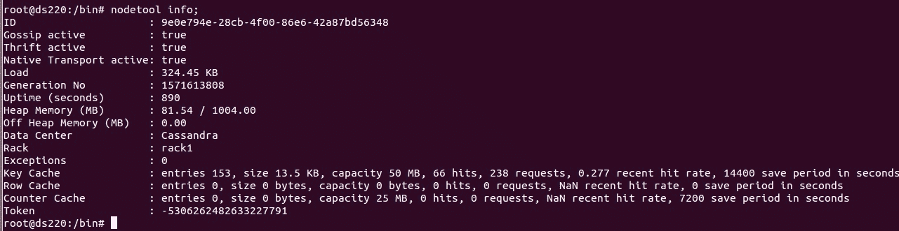
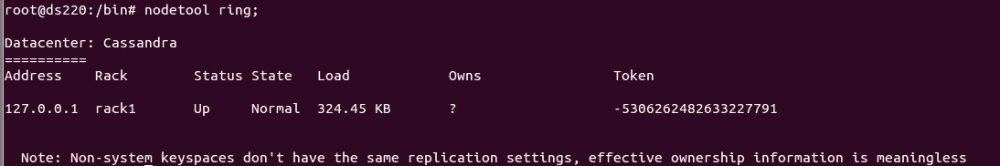
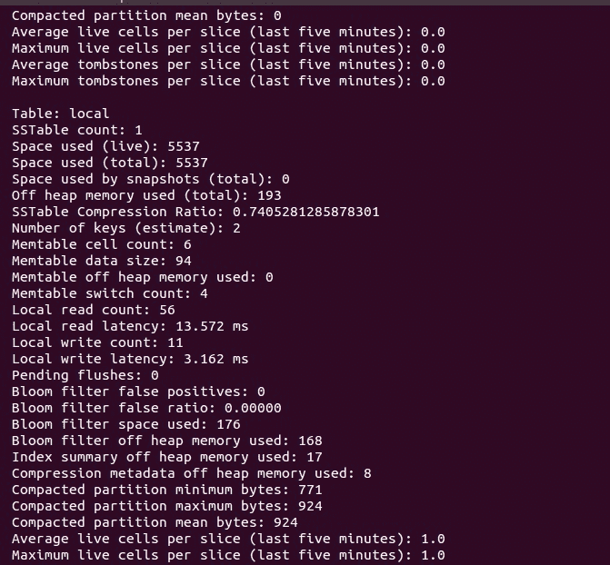
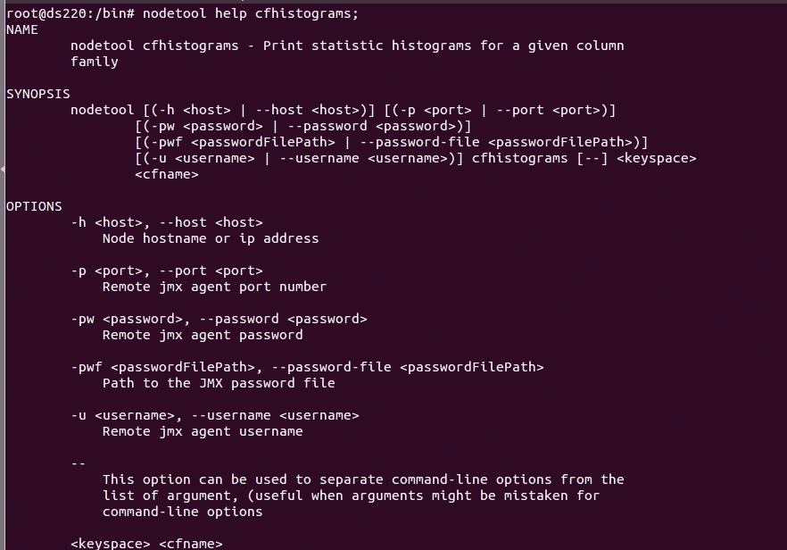

# 卡珊德拉监控集群

> 原文:[https://www . geesforgeks . org/monitoring-cluster-in-Cassandra/](https://www.geeksforgeeks.org/monitoring-cluster-in-cassandra/)

监控[卡珊德拉](https://www.geeksforgeeks.org/introduction-to-apache-cassandra/)集群的工具包括 nodetool、Jconsole 和 Opscenter。所有这些监控集群的工具都是通过 JMX(Java 管理扩展)进行通信的。
在《卡珊德拉穿越 JMX》中，探索了许多度量和命令。这些工具可以用来监控和管理 Cassandra 集群。在本文中，我们将讨论 nodetool。

**Nodetool:**
是监控和管理 Cassandra 集群的重要工具之一。通过 nodetool 可以使用许多选项来监控集群。
有关所用节点工具选项的完整列表，请使用以下 CQL 查询。

```
nodetool help;
```

让我们来看看几个非常重要的用于监控 Cassandra 集群的 nodetool 命令。
例如:

```
1. nodetool status
2. nodetool info
3. nodetool ring
4. nodetool cfstats
5. nodetool cfhistograms 
```

这些解释如下。

**1。节点工具状态:**
定义为节点的状态。它描述了状态、节点的 IP 地址、负载、所有者、主机 id 和机架信息。
要检查节点工具状态，请使用以下 CQL 查询。

```
nodetool status;
```

让我们看看下面给出的截图。



<center>**Figure –** nodetool status</center>

**2。nodetool info:**
它给出了节点的信息，在这些信息中，它讲述了 ID、数据中心、缓存信息，例如行缓存、键缓存、以秒为单位的正常运行时间以及堆内存使用情况等。
要检查节点工具信息，请使用以下 CQL 查询。

```
nodetool info; 
```

让我们看看下面给出的截图。



<center>**Figure –** nodetool information</center>

**3。节点工具环:**
它提供关于节点状态的信息和关于环的信息。
检查节点工具环使用了以下 CQL 查询。

```
nodetool options ring ( -r | --resolve-ip ) --  
```

让我们看看下面给出的截图。



<center>**Figure –** nodetool ring</center>

**4。节点工具 cfstats:**
该工具已被重命名为**节点工具表状态**。nodetool tablestats 提供一个或多个表的统计信息。
要检查节点工具表状态，请使用以下 CQL 查询。

```
$ nodetool [ options ] tablestats
    [ -H | --human-readable ] 
    [ -i  table [, table ] . . . ] [ - - ] 
    [ keyspace | table | keyspace.table ] [keyspace | table | keyspace.table ] 
```

让我们看看下面给出的截图。



<center>**Figure –** nodetool tablestats</center>

**5。节点工具 cf 直方图:**
该工具已更名为**节点工具表格直方图**。它提供了初始故障排除性能指标和过去十五分钟内表的读写延迟的当前性能统计数据，以监控 Cassandra 中的集群。
要检查节点工具 cf 直方图，请使用以下 CQL 查询。

```
nodetool options tablehistograms 
[--] keyspace_name table_name

or
nodetool options cfhistograms  
```

让我们看看下面给出的截图。



<center>**Figure –** nodetool cfhistograms or nodetool tablehistograms</center>