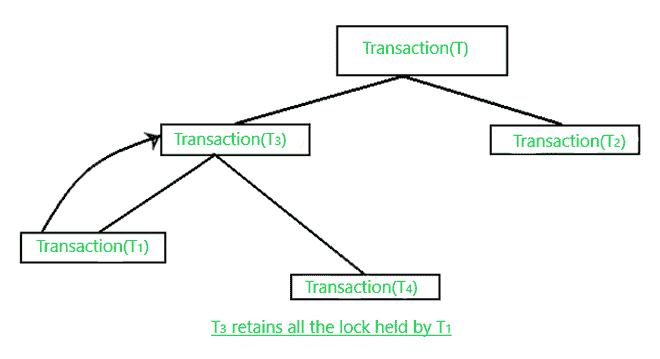
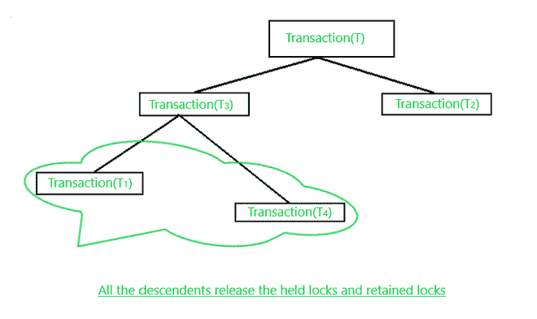
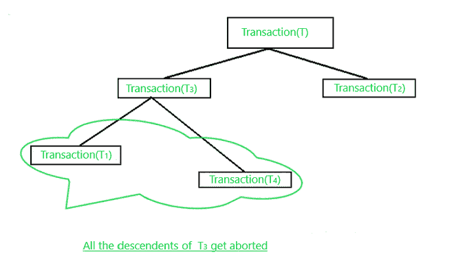

# MOSS 并发控制协议(数据库分布式锁定)

> 原文:[https://www . geesforgeks . org/moss-并发-控制-协议-分布式-数据库锁定/](https://www.geeksforgeeks.org/moss-concurrency-control-protocol-distributed-locking-in-database/)

这是一个在分布式数据库环境中用来控制并发性的协议，下面我们来了解一下在应用 **MOSS 并发控制协议时需要牢记的规则和规定。**

**<u>MOSS 并发控制协议</u>:-**T5】

**a)主要用于**处理基于继承的嵌套(分层)事务。

**b)** 考虑一个**事务(T)** 以某种模式(M)获取数据项(X)的锁。

**c)****交易(T)** 在模式(M)下保持锁定，直到它终止。

**d)** 当 **T** 的任何**子事务(T 1 )** 提交时，其父事务将占用或继承该锁并保留，直到所有子事务都无法完成。

**e)** 如果事务持有数据项(X)的锁，那么它有权以相应的模式访问被锁定的**数据项(X)** 。然而，如果一个事务保留了来自任何其他子事务(后代)的锁，那么它就无效。

**f)** 保留锁只是一种占位符，表示不在对应层级的子事务不能获取锁，但后代可以获取锁。

**g)** 一旦事务成为后代子事务 S 的锁的保持器，它就保持保持器，直到事务完成。

**<u>关于本协议的通用锁定规则</u> :-**

**a)子转换(T 1 )** 可以获取**数据项(X)** 的读锁，如果:

**a.1)** 没有其他子事务(后代)持有 X 上的写锁，并且

**a.2)** 在 X 上保留了写锁的所有子事务都是**子事务的祖先。**

**b)子事务(T1)** 可以获取数据项(X)上的写锁，如果:

**b.1)** 没有其他子交易持有 **X** 上的**读/写**锁，并且

**b.2)** 在 **X** 上保留了**读/写**锁的所有子事务都是 **T 1 的祖先。**

**c)** 当一个**子 transaction(T 1 )** 完成执行时， **T 1** 的父代以与 T 1 相同的方式继承(保留)由**T1**T15】持有的锁。

**图 c**

**d)** 当**子事务的顶级(T 3 )** 提交其所有后代的释放时，持有的锁和保留的锁一起被释放。

**图 d**

**e)** 当**子转换(T 3 )** 中止时，它会释放所有保持的锁以及保留的锁。源自中止事务的所有子事务也被中止，如果它们已经开始执行，则必须从头开始。

**图 e**