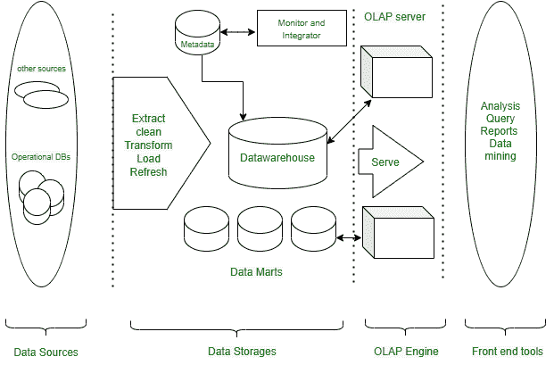

# 数据仓库的多层架构

> 原文:[https://www . geeksforgeeks . org/多层架构数据仓库/](https://www.geeksforgeeks.org/multi-tier-architecture-of-data-warehouse/)

一个[数据仓库](https://www.geeksforgeeks.org/data-warehousing/)可以通过来自多个异构源的数据集成来表示。它是由**比尔·恩门**在 1990 年定义的。数据仓库是一个集成的、面向主题的、时变的、非易失性的数据集合。数据仓库是通过来自多个异构源的数据集成来构建的。这是一个用于数据分析和报告的系统。数据仓库是商业智能的核心要素。BI 技术提供了业务运营的历史、当前和预测视图，没有数据挖掘，许多企业可能无法执行有效的市场分析、竞争对手的优势和劣势、盈利决策等。

数据仓库是指与组织的运营数据分开维护的数据存储库。**多层数据仓库架构由以下组件组成:**

1.  底层
2.  中间层
3.  顶级

数据仓库的三层/多层架构

#### 底层(数据源和数据存储) :

1.  底层通常由数据源和数据存储组成。
2.  它是一个仓库数据库服务器。例如 RDBMS。
3.  在底层，使用应用程序接口(称为网关)，从操作和外部来源提取数据。
4.  支持开放数据库连接、数据库开放链接和嵌入、JDBC 等应用程序接口。

#### **中间层:**

中间层是 OLAP 服务器，通常使用以下两种方式之一来实现:
关系 OLAP (ROLAP)模型(即，将操作从标准数据映射到标准数据的扩展关系数据库管理系统)；**或**多维 OLAP (MOLAP)模型(即直接实现多维数据和操作的专用服务器)。

#### 顶层:

顶层是前端客户端层，包括查询和报告工具、分析工具和/或数据挖掘工具(如趋势分析、预测等)。).

#### **数据仓库模型:**

从架构的角度来看，有三种仓库模型-

**企业仓库:-**

*   企业仓库收集分布在整个组织中的所有信息主题。
*   它提供公司范围的数据集成，通常来自一个或多个运营系统或外部信息提供商，并且在范围上是跨职能的。
*   它通常包含详细数据和汇总数据，大小范围从几千兆字节到数百千兆字节、万亿字节或更大。可以是企业数据仓库。
*   传统的大型机、计算机超级服务器或并行架构已经在平台上实现。这需要大量的商业建模，并且可能需要数年时间来设计和制造。

**数据集市:-**

*   数据集市包含对特定用户组很重要的公司范围的数据子集。
*   范围仅限于特定的选定主题。
*   例如，营销数据集市可能将其主题限制为客户、商品和销售。
*   数据疣中包含的数据总结如下。数据疣通常应用于基于 Unix/Linux 或 Windows 的低成本部门服务器。
*   数据集市的实施周期更可能以周为单位，而不是以月或年为单位。然而，从长远来看，复杂的集成并不涉及整个企业的设计和规划。

**虚拟仓库:-**

*   虚拟仓库是操作数据库上的一组视图。
*   为了高效的查询处理，只有少数可能的摘要视图是物理视图。
*   创建一个虚拟仓库很容易，但是需要操作数据库服务器的额外容量。