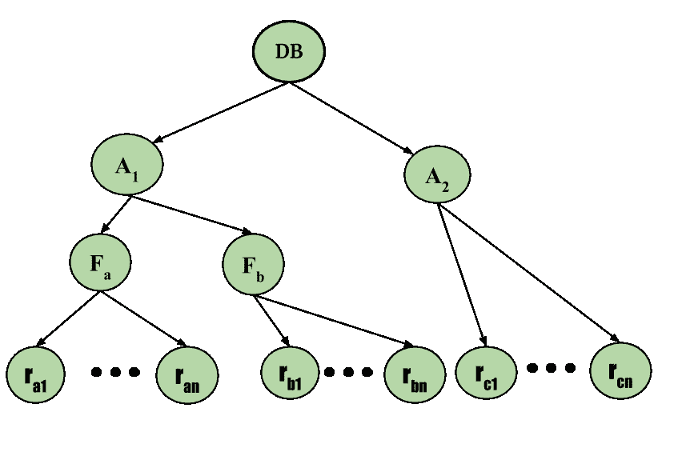

# 数据库管理系统中的多粒度锁定

> 原文:[https://www . geesforgeks . org/多粒度锁定 dbms/](https://www.geeksforgeeks.org/multiple-granularity-locking-in-dbms/)

先决条件–[时间戳排序协议](https://www.geeksforgeeks.org/dbms-concurrency-control-protocols-timestamp-ordering-protocols/)
各种并发控制方案使用了不同的方法，并将每个单独的数据项作为执行同步的单元。这种技术的一个缺点是，如果事务 T i 需要访问整个数据库，并且使用了锁定协议，那么 T i 必须锁定数据库中的每个项目。效率较低，如果 T i 可以使用一个锁来锁定整个数据库，那就更简单了。但是，如果它考虑第二项建议，这实际上不应该忽视拟议方法中的某些缺陷。假设另一个事务只需要访问数据库中的几个数据项，那么锁定整个数据库似乎是不必要的，而且它可能会让我们失去并发性，这是我们最初的主要目标。在效率和并发性之间权衡。使用粒度。

让我们从理解粒度的含义开始。

**粒度–**是允许锁定的数据项的大小。现在*多粒度*意味着将数据库分层分解成可以锁定和跟踪的块，需要锁定什么，以什么方式锁定。这样的层次结构可以用图形表示为一棵树。

例如，考虑由四层节点组成的树。最高级别代表整个数据库。下面是**区域**类型的节点；数据库正是由这些区域组成的。该区域有称为文件的子节点。每个区域都有作为其子节点的文件。任何文件都不能跨越多个区域。

最后，每个文件都有称为记录的子节点。和以前一样，该文件完全由作为其子节点的记录组成，任何记录都不能出现在多个文件中。因此，从顶层开始的级别是:

*   数据库
*   区域
*   文件
*   记录

**图–**多粒度树层次结构

考虑上面给出的示例图，树中的每个节点都可以单独锁定。如同[两相锁定协议](https://www.geeksforgeeks.org/dbms-concurrency-control-protocols-two-phase-locking-2-pl/)一样，应使用共享和独占锁定模式。当事务以共享或独占模式锁定一个节点时，该事务也会以相同的锁定模式隐式锁定该节点的所有后代。例如，如果事务 T i 在独占模式下获得了文件 F c 的显式锁，那么它在独占模式下对属于该文件的所有记录都有一个隐式锁。不需要明确锁定 F c 的个别记录。这是基于树的[锁定](https://www.geeksforgeeks.org/dbms-concurrency-control-protocol-graph-based-protocol/)和多粒度的分层锁定的主要区别。

现在，文件和记录的锁定变得简单了，系统如何确定根节点是否可以被锁定？一种可能性是它搜索整个树，但是该解决方案否定了多粒度锁定方案的全部目的。获得这些知识的更有效的方法是引入一种新的锁定模式，称为*意图锁定模式*。

**意向模式锁定–**
除了 **S** 和 **X** 锁定模式外，还有三种多粒度的额外锁定模式:

*   **意图共享(IS):** 在树的较低级别显式锁定，但仅使用共享锁。
*   **意图-排他(IX):** 使用排他锁或共享锁在较低级别进行显式锁定。
*   **共享&意图-独占(SIX):** 该节点所扎根的子树在共享模式下被显式锁定，并且显式锁定是在具有独占模式锁定的较低级别上完成的。

这些锁定模式的兼容性矩阵描述如下:

**图–**多粒度树层次结构

多粒度锁定协议使用意图锁定模式来确保可串行化。它要求试图锁定节点的事务必须遵循以下协议:

1.  事务 T i 必须遵循锁兼容矩阵。
2.  事务 T i 必须先锁定树根，它可以在任何模式下锁定。
3.  事务 T i 只有当事务 T i 当前在 IX 或 IS 模式下锁定了节点的父节点时，才能在 S 或 IS 模式下锁定该节点。
4.  事务 T i 只有当事务 T i 当前在 IX 或 SIX 模式下锁定了节点的父节点时，才能将节点锁定在 X、SIX 或 IX 模式下。
5.  事务 T i 只有在 T i 之前没有解锁任何节点(即 T i 为两相)的情况下才能锁定一个节点。
6.  事务 T i 只有在 T i 当前没有锁定节点的子节点时才能解锁节点。

请注意，多粒度协议要求以自顶向下(从根到叶)的顺序获取锁，而锁必须以自底向上(从叶到根)的顺序释放。
作为协议的示例，考虑上面给出的树和事务:

*   说交易 T 1 读取文件 F a 中的记录 R a2 。然后 T 2 需要锁定数据库，IS 模式下区域 A 1 ，F a (按此顺序)，最后 S 模式下锁定 R a2 。
*   说交易 T 2 修改文件 F a 中的记录 R a9 。然后，T 2 需要在 IX 模式下锁定数据库，A 区 1 ，F 区 a 区(按此顺序排列)，最后在 X 模式下锁定 R 区 a9 。
*   说交易 T 3 读取文件 F a 中的所有记录。然后，T 3 需要在 IS 模式下锁定数据库和区域 A 1 (依次类推)，最后在 S 模式下锁定 F a 。
*   假设事务 T 4 读取整个数据库。它可以在 S 模式下锁定数据库后这样做。

注意事务 T 1 、T 3 、T 4 *可以并发访问数据库*。交易 T 2 可以与 T 1 同时执行，但不能与 T 3 或 T 4 同时执行。
该协议增强了*的并发性，降低了*的锁开销。死锁在多粒度协议中仍然是可能的，就像在两阶段锁定协议中一样。这些可以通过使用某些[死锁消除技术](https://www.geeksforgeeks.org/deadlock-in-dbms/)来消除。