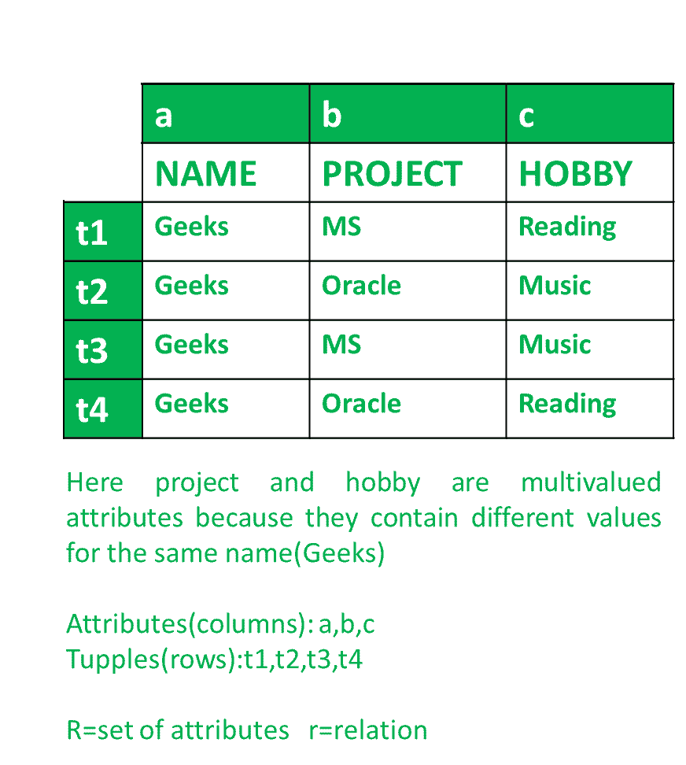
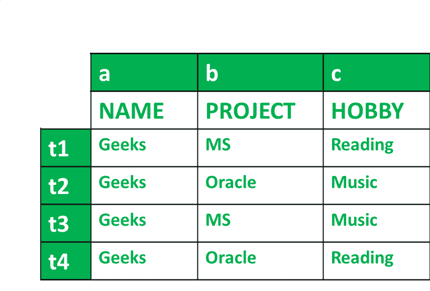

# 数据库管理系统中的多值依赖关系

> 原文:[https://www . geesforgeks . org/multically-dependency-MVD-in-DBMS/](https://www.geeksforgeeks.org/multivalued-dependency-mvd-in-dbms/)

MVD 或多值依赖意味着对于属性“a”的单个值，存在属性“b”的多个值。我们把它写成，

```
a --> --> b 
```

它被理解为:a 是依赖于 b 的多值。

假设一个叫极客的人在微软和甲骨文的两个项目上工作，有两个爱好，即阅读和音乐。这可以通过以下方式以表格形式表示。



项目和爱好是多值属性，因为它们对一个人(即极客)有多个值。

**多值依赖(MVD) :**
我们可以说，满足以下条件，多值依赖就存在。

**MVD 的条件:**
任意属性说 **a** 多重定义另一个属性 b；对于 R 中的所有元组对 t1 和 t2，

```
t1[a] = t2[a] 
```

那么 r 中存在 t3 和 t4。

```
t1[a] = t2[a] = t3[a] = t4[a]
t1[b] = t3[b]; t2[b] = t4[b] 
t1 = t4; t2 = t3 
```

那么就存在多值(MVD)依赖。

为了检查给定表中的 MVD，我们应用上述条件，并用给定表中的值进行检查。



**MVD 的条件-1–**

```
t1[a] = t2[a] = t3[a] = t4[a] 
```

从表中查找，

```
t1[a] = t2[a] = t3[a] = t4[a] = Geeks 
```

因此，条件 1 是满足的。

**MVD 的条件-2–**

```
t1[b] = t3[b] 
And 
t2[b] = t4[b] 
```

从表中查找，

```
t1[b] = t3[b] = MS 
And 
t2[b] = t4[b] = Oracle 
```

因此，条件 2 满足。

**MVD 的条件-3–**

```
t1 = t4 
And  
t2=t3 
```

从表中查找，

```
t1 = t4 = Reading 
And
t2 = t3 = Music 
```

所以，条件 3 满足。

因此，所有条件都得到满足，

```
a --> --> b 
```

根据我们得到的表格，

```
name --> --> project 
```

对于，

```
a --> --> C 
```

我们得到，

```
name --> --> hobby 
```

因此，我们知道 MVD 存在于上表中，

```
name --> --> project
name --> --> hobby 
```