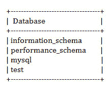
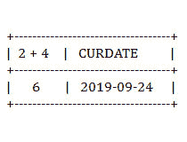

# MySQL |常用 MySQL 查询

> 原文:[https://www.geeksforgeeks.org/mysql-common-mysql-queries/](https://www.geeksforgeeks.org/mysql-common-mysql-queries/)

**MySQL** 服务器是一个开源的关系数据库管理系统，是对基于 web 的应用程序的主要支持。数据库和相关表格是许多网站和应用程序的主要组成部分，因为数据是通过网络存储和交换的。甚至所有的社交网站，主要是脸书、推特和谷歌，都依赖于为此目的而设计和优化的 MySQL 数据。由于所有这些原因，MySQL 服务器成为网络应用程序的默认选择。

MySQL 服务器用于数据操作，如查询、排序、过滤、分组、修改和连接表。在学习常用的查询之前，让我们先了解一下 MySQL 的一些优点。

**MySQL 的优势:**

*   快速且高性能的数据库。
*   易于使用、维护和管理。
*   易于获得并保持数据库的完整性。
*   提供可扩展性、可用性和可靠性。
*   低成本硬件。
*   MySQL 可以读取简单和复杂的查询和写操作。
*   InnoDB 是默认且广泛使用的存储引擎。
*   提供强大的索引支持。
*   为安全连接提供 SSL 支持。
*   提供强大的数据加密和准确性。
*   提供跨平台兼容性。
*   提供最小化的代码重复。

查询可以理解为与数据库表交互以处理数据的命令。一些常用的 MySQL 查询、运算符和函数如下:

1.显示数据库

这将显示服务器中所有现有数据库的信息。

**输出:**



**注:**数据库*【信息 _ 架构】**【mysql】**【performance _ 架构】*为 MySQL 服务器内部使用的系统数据库。一个*“测试”*数据库用于安装期间提供的测试目的。

2.使用数据库名称
**数据库名称:**数据库名称
这将数据库设置为 MySQL 服务器中的当前数据库。
要显示当前设置的数据库名称，请使用语法

```
SELECT DATABASE(); 
```

3.描述表名
**表名:**表名
该表描述了*表名*中字段、类型、空值、键、默认值、额外的列。

4.显示表格
显示所选数据库中的所有表格作为信息。

5.SHOW CREATE TABLE TABLE _ name
**TABLE _ name:**表的名称
这显示了 MySQL 用来创建表的完整 CREATE TABLE 语句。

6.SELECT NOW()
MySQL 查询大多以 SELECT 语句开始。
该查询显示当前日期和时间。
T3】输出:

```
2019-09-24 07:08:30 
```

7.选择 2+4；

**输出:**

```
6 
```

这将在没有任何表的情况下执行 SELECT 语句。
SELECT 可用于执行表达式或计算内置函数。
SELECT 也可以用于一列或多列。

**示例:**

```
SELECT 2+4, CURDATE(); 
```

**输出:**



8.评论
评论有两种类型。多行注释或单行注释或行尾注释。

```
/*  These are multi-line comments.  */ 
```

```
 #  This is single-line comment.
```

```
 -- This is also single-line comment.
```

9.创建数据库数据库名称
**数据库名称:**数据库名称
该语句创建一个新的数据库。

10.DROP DATABASE _ name
**DATABASE _ name:**数据库的名称
此语句删除数据库。
**注意:**用户在删除数据库之前必须非常小心，因为这样会丢失数据库中存储的所有重要信息。

11.CREATE TABLE table_name(第 1 列，第 2 列，第 3 列..)
**table_name :** 表的名称
**列 1 :** 第一列的名称
**列 2 :** 第二列的名称
**列 3 :** 第三列的名称
当开发人员开始构建应用程序时，他需要创建数据库表。
该语句用给定的列创建一个新表。

**示例:**

```
CREATE TABLE  employee(
   'id' INTEGER  NOT NULL AUTO_INCREMENT,
   'name' VARCHAR(30) NOT NULL,
   'profile' VARCHAR(40) DEFAULT 'engineer',
   PRIMARY KEY ('id')
)ENGINE = InnoDB; 
```

**注意:**你有*‘id’*列作为 AUTO_INCREMENT，带有主键约束，保证每个 id 都是递增值，避免重复。选择的存储引擎是允许外键约束和相关交易的*‘InnoDB’*。

12.AUTO_INCREMENT
用于生成新行的唯一标识字段。

13.DROP TABLE TABLE _ name
**TABLE _ name:**表的名称
该语句删除了上述表。

14.重命名表旧 _ 表名为新 _ 表名
**旧 _ 表名:**上一个表的名称。
T4【新 _ 表 _ 名称:新表的名称。
此语句将表重命名为新名称。

15.ALTER TABLE table_name ADD(第 1 列，第 2 列，第 3 列..)
**表 _ 名称:**现有表的名称。
**第 1 列:**第 1 列名称。
**第 2 列:**第 2 列名称。
**第 3 列:**第 3 列名称。
此语句向现有表中添加列。

16.ALTER TABLE TABLE _ name DROP(column 1)
**TABLE _ name:**现有表的名称。
**第 1 列:**第 1 列名称。
此语句从现有表中删除指定的列。

17.插入表名(第 1 列，第 2 列，第 3 列。。)值(value1，value2，value3。。)
**表 _ 名称:**现有表的名称。
**第 1 列:**第 1 列名称。
**第 2 列:**第 2 列名称。
**第 3 列:**第 3 列名称。
**值 1 :** 第一列的值。
**值 2 :** 值为第二列。
**值 3 :** 值为第三列。
此语句用指定的值将新记录插入表中。

18.UPDATE table_name SET 列 1 =值 1，列 2 =值 2，列 3 =值 3..WHERE 条件
**表 _ 名称:**表的名称。
**第 1 列:**第 1 列名称。
**第 2 列:**第 2 列名称。
**第 3 列:**第 3 列名称。
**值 1 :** 第一列的值。
**值 2 :** 值为第二列。
**值 3 :** 值为第三列。
**条件:**条件语句。
此语句用列的新给定值更新表中的记录。

**注意:**MySQL 查询中的 WHERE 子句用于筛选特定条件的行。

19.从表中删除 _ 名称 WHERE 条件
**表 _ 名称:**表的名称。
**条件:**条件陈述。
此语句从表中删除记录。

20.选择列 1、列 2、列 3..FROM 表 _name WHERE 条件
**表 _name :** 表的名称。
**第 1 列:**第 1 列名称。
**第 2 列:**第 2 列名称。
**第 3 列:**第 3 列名称。
**条件:**条件语句。
此语句执行并给出与 WHERE 子句后的条件匹配的表中特定列的记录。

21.选择* FROM 表名
**表名:**表名。
您可以使用星号(*)表示表格的所有列，而不是指定一列或多列。该查询从表中检索所有记录。

22.COUNT
COUNT 函数用于从任何表中返回符合条件的记录总数。
是已知的 AGGREGATE 函数之一。

**示例:**

```
SELECT COUNT(*) from student; 
```

**注意:**聚合函数允许您使用
选择查询对数据进行计算并提供信息。

23.MAX
用于获取表格某一列的最大数值。

**示例:**

```
SELECT MAX(marks) FROM student_report;  
```

**注意:**最小值和最大值功能在数字和字母值上都能正常工作。

24.MIN
用于获取表格某一列的最小数值。

**示例:**

```
SELECT MIN(marks) FROM student_report;  
```

**注意:**根据需求，上面给出的示例查询也可以相互嵌套。

**示例:**

```
SELECT MIN(marks) 
FROM student_report 
WHERE marks > ( SELECT MIN(marks) from student_report); 
```

25.极限
用于设置结果集中记录数的极限。

**示例:**

```
SELECT * 
FROM student limit 4, 10; 
```

这给出了从第 5 个记录开始的 10 个记录。

26.在
之间，用于获取从指定下限到上限的记录。
这将验证某个值是否在给定范围内。

**示例:**

```
SELECT * FROM employee 
WHERE age BETWEEN 25 to 45\. 
```

27.DISTINCT
用于获取所有不同的记录，避免所有重复的记录。

**示例:**

```
SELECT DISTINCT profile 
FROM employee; 
```

28.在子句
中，验证一行是否包含在一组给定值中。
代替查询中使用这么多 OR 子句。

**示例:**

```
SELECT * 
FROM employee 
WHERE age IN(40, 50, 55); 
```

29.AND
MySQL 查询中的这个条件用于根据 AND 条件过滤结果数据。

**示例:**

```
SELECT NAME, AGE 
FROM student 
WHERE marks > 95 AND grade = 7; 
```

30.OR
MySQL 查询中的这个条件用于根据 OR 条件过滤结果数据。

**示例:**

```
SELECT * 
FROM student 
WHERE address = 'Hyderabad' OR address = 'Bangalore'; 
```

31.IS NULL
此关键字用于布尔比较或检查一列的数据值是否为 NULL。

**示例:**

```
SELECT * 
FROM employee 
WHERE contact_number IS NULL; 
```

32.外键
用于指向另一个表的主键。

**示例:**

```
CREATE TABLE Customers
 (
 id INT AUTO_INCREMENT PRIMARY KEY, 
 name VARCHAR(30) NOT NULL, 
)

CREATE TABLE Orders
(
 order_id INT AUTO_INCREMENT PRIMARY KEY,
 FOREIGN KEY (id) REFERENCES Customers(id)
 ); 
```

**注意:**这在 MySQL 服务器的 MYISAM 存储引擎中没有使用。
InnoDB 存储引擎支持外键约束。

33.像
这是用来获取符合指定字符串模式的记录。

**示例:**

```
SELECT * 
FROM employee 
WHERE name LIKE 'Sh%';

SELECT * 
FROM employee  
WHERE name LIKE '%Sh%';   
```

**注意:**查询中的百分比符号(%)表示零个或多个字符。

34.JOINS
Joins 是两个或多个数据库表基于一个公共字段获取数据的连接。
不同的数据库中有不同名称的各种类型的连接。
常见的连接有自连接、外连接、内连接等等。

**常规连接:**
连接从两个表中获取与给定条件完全匹配的所有记录。

**示例:**

```
SELECT student.name, department.name 
FROM student JOIN department ON student.department = department.name 
```

**左连接:**
是连接获取所有符合给定条件的记录，同时也从左表
中获取所有记录。

**示例:**

```
SELECT student.name, department.name 
FROM student LEFT JOIN department ON student.deptartment = department.name 
```

**右连接:**
是连接获取所有符合给定条件的记录，同时也从右表
中获取所有记录。

**示例:**

```
SELECT student.name, department.name 
FROM student RIGHT JOIN department on student.department = department.name 
```

35.添加或删除列
如果以后需要，可以在数据库表上添加新列。

**示例:**

```
ALTER TABLE employee ADD COLUMN salary VARCHAR(25); 
```

同样，可以从数据库表中删除任何列。

**示例:**

```
ALTER TABLE employee DROP COLUMN salary; 
```

**结论:**

运行 MySQL 查询是数据库管理过程中最常执行的获取数据的任务。有很多像 **phpMyAdmin** 这样的数据库管理工具，可以帮助执行查询，并以可视化的数据结果轻松处理事务。您已经滚动了日常编码实践中使用的最常见的 MySQL 查询。开发人员可以针对特定需求定制或增强查询。