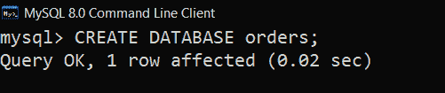
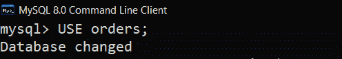
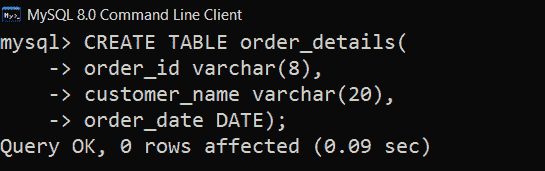
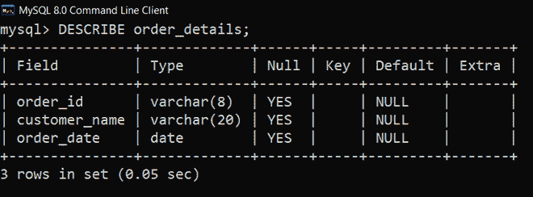
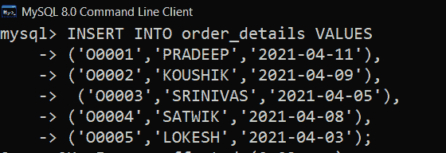
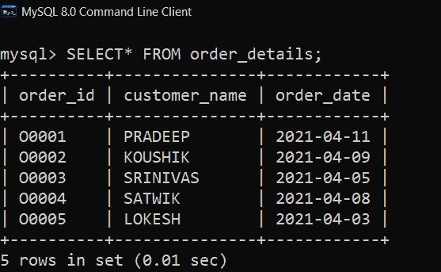
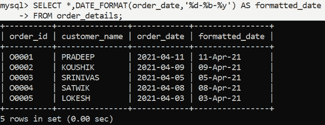
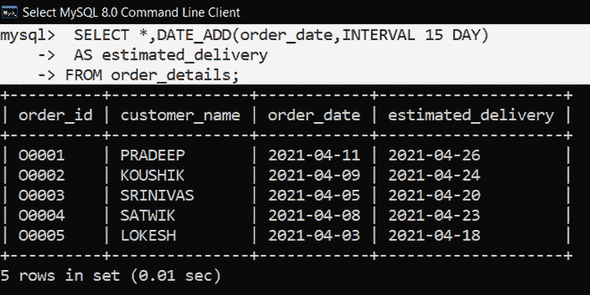
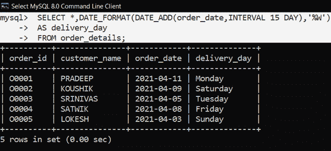
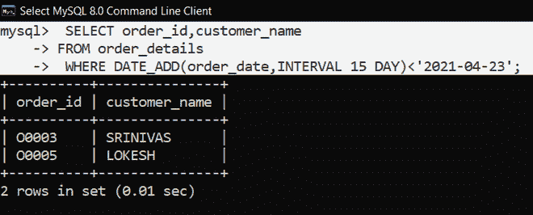

# MySQL–日期操作查询

> 原文:[https://www . geesforgeks . org/MySQL-查询-日期-操作/](https://www.geeksforgeeks.org/mysql-queries-on-date-manipulation/)

在 [**MySQL**](https://www.geeksforgeeks.org/sql-tutorial/) **中，日期**是一种数据类型，默认遵循格式**‘YYYY-MM-DD’**，但是通过使用日期格式化功能，我们可以格式化日期，并且可以在表格中获得所需的日期格式，甚至可以使用不同的日期功能来操作日期。

在本文中，让我们逐步详细地执行一些关于日期格式的查询:

### **创建数据库:**

通过使用以下[**【SQL】**](https://www.geeksforgeeks.org/sql-tutorial/)查询创建学生数据库如下。

```
CREATE DATABASE orders;
```



### **使用数据库:**

使用数据库学生使用以下 [**SQL**](https://www.geeksforgeeks.org/sql-tutorial/) 查询如下。

```
USE orders;
```



### **创建表格:**

表–使用以下[](https://www.geeksforgeeks.org/sql-tutorial/)**查询创建一个 3 列的表 *order_details* 如下。**

```
**CREATE TABLE** order_details(
order_id **varchar(8)**,
customer_name **varchar(20)**,
order_date **DATE**);
```

****

### ****验证数据库:****

**要查看数据库中表的描述，使用以下 [**SQL**](https://www.geeksforgeeks.org/sql-tutorial/) 查询如下。**

```
 **DESCRIBE** order_details;
```

****

### ****将数据插入表中:**** 

**使用如下 [SQL](https://www.geeksforgeeks.org/sql-tutorial/) 查询将行插入 order_details 表。**

```
 **INSERT INTO** order_details **VALUES**
     ('O0001','PRADEEP','2021-04-11'),
     ('O0002','KOUSHIK','2021-04-09'),
     ('O0003','SRINIVAS','2021-04-05'),
     ('O0004','SATWIK','2021-04-08'),
     ('O0005','LOKESH','2021-04-03');
```

****

### ****验证插入的数据:**** 

**插入行后查看表 *order_details* 使用如下 [**SQL**](https://www.geeksforgeeks.org/sql-tutorial/) 查询如下。**

```
 **SELECT* FROM** order_details;
```

****

### ****查询:****

****1。将订单日期格式化为“日-月-YY”的查询。****

**可以使用 **DATE_FORMAT( )** 功能从默认日期开始格式化默认日期:**

```
SYNTAX:
**DATE_FORMAT**(date,new_format);
```

**在这个查询中，我们使用 **%d** 获取日，然后使用 **%b** 获取月，使用 **%y** 获取年。**

```
 **SELECT *,DATE_FORMAT**(order_date,**'%d-%b-%y'**) **AS** formatted_date
 **FROM** order_details;
```

****

****2。查询以获取订单日期 15 天后的预计交货日期。****

**使用 **DATE_ADD( )** 功能可以添加需要的天数:**

```
SYNTAX:
**DATE_ADD**(date, **INTERVAL** no_of_days **DAY**);
```

```
 **SELECT *,DATE_ADD**(order_date,**INTERVAL** 15 **DAY**)
 **AS** estimated_delivery
 **FROM** order_details;
```

****

****3。查询以获取预计交货日期。****

**这可以通过使用 **DATE_FORMAT( )** 和 **DATE_ADD( )** 功能来完成。**

```
 **SELECT ***,**DATE_FORMAT**(**DATE_ADD**(order_date,**INTERVAL** 15 **DAY**),**'%W'**)
 **AS** delivery_day
 **FROM** order_details;
```

**这里 **%W** 将日期格式化为工作日。**

****

****4。** **查询获取 2021-04-23 之前订单交付人员的订单 id 和客户名称。****

**这里 **DATE_ADD( )** 功能是获取预计发货，检查是否小于 2021-04-23。**

```
 **SELECT** order_id,customer_name
   **FROM** order_details
  ** WHERE** **DATE_ADD**(order_date,**INTERVAL** 15 **DAY**)**<**'2021-04-23';
```

****