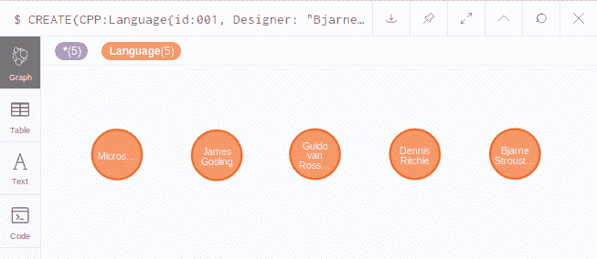
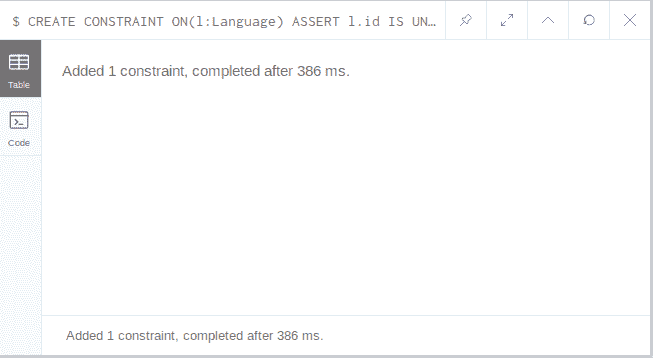
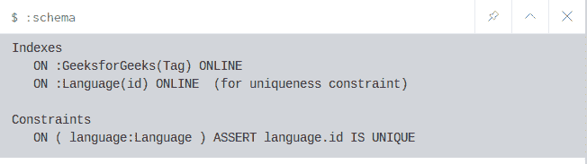
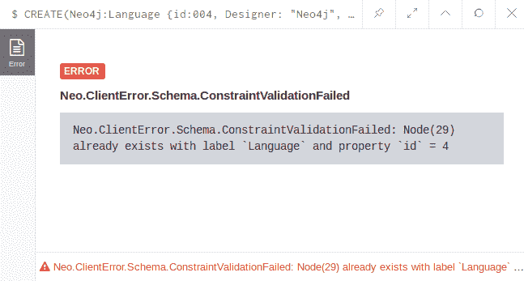

# Neo4j 创建约束

> 原文:[https://www.geeksforgeeks.org/neo4j-create-constraint/](https://www.geeksforgeeks.org/neo4j-create-constraint/)

**neo4j** 约束有助于用户输入错误的数据。当约束被应用并且用户错误地输入了错误的数据类型时，它将显示一条错误消息。在 neo4j 中有两种约束一种是**唯一性约束**另一种是**属性存在**约束。
下面是两个约束同例的例子:
假设下面已经有数据库是存在的。

```
CREATE(CPP:Language{id:001, Designer: "Bjarne Stroustrup", YOE: 1985}) 
CREATE(C:Language {id:002, Designer: "Dennis Ritchie", YOE: 1972}) 
CREATE(Python:Language {id:003, Designer: "Guido van Rossum ", YOE: 1990}) 
CREATE(Java:Language {id:004, Designer: "James Gosling", YOE: 1995}) 
CREATE(CSharp:Language {id:005, Designer: "Microsoft", YOE: 2000})
RETURN CPP, C, Python, Java, CSharp 

```

**输出:**


**Uniqueness Constraints:**

*   **Query:**

    ```
    CREATE CONSTRAINT ON(l:Language) ASSERT l.id IS UNIQUE
    ```

    **输出:**
    

    *   **View the Constraint:**

    ```
    :schema
    ```

    **输出:**
    

    *   **测试约束:**
    这里我们将尝试用冗余 id 值(004)向数据库中添加另一个节点。
    **查询:**

```
CREATE(Neo4j:Language {id:004, Designer: "Neo4j", YOE: 2012})
```

**输出:**


**Property Existence Constraints:**

*   **Query:**

    ```
    CREATE CONSTRAINT ON (label) ASSERT exists(node)
    ```

    **注:**
    属性存在约束仅在 Neo4j 企业版中可用。