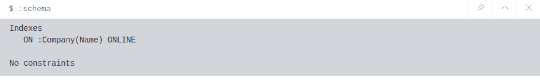

# Neo4j 创建索引

> 原文:[https://www.geeksforgeeks.org/neo4j-create-index/](https://www.geeksforgeeks.org/neo4j-create-index/)

在 neo4j 中，您可以为属性和节点创建索引。索引是一种数据结构，有助于提高数据库检索操作的性能。neo4j 索引有一些特殊功能，一旦创建索引，该索引将自行管理，并在数据库发生更改时保持最新。同样，CREATE INDEX ON 语句将提供索引。

**示例:**在下面的示例中，我们使用 *GeeksforGeeks* 标签在所有节点的*标签*属性上创建索引。

```
$ CREATE INDEX ON:GeeksforGeeks(Tag)
```

*   **输出:**


*   **注意:**
    创建索引时，neo4j 会在后台创建索引。如果您的数据库很大，将需要一些时间。

**视图索引:**
索引和约束是数据库模式的一部分。要查看索引，您必须使用 **:schema** 命令，如下例所示。

```
:schema
```

*   **输出:**



**索引提示:**
如果索引存在于您的数据库中，那么当您触发类似类型的查询时，它会有所帮助，它会提高性能。您可以通过在查询中包含 USING INDEX …来创建索引提示。

```
$ MATCH (a:GeeksforGeeks {Tag: "A Computer Science Portal"}) 
USING INDEX a:GeeksforGeeks(Tag) 
RETURN a 
```

*   **Output: **

    **注意:**还可以提供多个提示。只需为您想要实施的每个索引添加一个新的**使用索引**。

