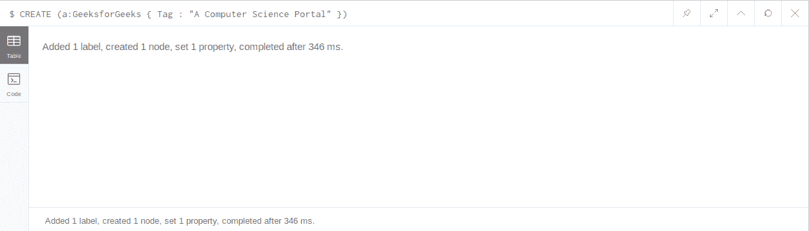
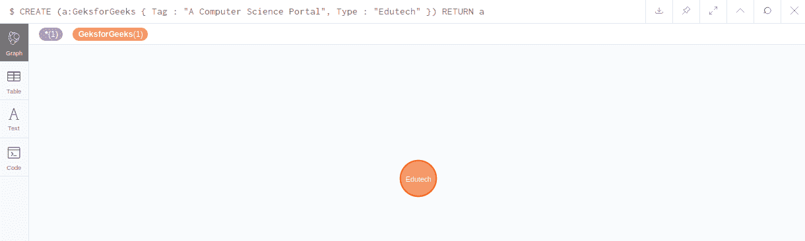
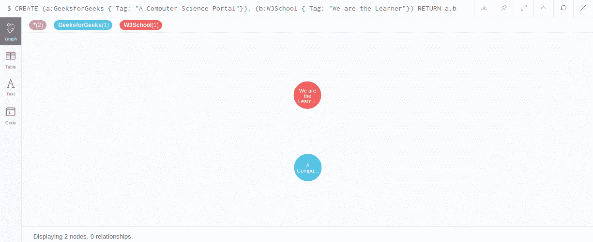

# Neo4j 创建节点

> 原文:[https://www.geeksforgeeks.org/neo4j-create-node/](https://www.geeksforgeeks.org/neo4j-create-node/)

在 Neo4j 创建节点中，您必须声明 **CREATE** 语句。借助于 cypher 语言，很容易创建节点、属性和节点之间的关系。让我们创建 GeeksforGeesk 的示例节点。您也可以通过选择选项来查看表格格式、实际代码和文本。下面的例子将更清楚地说明这个概念。

**示例:**在本例中，我们将创建一个带有“Tag”属性的节点标签“geeksforgeks”，它将告诉我们将成为属性值的“geeksforgeks”。

*   **To create the node:**

    ```
    $ CREATE (a:GeeksforGeeks { Tag : "A Computer Science Portal" })

    ```

    前缀 **a** 是一个变量，它将是这个东西在以后的任何语句中需要引用的任何东西。启动 Cypher 查询后，您将获得如下图所示的内容。
    **输出:**
    

    **显示节点:**
    那么现在你已经创建了一个节点但是上面的查询没有显示你所创建的节点要看到这个节点你需要使用 **RETURN** 语句像是不得不激发下面的查询。这里我们将再次创建一个具有两个属性的节点。

    *   **Display Created node:**

    ```
    $ CREATE (a:GeksforGeeks { Tag : "A Computer Science Portal", Type : "Edutech" }) 
    RETURN a

    ```

    **输出:**
    
    **注:**我们通过使用节点的变量名(在本例中为 a)返回节点。

    **创建多个节点:**
    要创建多个节点，请使用 **CREATE** 语句，并通过“、”来分隔节点，或者您可以使用多个时间 **CREATE** 语句，如下查询所示。

    *   **Multiple nodes single Query using coma:**

    ```
    $ CREATE (a:GeeksforGeeks { Tag: "A Computer Science Portal"}), 
    (b:W3School { Tag: "We are the Learner"}) 
    RETURN a, b

    ```

    或者

    ```
    CREATE (a:GeeksforGeeks { Tag: "A Computer Science Portal"}) 
    CREATE (b:W3School { Tag: "We are the Learner"}) 
    RETURN a, b

    ```

    **输出:**
    

    **注意:**两个查询都会给你相同的输出。