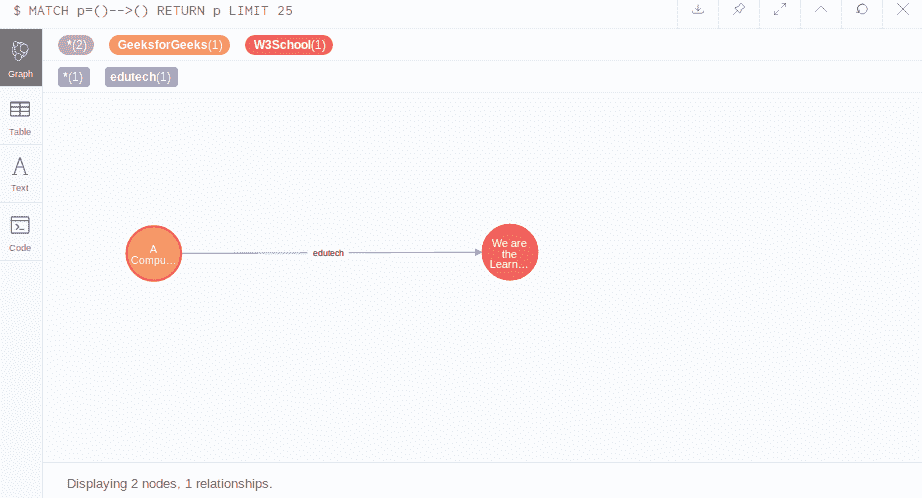
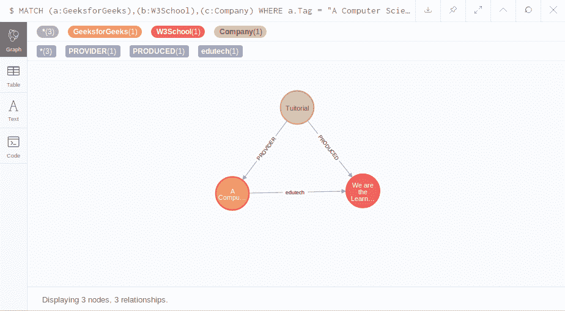

# Neo4j 创建关系

> 原文:[https://www.geeksforgeeks.org/neo4j-create-relationship/](https://www.geeksforgeeks.org/neo4j-create-relationship/)

在 Neo4j 中，要创建节点之间的关系，您必须使用 create 语句，就像我们以前创建节点一样。让我们在两个已经创建的节点之间创建关系。
**例:**

*   已经创建的节点:
*   查询创建关系:

    ```
    $ MATCH (a:GeeksforGeeks), (b:W3School)
    WHERE a.Name = "A Computer Science Portal" AND b.Name = "We are the Learner"
    CREATE (a)-[r:edutech]->(b)
    RETURN r
    ```

*   Output of above query:
    

    **创建多个节点之间的关系:**
    你可以看到继续创建更多的节点以及它们之间的关系是多么容易。因此，我们将再创建一个节点，并再添加两个关系。

*   **Creating a new node:**

    ```
    $ CREATE (c:Company { Name: "Tuitorial" })
    ```

    **输出:**
    

*   **Creating relationship:**

    ```
    MATCH (a:GeeksforGeeks), (b:W3School), (c:Comapny)
    WHERE a.Tag = "A Computer Science Portal" AND b.Tag = "We are the Learner" AND 
    c.Name = "Tuitorial" CREATE (c)-[pr:PRODUCED]->(b), (c)-[pr1:PROVIDER]->(a)
    RETURN a, b, c
    ```

    **输出:**
    