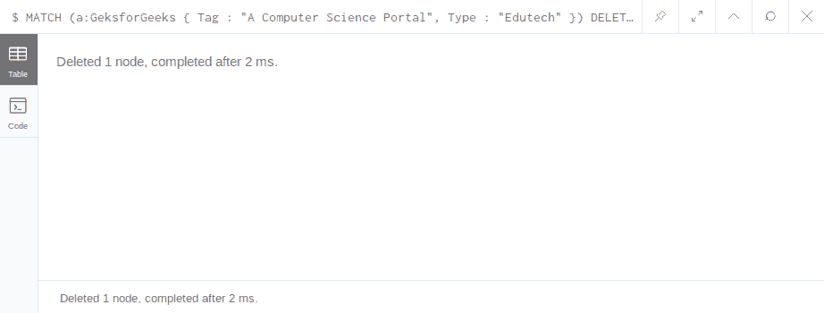
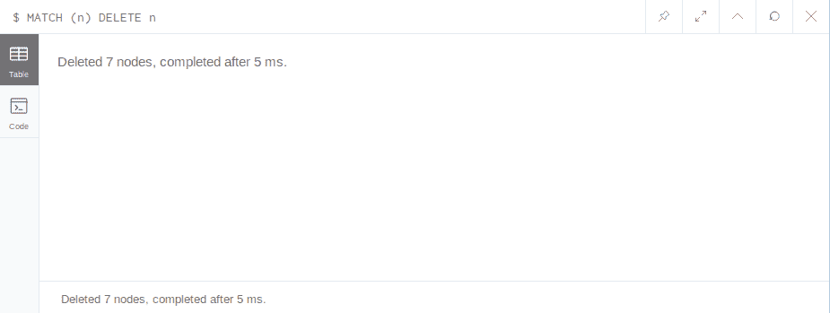

# Neo4j 删除节点

> 原文:[https://www.geeksforgeeks.org/neo4j-delete-node/](https://www.geeksforgeeks.org/neo4j-delete-node/)

在 Neo4j 中，要删除一个节点或节点之间的关系，必须使用 **DELETE** 子句。要删除任何节点，您需要带有 MATCH 语句的 delete 子句，MATCH 语句数据将找到特定的节点，无论哪个节点与该语句匹配，该节点都将消失。与 **CREATE** 和 **RETURN** 语句类似，只是将 **CREATE** 替换为 **MATCH** ， **RETURN** 替换为 **DELETE** 。下面的例子将说明这种方法。

**示例:**删除节点的基本方式是查找节点并删除匹配节点，但是在可以检查节点之前是要使用 **RETURN** 语句删除的节点，之后可以在下面激发查询。该查询将删除标签为“极客”标签为“计算机科学门户”且类型为“教育技术”的节点。

*   **To delete node:**

    ```
    $ MATCH (a:GeksforGeeks { Tag : "A Computer Science Portal", Type : "Edutech" }) 
    DELETE a
    ```

    **输出:**
    

    **删除多个节点:**
    要删除多个节点，请使用 **DELETE** 语句，并将节点用“、”隔开，或者可以使用多个 time MATCH 语句，如下查询。

    *   **Multiple nodes deleted:**

    ```
    $ DELETE (a:GeeksforGeeks { Tag: "A Computer Science Portal"}), 
    (b:W3School { Tag: "We are the Learner"}) 
    MATCH a, b
    ```

    或者

    ```
    $ MATCH (a:GeeksforGeeks { Tag: "A Computer Science Portal"}) 
    MATCH (b:W3School { Tag: "We are the Learner"}) 
    DELETE a, b

    ```

    **输出:**
    

    **删除所有节点:**一次删除所有节点就是要多短的查询才能火下面的查询会一次删除所有节点。

    *   **Delete all nodes:**

    ```
    $ MATCH (n) DELETE n
    ```

    **输出:**
    

    **注意:**删除任何节点或包含与其他节点关系的节点将显示错误消息。