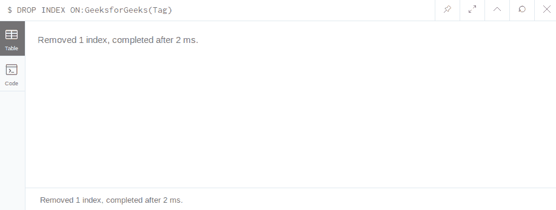
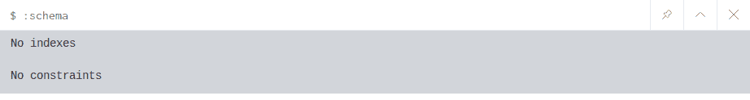

# Neo4j 下降指数

> 原文:[https://www.geeksforgeeks.org/neo4j-drop-index/](https://www.geeksforgeeks.org/neo4j-drop-index/)

在 neo4j 中，您可以删除属性和节点的索引。索引是一种数据结构，有助于提高数据库检索操作的性能。neo4j 索引有一些特殊功能，一旦创建索引，该索引将自行管理，并在数据库发生更改时保持最新。类似地**将索引置于**语句将提供索引。
**语法:**

```
DROP INDEX ON:label(node)
```

**示例:**在下面的示例中，我们将索引放在带有*极客标签*的所有节点的*标签*属性上。

*   ```
    $ DROP INDEX ON:GeeksforGeeks(Tag)

    ```

    **输出:**
    

    **查看模式:**您可以使用:Schema 命令查看是否从模式中删除了适用的索引。

    *   ```
    :schema
    ```

    **输出:**
    

    **注意:**如果有其他索引可用，那么它会显示这些，基本上这个命令会显示所有的模式。

    记住几件事，快速删除任何东西首先删除关系，然后尝试 DELETE 子句或 remove 子句，这是一个很好的做法。要删除任何节点，您必须删除这些关系，但在不需要索引的情况下。索引是不同的东西，它对数据库没有影响，只是增加了数据库的可访问性。通过删除索引，您失去了快速访问能力。