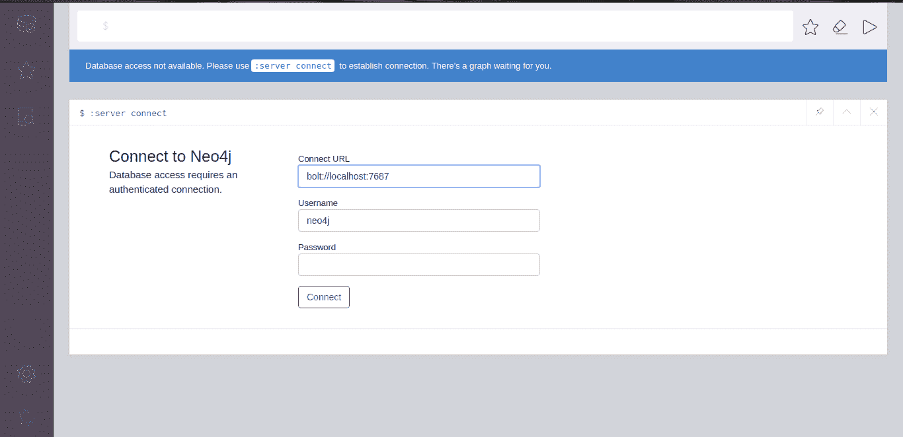
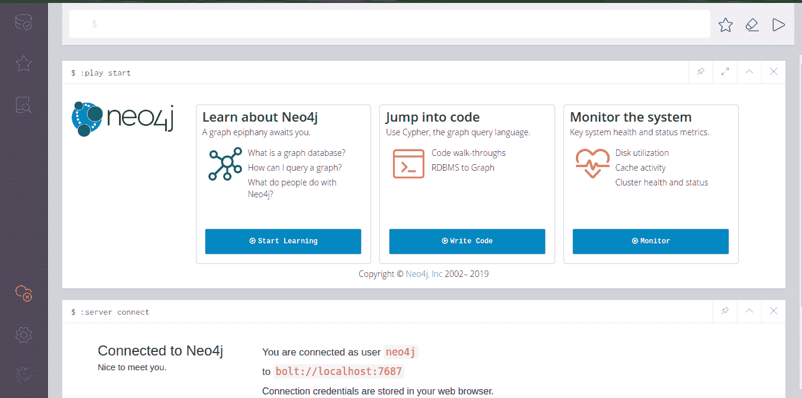

# Neo4j 安装

> 原文:[https://www.geeksforgeeks.org/neo4j-installation/](https://www.geeksforgeeks.org/neo4j-installation/)

最受欢迎的图形数据库 **Neo4j** 非常容易在您的系统中本地安装。要在任何系统中安装 neo4j，步骤因操作系统而异，但在这里，您将一个接一个地获得所有步骤，但视觉效果仅适用于 **Linux Ubuntu** 以及您将在这里了解的 mac 和 windows 步骤。

**安装:**
首先需要从[这里](https://neo4j.com/download-center/#community)下载 neo4j 的 **tar** 文件，这是免费的**社区版**还有一个不免费的版本**企业版**。该网站将为您提供操作系统所需的版本，因此您无需选择任何版本或其他任何内容，只需单击下载按钮并提供该页面中要求的详细信息。之后，下载将在几秒钟内开始。之后所有的步骤在下面一一描述。

#### 在 Linux Ubuntu 中安装 neo4j:

*   **Step 1:**
    Copy the downloaded file to somewhere where you want to work, after the open you terminal go to that folder by

    ```
    $ cd folderaddress
    ```

    使用以下命令解压缩下载的文件:

    ```
    $ tar -xf Downloaded file name
    *like: $ tar -xf neo4j-enterprise-3.5.8-unix.tar.gz*
    ```

*   **Step 2:**
    Now to run the neo4j run the below command:

    ```
    $unzip filename/bin/neo4j console
    *like: $ neo4j-community-3.5.8/bin/neo4j console*
    ```

    该命令将在浏览器后台运行 neo4j。

*   **第三步:**
    要检查打开任何浏览器并访问该本地主机 http://localhost:7474 在访问该主机后，您将获得如下图所示的内容。
    *   用户名和密码默认为 **neo4j** 。输入密码后，您将可以更新密码。
    *   更新新密码后，您会得到类似这样的信息。在下图中，您可以看到服务器已连接。

#### 在 Mac 中安装 neo4j:

*   打开刚刚下载的 dmg 文件。
*   将 Neo4j 图标拖到您的应用程序文件夹中。观看视频，了解这一点。
    从应用程序文件夹中打开 Neo4j。您可能需要承认您从互联网下载了该应用程序。
*   按开始按钮启动 Neo4j 服务器。
*   在任何网络浏览器中打开上面提供的网址。
*   更改 neo4j 帐户的密码默认密码是 neo4j。

#### 在 Windows 中安装 neo4j()。exe):

这个过程需要 JRE (Java 运行时环境)来运行 neo4j。

*   启动刚刚下载的安装程序。您必须授予安装程序对您的计算机进行更改的权限，请按“是”。
*   按照所有提示，选择选项运行 Neo4j。
*   按开始按钮启动 Neo4j 服务器。
*   在任何网络浏览器中打开上面提供的网址。
*   更改 neo4j 帐户的密码默认密码是 neo4j。