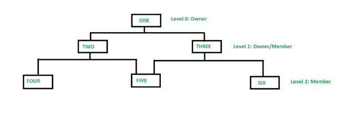
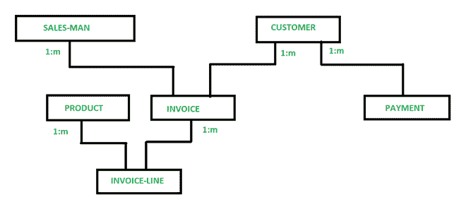

# 数据库管理系统中的网络模型

> 原文:[https://www.geeksforgeeks.org/network-model-in-dbms/](https://www.geeksforgeeks.org/network-model-in-dbms/)

**网络模型:**
这个模型是由数据库任务组在 20 世纪 60 年代形式化的。这个模型是层次模型的推广。该模型可以由多个父段组成，这些段被分组为级别，但是属于任何级别的段之间存在逻辑关联。大多数情况下，这两个部分之间存在多对多的逻辑关联。我们称**图形**为线段之间的逻辑关联。因此，该模型用类似图的结构代替了层次树，这样，不同节点之间可以有更通用的连接。它可以有 M: N 关系，即多对多关系，允许一个记录有多个父段。
这里，一个关系称为一个集合，每个集合至少由两种类型的记录组成，如下所示:

*   与层次模型中的父记录相同的所有者记录。
*   与层次模型中子记录相同的成员记录。

**网络模型的结构:**

网络数据模型

在上图中，成员二只有一个所有者“一”，而成员五有两个所有者，即二和三。这里，两种记录类型之间的每一个链接都代表它们之间的 1 : M 关系。该模型包括节点之间的横向和自顶向下的连接。因此，它允许给定实体之间的 1: 1、1 : M、M : N 关系，这有助于避免数据冗余问题，因为它支持到同一记录的多条路径。有各种各样的例子，如 Cincom 系统公司的 TOTAL，施乐公司的 EDMS 等。

**示例:**财务部的网络模型。

下面我们为财务部设计了网络模型:

财务部网络模型。

因此，在网络模型中，一对多(1: N)关系在两种记录类型之间有联系。在上图中，销售人员、客户、产品、发票、付款、发票行是公司销售的记录类型。现在，正如您在给定的图中看到的，发票行归产品和发票所有。发票也有两个所有者销售人员和客户。

让我们看看**另一个例子**，其中我们有两个部分，教员和学生。假设学生约翰同时在计算机科学系和电子工程系学习课程。现在，找出会有多少个实例？

对于上面的示例，学生实例至少可以有 2 个父实例，因此，学生实例和教师段之间存在关系。这个模型可能非常复杂，就好像我们使用其他部分，比如课程和逻辑关联，比如学生注册和教师课程。因此，在这个模型中，学生可以与各种学院和课程的实例进行逻辑关联。

**网络模式优势:**

*   这个模型非常简单，像分层数据模型一样易于设计。
*   该模型能够处理多种类型的关系，这有助于对现实应用进行建模，例如 1: 1、1: M、M: N 关系。
*   在这个模型中，我们可以很容易地访问数据，应用程序也有机会访问集合中所有者和成员的记录。
*   该网络不允许成员在没有所有者的情况下存在，这导致了数据完整性的概念。
*   像分层模型一样，这个模型也没有任何数据库标准，

**网络模型的缺点:**

*   这个数据库的模式或结构本质上非常复杂，因为所有的记录都是通过使用指针来维护的。
*   存在操作异常，因为使用指针进行导航，这进一步导致了复杂的实现。
*   该模型的设计或结构不便于用户使用。
*   这个模型没有任何自动查询优化的范围。
*   尽管网络数据库模型能够实现数据独立性，但该模型无法实现结构独立性。