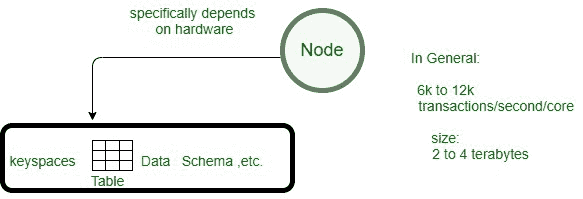

# 阿帕奇卡珊德拉中的节点

> 原文:[https://www.geeksforgeeks.org/node-in-apache-cassandra/](https://www.geeksforgeeks.org/node-in-apache-cassandra/)

在这篇文章中，我们将讨论什么是[卡珊德拉](https://www.geeksforgeeks.org/introduction-to-apache-cassandra/)中的节点，节点的信息，我们如何访问关于节点的信息，并且通过使用节点工具实用程序，我们还将讨论一些节点工具命令。让我们一个一个来讨论。

**节点:**

*   Cassandra 中的节点包含实际数据及其信息，如位置、数据中心信息等。
*   节点包含诸如键空间、表、数据模式等数据。
*   您可以执行读取、写入、删除数据等操作。在一个节点上。
*   节点在 Cassandra 集群中扮演着重要的角色。
*   在卡珊德拉环中，每个节点都是对等连接的，每个节点都与集群中的其他节点相似。

让我们考虑一个示例，其中您有三个数据副本，每个副本位于不同的节点上。现在，如果您想读取数据，那么任何节点都可以响应，这就是为什么在 Cassandra 中，跨集群分布数据的概念是如此有效和高可用性的机制。



**节点主体:T1**

*   它是节点管理实用工具，通过它可以获得节点健康信息、节点信息、集群信息等。
*   借助 nodetool 命令，您可以访问节点的所有必需信息。
*   Nodetool 命令，如帮助、信息、状态，将为您提供关于节点的一般信息。
*   默认情况下，它位于安装 Cassandra 的文件夹中。

**一些基本的节点工具命令:**

<center>

| 命令 | 描述 |
| --- | --- |
| 帮助 | 它将列出所有 nodetool 命令。 |
| 状态 | 它将为您提供节点的状态和基本健康信息报告。 |
| 信息 | 它将向您描述节点的当前设置和统计信息。 |

</center>

**示例–**

```
nodetool status

```

让我们考虑一个例子，如果用户想要知道节点的状态，那么需要执行 nodetool 状态命令。在下面给出的输出中，显示了节点处于非正常状态，默认节点的地址为 127.0.0.1，以及负载和机架信息等。

```
 C:\Program Files\apache-cassandra-3.11.4\bin>nodetool status
Datacenter: datacenter1
========================
Status=Up/Down
|/ State=Normal/Leaving/Joining/Moving
--  Address    Load       Tokens       Owns    Host ID                               Rack
UN  127.0.0.1  322.11 KiB  256          ?       83ae1bed-37b7-46c0-a166-2a774e147205  rack1 
```