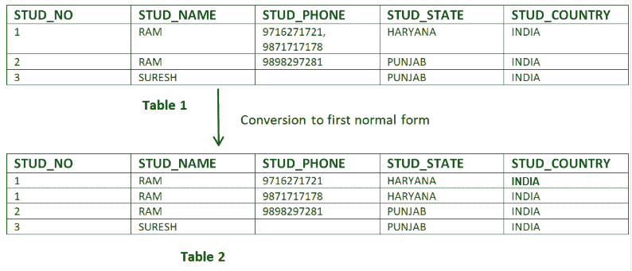

# 数据库管理系统中的范式

> 原文:[https://www.geeksforgeeks.org/normal-forms-in-dbms/](https://www.geeksforgeeks.org/normal-forms-in-dbms/)

**先决条件–**[数据库规范化和功能依赖概念](https://www.geeksforgeeks.org/introduction-of-database-normalization/)。

**归一化**是从一个关系或一组关系中最小化**冗余**的过程。相关的冗余可能导致插入、删除和更新异常。所以，这有助于减少关系中的冗余。**范式**用于消除或减少数据库表中的冗余。

### 1.第一范式–

如果关系包含复合或多值属性，则它违反第一范式，或者如果关系不包含任何复合或多值属性，则它处于第一范式。如果关系中的每个属性都是**单值属性**，则该关系处于第一范式。

*   **Example 1 –** Relation STUDENT in table 1 is not in 1NF because of multi-valued attribute STUD_PHONE. Its decomposition into 1NF has been shown in table 2.

    

*   **Example 2 –**

    ```

    ID   Name   Courses
    ------------------
    1    A      c1, c2
    2    E      c3
    3    M      C2, c3

    ```

    在上表中，课程是一个多值属性，因此它不在 1NF 中。

    由于没有多值属性，下表以 1NF 为单位

    ```
    ID   Name   Course
    ------------------
    1    A       c1
    1    A       c2
    2    E       c3
    3    M       c2
    3    M       c3

    ```

### 2.第二范式–

要处于第二范式，关系必须处于第一范式，并且关系不能包含任何部分依赖。如果一个关系具有**无部分依赖关系，**即**，**无非主属性(不属于任何候选关键字的属性)依赖于表中任何候选关键字的任何适当子集，则该关系为 2NF。

**部分依赖–**如果候选关键字的合适子集确定了非素属性，则称为部分依赖。

*   **Example 1 –** Consider table-3 as following below.

    ```
    STUD_NO            COURSE_NO        COURSE_FEE
    1                     C1                  1000
    2                     C2                  1500
    1                     C4                  2000
    4                     C3                  1000
    4                     C1                  1000
    2                     C5                  2000

    ```

    {请注意，有许多课程的学费相同。}

    这里，
    COURSE_FEE 不能单独决定 COURSE_NO 或 STUD_NO 的值；
    课程 _ 费用和学习编号不能决定课程 _ 编号的值；
    课程费和课程号不能决定学习号的价值；
    因此，
    课程 _ 费用将是一个非质数属性，因为它不属于唯一的候选关键字{梭哈 _ 否，课程 _ 否}；
    但是，COURSE_NO - > COURSE_FEE，即 COURSE_FEE 依赖于 COURSE_NO，它是候选关键字的适当子集。非质数属性 COURSE_FEE 依赖于候选关键字的一个适当子集，这是一个部分依赖，因此这种关系不在 2NF 中。

    要将上述关系转换为 2NF，
    我们需要将该表拆分为两个表，如:
    表 1: STUD_NO，COURSE_NO
    表 2: COURSE_NO，COURSE_FEE

    ```
           Table 1                                    Table 2
    STUD_NO            COURSE_NO          COURSE_NO                COURSE_FEE     
    1                 C1                  C1                        1000
    2                 C2                  C2                        1500
    1                 C4                  C3                        1000
    4                 C3                  C4                        2000
    4                 C1                  C5                        2000        
    ```

    2 C5

    **注意:** 2NF 试图减少存储在内存中的冗余数据。例如，如果有 100 名学生参加 C1 课程，我们不需要将所有 100 条记录的费用存储为 1000，而是可以将它存储在第二个表中，因为 C1 的课程费用为 1000。

*   **Example 2 –** Consider following functional dependencies in relation  R (A,  B , C,  D )

    ```
    AB -> C  [A and B together determine C]
    BC -> D  [B and C together determine D]
    ```

    在上述关系中，AB 是唯一的候选键，不存在部分依赖关系，即 AB 的任何适当子集都不确定任何非素数属性。

    ### 3.第三范式–

    一个关系处于第三范式，如果非素属性不存在**传递依赖**，它也处于第二范式。
    如果在每个非平凡函数依赖项 X–>Y 中至少有一个以下条件成立，则关系为 3NF

    1.  x 是一把超级钥匙。
    2.  Y 是一个主要属性(Y 的每个元素都是某个候选键的一部分)。

    [](https://media.geeksforgeeks.org/wp-content/cdn-uploads/Normalisation_normalforms_3.png)

    **传递依赖–**如果 A- > B and B- > C 是两个 FD，那么 A- > C 被称为传递依赖。

    *   **Example 1 –** In relation STUDENT given in Table 4,

        FD 集:{梭哈 _ 编号->梭哈 _ 名称，梭哈 _ 编号->梭哈 _ 状态，梭哈 _ 状态->梭哈 _ 国家，梭哈 _ 编号->梭哈 _ 年龄}
        候选密钥:{梭哈 _ 编号}

        对于表 4 中的这个关系，螺柱 _ 编号->螺柱 _ 状态和螺柱 _ 状态->螺柱 _ 国家为真。所以 STUD_COUNTRY 是过渡依赖于 STUD_NO 的，它违反了第三范式。为了将其转换为第三范式，我们将关系 STUDENT (STUD_NO，STUD_NAME，STUD_PHONE，STUD_STATE，STUD_COUNTRY_STUD_AGE)分解为:
        STUDENT (STUD_NO，STUD_NAME，STUD_PHONE，STUD_STATE，STUD _ AGE)
        STATE _ COUNTRY(STATE，COUNTRY)

    *   **Example 2 –** Consider relation R(A, B, C, D, E)
        A -> BC,
        CD -> E,
        B -> D,
        E -> A
        All possible candidate keys in above relation are {A, E, CD, BC} All attributes are on right sides of all functional dependencies are prime.

        ### 4.Boyce-Codd 范式(BCNF)–

        一个关系 R 在 BCNF，如果 R 在第三范式，对于每个 FD，LHS 是超级关键。在每个非平凡的函数依赖中，BCNF iff 中都有一个关系 X–> Y，X 是一个超级键。

        *   **例 1–**求一个关系 R(A，B，C，D，E)的最高范式，FD 设置为{BC- > D，AC- > BE，B- > E}
            步骤 1。我们可以看到，(AC)+ ={A，C，B，E，D}但是它的子集都不能决定关系的所有属性，所以 AC 将是候选键。a 或 C 不能从关系的任何其他属性派生，因此将只有 1 个候选键{AC}。
            第二步。在本例中，质数属性是候选关键字{A，C}的一部分，其他属性在本例中是非质数{B，D，E}。
            第三步。关系 R 是第一范式，因为关系数据库管理系统不允许多值或复合属性。
            关系处于第二范式，因为 BC- > D 处于第二范式(BC 不是候选键 AC 的适当子集)，AC- > BE 处于第二范式(AC 是候选键)，B- > E 处于第二范式(B 不是候选键 AC 的适当子集)。
            这种关系不是第三范式，因为在 BC->D(BC 既不是超级键，D 也不是质数属性)和 B->E(B 既不是超级键，E 也不是质数属性)中，为了满足第三范式，FD 的 LHS 应该是超级键，RHS 应该是质数属性。
            所以关系的最高范式是第二范式。
        *   **例 2–**例如，考虑关系 R(A，B，C)
            A - > BC、
            B->T4】A 和 B 都是超级键，所以上面的关系是在 BCNF。

        **要点–**

        1.  BCNF 没有冗余。
        2.  如果一个关系在 BCNF，那么 3NF 也满足。
        3.  如果关系的所有属性都是素属性，那么关系总是在 3NF。
        4.  关系数据库中的关系总是并且至少是 1NF 形式的。
        5.  每个二元关系(只有两个属性的关系)总是在 BCNF。
        6.  如果一个关系只有单个候选键(即每个候选键只包含一个属性)，那么这个关系总是在 2NF 中(因为不可能有部分函数依赖)。
        7.  有时选择 BCNF 形式可能不会保持功能依赖性。在这种情况下，只有当不需要丢失的 FD 时，才选择 BCNF，否则只正常化到 3NF。
        8.  在 BCNF 之后，还有更多的正常形式存在，比如 4NF 等等。但是在现实世界的数据库系统中，一般不需要超越 BCNF。

        **练习 1** :在以下函数依赖下求 R (A，B，C，D，E)中的最高范式。

        ```
          ABC --> D
          CD --> AE 
        ```

        **解决上述类型问题的要点**。
        **1)** 先从 BCNF 开始查，然后 3 NF，以此类推，总是个好主意。
        **2)** 如果任何函数依赖满足一个范式，那么就不需要检查较低的范式。例如，ABC–>D 在 BCNF(注意 ABC 是一个超键)，所以不需要检查这种依赖关系的低范式。

        给定关系中的候选关键字是{ABC，BCD}

        **BCNF:** ABC - > D 在 BCNF。让我们检查 CD - > AE，CD 不是超级键，所以这个依赖不在 BCNF。所以，R 不在 BCNF。

        **3NF:** ABC - > D 我们不需要检查这个依赖，因为它已经满足了 BCNF。让我们考虑 CD - > AE。因为 E 不是素属性，所以关系不在 3NF。

        **2NF:** 在 2NF 中，我们需要检查部分依赖。CD 是候选关键字的适当子集，它确定 E，E 是非质数属性。所以，给定的关系也不在 2 NF。所以，最高范式是 1 NF。

        **GATE CS 角题**
        练习下面的题有助于测试你的知识。所有的问题在前几年的 GATE 考试或 GATE 模拟考试中都被问过。强烈建议你练习一下。

        1.  [GATE CS 2012，问题 2](https://www.geeksforgeeks.org/gate-gate-cs-2012-question-8/)
        2.  [GATE CS 2013，第 54 题](https://www.geeksforgeeks.org/gate-gate-cs-2013-question-54/)
        3.  [GATE CS 2013，第 55 题](https://www.geeksforgeeks.org/gate-gate-cs-2013-question-55/)
        4.  [GATE CS 2005，问题 29](https://www.geeksforgeeks.org/gate-gate-cs-2005-question-29/)
        5.  [GATE CS 2002，问题 23](https://www.geeksforgeeks.org/gate-gate-cs-2002-question-19/)
        6.  [GATE CS 2002，问题 50](https://www.geeksforgeeks.org/gate-gate-cs-2002-question-49/)
        7.  [GATE CS 2001，问题 48](https://www.geeksforgeeks.org/gate-gate-cs-2001-question-48/)
        8.  [GATE CS 1999，问题 32](https://www.geeksforgeeks.org/gate-gate-cs-1999-question-32/)
        9.  [GATE IT 2005，问题 22](https://www.geeksforgeeks.org/gate-gate-it-2005-question-22/)
        10.  [GATE IT 2008，问题 60](https://www.geeksforgeeks.org/gate-gate-it-2008-question-60/)
        11.  [GATE CS 2016(第 1 集)，第 31 题](https://www.geeksforgeeks.org/gate-gate-cs-2016-set-1-question-31/)

        所有前一年的问题见[数据库范式测验](https://www.geeksforgeeks.org/dbms-gq/database-design-normal-forms-gq/)。

        本文由 **Sonal Tuteja** 供稿。如果你喜欢 GeeksforGeeks 并想投稿，你也可以使用[write.geeksforgeeks.org](https://write.geeksforgeeks.org)写一篇文章或者把你的文章邮寄到 review-team@geeksforgeeks.org。看到你的文章出现在极客博客主页上，帮助其他极客。

        如果你发现任何不正确的地方，或者你想分享更多关于上面讨论的话题的信息，请写评论。