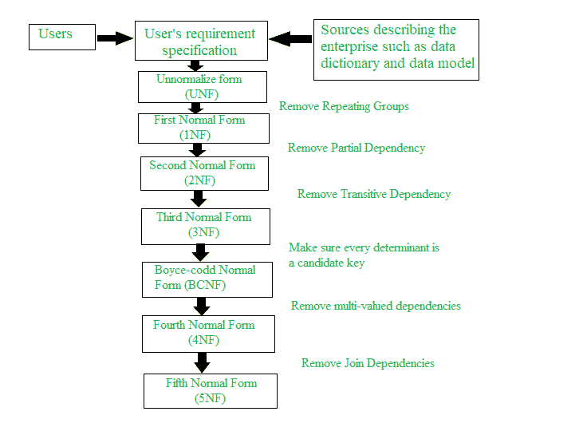

# 数据库管理系统中的规范化过程

> 原文:[https://www . geesforgeks . org/normalization-process-in-DBMS/](https://www.geeksforgeeks.org/normalization-process-in-dbms/)

**[数据库规范化](https://www.geeksforgeeks.org/introduction-of-database-normalization/)** 是一个逐步的形式化过程，它允许我们分解数据库表，使得数据依赖性和更新异常都最小化。在分析表时，它利用了表中存在的函数依赖和主键或候选键。最初提出的范式称为[第一范式(INF)](https://www.geeksforgeeks.org/first-normal-form-1nf/) 、[第二范式(2NF)](https://www.geeksforgeeks.org/second-normal-form-2nf/) 、[第三范式(3NF)](https://www.geeksforgeeks.org/third-normal-form-3nf/) 。

随后，R，Boyce 和 E. F. Codd 引入了更强的 3NF 定义，称为 [Boyce-Codd 范式](https://www.geeksforgeeks.org/boyce-codd-normal-form-bcnf/)。除了 1NF 之外，所有这些范式都是基于表属性之间的函数依赖关系。后来引入了超越 BCNF 的高等范式，如[第四范式(4NF)和第五范式(5NF)](https://www.geeksforgeeks.org/introduction-of-4th-and-5th-normal-form-in-dbms/) 。然而，这些后来的正常形式处理非常罕见的情况。

简而言之，标准化概述:

| 正规形式 | 试验 | 补救措施(正常化) |
| 1NF | 关系应该没有非原子属性或嵌套关系。 | 每个非原子属性或嵌套关系的表单名称关系。 |
| 2NF | 对于主键包含多个属性的关系，任何非键属性都不应在功能上依赖于主键的一部分。 | 分解并为每个部分键及其相关属性建立新的关系。确保与原始主键和任何功能上完全依赖于它的属性保持关系。 |
| 3NF | 关系不应具有由另一个非键属性(或一组非键属性)在功能上确定的非键属性，即主键的非键属性不应有传递依赖关系。 | 分解并建立包含非关键属性的关系，这些属性在功能上决定其他非关键属性。 |
| BCNF(中央银行) | 关系在函数依赖关系中不应该有任何非质数的属性，这种属性不会出现在任何候选键中。 | 确保每个函数依赖的左侧都是候选键。 |
| 4NF | 关系不应该有多值依赖，这意味着当一个表的两个属性相互独立，但都依赖于第三个属性时，关系就会出现。 | 将表格分解成两个子表。 |
| 5NF | 关系不应该有连接依赖，这意味着如果一个表可以通过连接多个表来重新创建，并且每个表都有该表的属性子集，那么该表就处于
**连接依赖中。** | 将所有表分解成尽可能多的数字，以避免依赖性。 |

